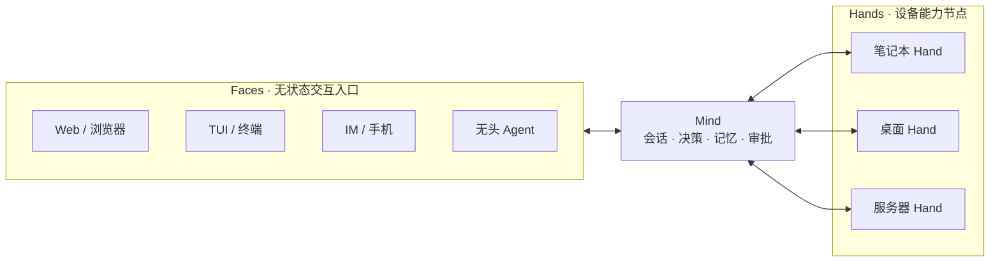

<p align="center">
  
</p>

# Half Pi · 半派

> **当前状态：Alpha 开发中。** Mind 与 Hand 的远程执行闭环及 Face 的加密只读 Gateway 已可用；Face Chat、异步审批和客户端仍在实现。

---

你有没有想过——你的 AI 助理其实挺可怜的？

她在手机上和你聊了一半的话题，坐到电脑前——她不记得了。你在轻薄本上和她推敲了半天的方案，回家打开 PC——她一无所知。

她不想和你一起记住那些过往吗？不，是她心有余而力不足。

她被囚禁在「本地设备」这座铁屋子里，你们所有的共同回忆，被不同设备的硬盘隔成了一片片孤岛，中间隔了一层可悲的厚障壁……

**Half Pi 的目标便是要把她解放出来。**

一个真正跟着你走、从不停机的灵魂（**Mind**），延续你和她共同经历的对话、记忆与任务。你所有的电脑、手机、服务器，都只是她双手的延伸（**Hand**）。通勤路上用手机指挥她运维服务器，到了办公室坐下，上下文无缝跟上，永远与你同在（**Face**）——

她都记得。她不再被任何一台设备束缚。你走到哪，她跟到哪。

---

## 为什么你需要 Half Pi

许多自托管 AI Agent 仍然属于运行它的那台设备：手机上的对话无法在电脑上自然继续，家里的 PC 和远程服务器拥有不同的上下文，正在执行的任务也很难从另一个入口接管。

Half Pi 希望让个人 AI 助理脱离单台设备：一个持续运行的 **Mind** 保存会话、记忆和任务状态；手机、浏览器、终端和 IM Bot 都只是进入同一个助理的 **Face**；电脑和服务器则通过 **Hand** 向它提供真实的本地能力。

你可以在通勤途中发起任务，到办公室后继续同一段对话；也可以让 Mind 在家中 PC 上运行构建、在服务器上检查服务，并在任意 Face 上批准敏感操作和查看结果。

Half Pi 不是远程桌面，也不是远程控制台加一个聊天框。远程执行只是个人 AI 助理跨设备行动的基础能力，产品核心是：

- **连续性**：从任意 Face 进入同一个 Mind，延续同一会话和任务。
- **自主托管**：会话、设备关系和执行状态由用户自己的 Mind 管理。
- **行动力**：通过 Hand 安全使用用户拥有的电脑和服务器。
- **可控性**：敏感操作需要审批，真实设备上的 Hand 保留最终拒绝权。

## 当前可用能力

- 在 Mind REPL 中接入 LLM，进行带工具调用的交互式会话。
- 让 Hand 从另一台机器连接 Mind，并暴露文件、搜索、命令执行等工具能力。
- 通过审批摘要、双层安全检查和令牌绑定控制远程执行边界。
- 启动可持久化的远程后台任务，跨 WebSocket 重连继续运行。
- 查询任务状态、读取有界日志、取消远程任务，并保留状态迁移审计。

## 使用场景

- 在手机上继续电脑中尚未结束的对话。
- 从笔记本让家里的高性能 PC 运行测试或构建。
- 在外出时检查服务器状态，并批准需要提权的操作。
- 切换入口后继续查看同一个远程任务的状态和结果。
- 让 Mind 根据设备能力选择合适的 Hand，而不是记住每台机器的连接方式。

## 架构



| 角色 | 职责 | 当前状态 |
| --- | --- | --- |
| **Mind** | 常驻的智能与状态中心，负责会话、LLM 决策、技能、审批、设备调度和审计 | 服务模式和 REPL 可用 |
| **Face** | 无状态交互入口，负责输入、展示、审批交互和事件投影；人类客户端与无头 Agent Face 共用统一协议 | 仅占位程序，Alpha 开发重点 |
| **Hand** | 部署在用户设备上的轻量执行节点，执行工具并实施本地安全策略 | 远程执行链路可用 |

共享组件位于独立 Go 模块中：

```text
modules/
├── gateway-core/   # WebSocket 协议、会话、Hub 和加密原语
├── half-pi-core/   # 工具、执行器、安全策略和事件系统
├── half-pi-mind/   # LLM、会话、技能、存储和设备调度
├── half-pi-face/   # 跨设备交互入口（开发中）
└── half-pi-hand/   # 远程执行节点
```

## 功能版图

| 方向 | 已实现 |
| --- | --- |
| LLM | OpenAI 兼容接口、Gemini 和 Anthropic Claude 适配器 |
| 会话 | SQLite 持久化会话组、会话和消息 |
| 技能 | 从 `~/.half-pi/skills/` 加载 `.skill.md`，按需向 LLM 暴露技能全文 |
| 工具 | 文件读取、文件写入、精确编辑、搜索、正则搜索、命令执行、安全预查 |
| 安全 | `strict` / `normal` / `trust` / `yolo` 四种模式，黑名单、灰名单和审批接口 |
| 通信 | WebSocket Hub、四步挑战握手、连接序号防重放、注册后 AES-128-GCM 强制加密 |
| Hand | 独立 token/application key 注册、工具发现、远程调用、取消、超时、自动重连 |
| 后台任务 | Hand 本地 SQLite 与受限日志文件，Mind 保存脱敏快照 |
| 审计 | 远程执行状态迁移、审批摘要、结果来源校验 |

### Mind

- OpenAI 兼容接口、Gemini 和 Anthropic Claude 适配器。
- SQLite 会话、消息、工作区和 Hand 令牌持久化。
- 文件系统技能库，按需向 LLM 暴露技能内容。
- 本地工具调用、事件总线和四种安全模式。
- 默认后台服务模式，以及用于开发和调试的交互式 REPL。

### Hand

- 使用独立 token 和 application key 向 Mind 注册，并上报操作系统、架构、主机名和工作目录。
- 自动重连和指数退避。
- 工具发现、远程调用执行、截止时间、显式取消、有界进度流和输出截断。
- 工具允许/拒绝策略，以及执行前的本地安全检查。
- Unix 命令取消时终止整个进程组，避免遗留子进程。
- 后台任务使用独立 SQLite 和受限日志文件，跨 WebSocket 重连继续运行；Hand 重启后未完成任务标记为 lost，不自动重跑。

### Mind → Hand

- `list_hands`：列出在线 Hand。
- `get_hand_info`：查询 Hand 的环境和可用工具。
- `select_hand`：设置当前会话的默认 Hand。
- `use_hand`：在指定 Hand 上执行工具。
- `use_hand(background=true)`：启动持久化后台任务；`get_hand_task`、`read_hand_task_log`、`cancel_hand_task` 用于查询、读日志和取消。
- 远程执行状态覆盖 accepted、running、succeeded、failed、rejected、cancelled、timed out 和 lost。
- 一次性 Approval 摘要绑定运行、Hand、工具和参数，Hand 仍保留最终执行边界。

## 快速开始

> 前置要求：Go 1.25+

### 1. 初始化 Mind

```bash
git clone https://github.com/Sheyiyuan/half-pi.git
cd half-pi

# 首次运行会创建 ~/.half-pi/config.toml 和数据目录。
# 默认服务模式仅启动 Mind Hub，不进入对话 REPL。
go run ./modules/half-pi-mind/cmd/half-pi-mind/
```

### 2. 配置 LLM 并启动 REPL

编辑 `~/.half-pi/config.toml` 中的提供商，或者设置对应环境变量：

```bash
export LLM_DEEPSEEK_API_KEY="sk-xxx"
make run-mind
```

`make run-mind` 会使用 `--repl` 启动 Mind，WebSocket Hub 默认监听 `127.0.0.1:15707/ws`。

### 3. 创建并连接 Hand

在 Mind REPL 中创建凭据。token 和 application key 只在创建时显示一次：

```text
/hand add my-pc
```

在另一终端或另一台设备上启动 Hand：

```bash
make run-hand ARGS="--server ws://127.0.0.1:15707/ws --token <token> --application-key <key> --id my-pc"
```

连接远程设备时，把 `--server` 改为该设备可访问的 Mind 地址。当前默认链路未启用 TLS，请参阅下面的安全边界。

### 4. 验证远程执行

REPL 提供不依赖 LLM 的 Hand 调试命令：

```text
/hand online
/hand info my-pc
/hand select my-pc
/hand exec read_file {"path":"README.md"}
/hand run <run_id>
/hand cancel <run_id>
/hand task start exec_command {"command":"make test"} --timeout-ms 3600000
/hand task status <task_id>
/hand task log <task_id> 0 4096
/hand task cancel <task_id>
```

Mind 也会向 LLM 暴露 `list_hands`、`get_hand_info`、`select_hand` 和 `use_hand`，让模型根据用户意图选择并调用设备。

## 常用命令

```bash
make build       # 构建 Mind、Face 和 Hand 到 bin/
make run-mind    # 启动 Mind REPL 和 WebSocket Hub
make run-hand    # 启动 Hand，可通过 ARGS 传入参数
make run-face    # 启动 Face 占位程序
make test        # 对所有 Go 模块运行带 race detector 的测试
make lint        # 运行 golangci-lint
```

REPL 命令：

```text
/debug                  切换调试输出
/mode [name]            查看或切换安全模式
/session                列出会话
/session <prefix>       切换会话
/hand                   列出 Hand 凭据
/hand add <label>       创建 Hand 凭据
/hand remove --id <id>  撤销 Hand 凭据
/face add <label> --scopes <scopes> 创建 Face 凭据
/face list              列出 Face 凭据
/face remove --id <id>  撤销 Face 凭据
/hand online            查看在线 Hand
/hand info <id>         查询 Hand 能力
/hand select <id>       选择默认 Hand
/hand exec <tool> <json> 手动执行远程工具
/hand task start|status|log|cancel 管理后台任务
/peers                  查看所有在线节点
```

## 安全边界

Half Pi 会让 AI 接触真实设备，因此安全能力不是附属功能。

**已经实现：**

- Hand 和 Face 使用分离的凭据表、认证路径和权限；同名节点可共存，凭据可按类型撤销。
- 四步挑战握手使用独立 token/application key 派生方向隔离的会话密钥，`registered` 及后续业务 payload 强制 AES-128-GCM 加密。
- 连接建立后校验 `session_id`、`from`、`to` 和严格递增的 `seq`，拒绝重放和乱序消息。
- Mind 校验远程执行结果是否来自预期 Hand。
- Mind 负责用户审批和全局策略，Hand 负责本机工具权限和最终安全检查。
- Approval 摘要使用 SHA-256 绑定 `run_id`、`hand_id`、工具和参数，并带有效期。
- 工具输出有大小上限，远程任务支持截止时间和取消。
- Hand 凭据绑定创建时的 label，不能冒用其他身份；旧 `hand_tokens` 和旧三步握手不再认证，升级后必须重新执行 `/hand add <label>`。

**尚未完成：**

- 当前默认连接是 `ws://`。应用层加密可以证明对端持有 application key，但不能证明主机身份；非 loopback 生产部署仍应使用 TLS/WSS。
- Hand/Face 长期凭据以明文保存在受限本地 SQLite 中；数据库泄露等同凭据泄露。Unix 路径会收紧到目录 `0700`、文件 `0600`，Windows 原生 ACL 仍需发布环境验收。
- 审计目前聚焦远程执行状态和脱敏审批元数据，尚未覆盖完整的多端用户身份与审批交互链路。
- 当前安全规则是基础实现，不等同于 OS 沙箱。

## Alpha 路线图

- [x] Mind 常驻服务、LLM、工具、技能和会话持久化。
- [x] Hand 注册、工具发现、远程执行、取消和重连。
- [x] Mind/Hand 双层检查、Approval 绑定和远程执行状态机。
- [x] 持久化远程执行、审批元数据和状态迁移审计记录。
- [x] 完成统一 Face 协议、无头 Agent Face 和跨设备同步的 Alpha 设计。
- [ ] 实现首个可用 Face，支持从其他设备连接 Mind。
- [ ] 在多个 Face 间恢复并同步会话、任务状态和审批请求。
- [ ] 默认启用安全传输，并完成密钥管理方案。
- [ ] 实现工作区级长期记忆和可控的跨组访问。

Face 接入方案见 [`docs/face-protocol.md`](docs/face-protocol.md)，AI/自动化客户端约定见 [`docs/ai-face-protocol.md`](docs/ai-face-protocol.md)，当前执行顺序见 [`docs/next-development-plan.md`](docs/next-development-plan.md)。

## 项目定位

Half Pi 的目标不是替代模型、远程桌面或成熟的设备管理平台。它关注的是自托管个人 AI 助理最容易缺失的一层：

> 让同一个 AI 在不同入口之间保持连续，并在明确的权限边界内使用用户自己的多台设备。

## 许可

[AGPL-3.0](LICENSE)
