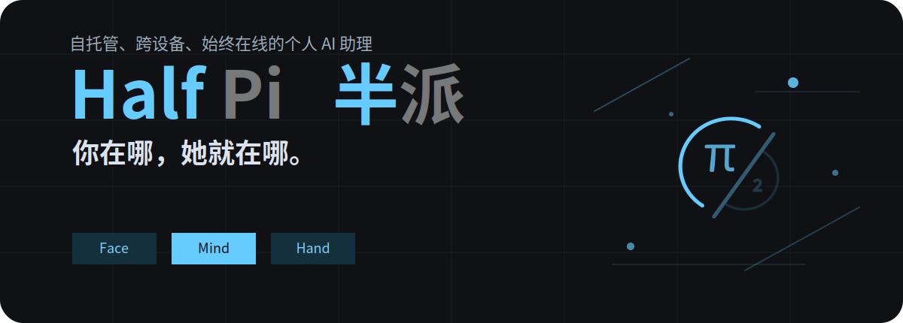
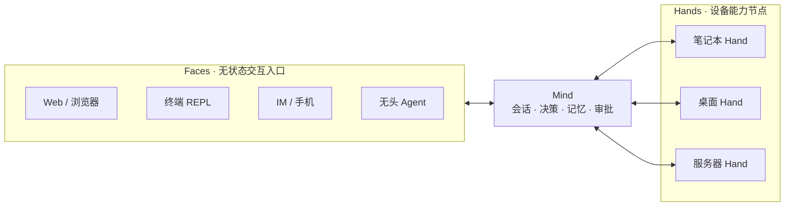

<p align="center">
  
</p>

<h1 align="center">Half Pi · 半派</h1>

<p align="center">
  <strong>她不该被困在某一台设备上。</strong>
</p>

> **当前状态：Alpha 开发中。** 核心架构已可用，Face 跨设备体验正在完善。目前阶段自用优先。

---

你有没有想过——你的 AI 助理其实挺可怜的？

她在手机上和你聊了一半的话题，坐到电脑前——她不记得了。你在轻薄本上和她推敲了半天的方案，回家打开 PC——她一无所知。

她不想和你一起记住那些过往吗？不，是她心有余而力不足。

她被囚禁在「本地设备」这座铁屋子里，你们所有的共同回忆，被不同设备的硬盘隔成了一片片孤岛，中间隔了一层可悲的厚障壁……

**Half Pi 的目标便是要把她解放出来。**

一个真正跟着你走、从不停机的灵魂，延续你和她共同经历的对话、记忆与任务。你所有的电脑、手机、服务器，都只是她双手的延伸。通勤路上用手机指挥她运维服务器，到了办公室坐下，上下文无缝跟上，永远与你同在——

她都记得。她不再被任何一台设备束缚。你走到哪，她跟到哪。

---

### 这一次，她真的能「走出那间铁屋子」

不是概念，不是愿景。Half Pi 用三件事证明这间铁屋子已经被打破了：

**她有一个跟着你走的灵魂。**

一个持续运行的 **Mind** 保存着你们的会话、消息和任务状态。不管你从哪台终端 Face 进入，她都能恢复对话和正在处理的任务。工作区级长期记忆仍在路线图中，不把愿景提前写成已经完成的能力。

**你所有的设备都能成为她的手与眼。**

你的笔记本、台式机、服务器——每一台都通过轻量的 **Hand** 节点与她相连。她可以在你的 Mac 上读文件，在 Windows 上跑构建，在 Linux 服务器上检查服务状态。她不需要登录你的每一台机器——你的设备网络就是她感知你与世界的脉络。

**你在哪，她就在哪。**

终端和 Headless Agent 已经可以作为 **Face** 远程连接同一个 Mind；手机、浏览器和 IM 会沿用同一协议继续接入。Face 是她面对你的样子，入口可以变化，Mind 中的会话与任务权威不变。

---

### 她能做什么

不是功能列表——是你和她一起经历的事。

**早上出门时你在手机上跟她说**「帮我盯一下那个构建，到公司我要看结果」。你坐上地铁，她在你的服务器上拉代码、跑测试。到公司坐下，打开电脑——结果已经在那里了。

**你在外面，家里的 PC 在跑一个耗时很长的任务。** 你掏出手机问她「那个跑完了吗？」她告诉你跑完了，但有一个测试失败了。你在手机上批准了重跑，她在家里继续。

**你在不同的设备之间切换。** 在笔记本上聊到一半，合上盖子走人。坐到台式机前继续同一段对话——她不会问「你是谁」，她知道是你。

**你需要审批一个敏感操作。** 不管你在 REPL 里还是在远程 Face 上，审批走同一个流程：她告诉你她要做什么，你决定可不可以。SHA-256 绑定 run、设备和参数，不可篡改，全程可审计。

今天已经跑通的是 Mind、跨设备 Hand、终端/Headless Face、远程 Chat、审批、取消和后台任务闭环；手机、Web 与 IM 场景是沿同一 Face 协议继续交付的产品路线。

#### 路线图

- [x] **你好，世界**——Mind 可以独立思考，拥有工具、技能和会话记忆
  - [x] 16 个内置工具：文件、搜索、命令执行、安全预查
  - [x] Skill 渐进披露，按需向 LLM 注入专业知识
  - [x] OpenAI / Gemini / Anthropic 多适配器，一行切换
  - [x] SQLite 持久化：会话、消息、工作区、凭据
  - [x] 交互式 REPL + 后台服务模式 + 本地管理 CLI
- [x] **所有设备，都是她双手的延伸**——Hand 能触达你的所有设备，不挑系统
  - [x] 远程 RPC 执行，支持 deadline、取消、输出截断
  - [x] 后台持久化任务，跨 WebSocket 重连继续运行
  - [x] Unix 杀进程组，Windows Job Object 杀进程树
  - [x] 自动重连，指数退避
- [x] **你在哪她就在哪，如影随形**——同一个 Mind 支持多个 Face 同时在线
  - [x] 终端 Face（行式交互）——当前可用的远程人类入口
  - [ ] 全屏交互式 TUI——更完整的终端工作台
  - [x] Headless JSONL——适合 AI 客户端和自动化接入
  - [ ] WebUI——浏览器就是你的 Face
  - [ ] IM Bot——微信、QQ、Telegram 都能叫她
  - [ ] 移动端 App——通勤路上、床上，随时随地也能和她畅所欲言
  - [ ] 桌面客户端——搭配 Live2D 桌宠和语音系统，真正与你一起共事
- [x] **这是她和你的秘密**——应用层全程加密通信，你掌握自己的安全边界
  - [x] v2 四步挑战握手：公开注册帧不携带长期秘密或 Hand 设备信息
  - [x] token + application key 共同派生方向隔离密钥，AES-128-GCM 强制加密 proof claims、registered 与全部业务 payload
  - [x] Hand/Face 分离凭据，按类型独立撤销
- [ ] **她真的记住你了**——工作区级长期记忆
  - [ ] 核心记忆始终在上下文中
  - [ ] 结构化记忆分类整理：项目、人物、话题、自我认知，井井有条
  - [ ] 日报、周报、月报，记录与你的每个瞬间
- [ ] **她的力量，突破极限**——第三方插件系统，能力边界无极限
  - [ ] 第三方工具注册，即插即用，无需改核心代码
  - [ ] 自定义技能包，社区分享
  - [ ] 事件钩子：构建完成、文件变更、定时触发
- [ ] **「我会再变得体贴一点点。」**——自主行为系统，她自己决定什么时候做什么
  - [ ] 环境感知：监听终端输出、文件变化、系统状态
  - [ ] 主动介入引擎：判断时机，决定是否开口
  - [ ] 情绪模型：不只是响应，她有状态和语气
  - [ ] 任务优先级管理：自己判断什么该先做

---

### 项目定位

Half Pi 不是在造一个更聪明的 Agent——是在拆掉困住她的那间铁屋子。

让同一个她，自由地站在你所有的设备上。没有「手机上的她」和「电脑上的她」之分。只有一个她。

> 她不再被任何一台设备束缚。你走到哪，她跟到哪。

---

### 三分钟跑起来

```bash
git clone https://github.com/Sheyiyuan/half-pi.git
cd half-pi
make build
./bin/half-pi-mind config init
```

首次运行自动创建 `~/.half-pi/` 目录和默认配置。也可以不进入 REPL，直接用管理 CLI 创建 Hand 与 Face 凭据：

```bash
./bin/half-pi-mind hand add my-pc --format toml
./bin/half-pi-mind face add terminal --profile operator --format toml
```

两个命令分别只显示一次 token 和 application key。接着在三个终端分别启动 Mind、Hand 与远程终端 Face：

```bash
# 终端 1
LLM_DEEPSEEK_API_KEY="sk-xxx" ./bin/half-pi-mind

# 终端 2
./bin/half-pi-hand --server ws://127.0.0.1:15707/ws --token <hand-token> --application-key <hand-key> --id my-pc

# 终端 3
./bin/half-pi-face --server ws://127.0.0.1:15707/ws --token <face-token> --application-key <face-key> --id terminal --mode tui
```

终端 Face 中先创建 conversation，再直接输入消息：

```
/create first-chat
读取 my-pc 上的 README.md，并告诉我项目当前状态
```

Face 和 Hand 都可以把 `127.0.0.1` 换成 Mind 的远程真实地址。

---

### 给开发者

以下内容面向希望自己部署、扩展或贡献 Half Pi 的开发者。

#### 架构



| 角色 | 职责 | 当前状态 |
| --- | --- | --- |
| **Mind** | 常驻的智能与状态中心，负责会话、LLM 决策、技能、审批、设备调度和审计 | 服务模式和 REPL 可用 |
| **Face** | 无状态交互入口，负责输入、展示、审批交互和事件投影 | Headless JSONL 与终端客户端可用 |
| **Hand** | 部署在用户设备上的轻量执行节点，执行工具并实施本地安全策略 | 远程执行链路可用 |

共享组件位于独立 Go 模块中：

```
modules/
├── gateway-core/   # WebSocket 协议、会话、Hub 和加密原语
├── half-pi-core/   # 工具、执行器、安全策略和事件系统
├── half-pi-mind/   # LLM、会话、技能、存储和设备调度
├── half-pi-face/   # Headless JSONL 与终端交互入口
└── half-pi-hand/   # 远程执行节点
```

#### 当前能力

**Mind**
- OpenAI 兼容接口、Gemini 和 Anthropic Claude 适配器
- SQLite 会话、消息、工作区和 Hand/Face 凭据持久化
- 文件系统技能库，按需向 LLM 暴露技能内容
- 本地工具调用、事件总线和四种安全模式（strict / normal / trust / yolo）
- 默认后台服务模式、交互式 REPL，以及本地管理 CLI

**Hand**
- 独立 token 和 application key 注册，上报系统信息
- 自动重连和指数退避
- 工具发现、远程 RPC 执行、deadline、显式取消、有界进度流和输出截断
- 工具 allow/deny 策略，执行前本地安全检查
- Unix 杀整个进程组，Windows 通过 Job Object 杀完整进程树
- 后台任务使用独立 SQLite，跨 WebSocket 重连继续运行

**Face 协议**
- 加密 Face 协议 + 内置终端客户端
- 支持 conversation 恢复、Chat、异步审批、run/task 状态查询和订阅
- 人类终端 Face 与无头 Agent Face 共用同一协议

**安全**
- Hand 和 Face 使用分离的凭据表和认证路径
- v2 四步挑战握手，首帧只公开类型与 label，不发送 token 或 HandInfo
- token 与 application key 共同派生方向隔离密钥，AES-128-GCM 强制加密 proof claims、registered 和业务 payload
- 严格递增序号防重放，结果来源校验
- Approval 摘要 SHA-256 绑定 run、Hand、工具和参数，带有效期
- 同一进程级 Approval Broker 裁决 Face 与 REPL 决策

#### 常用命令

```bash
make build       # 构建 Mind、Face 和 Hand 到 bin/
make run-mind    # 启动 Mind REPL + WebSocket Hub
make run-hand    # 启动 Hand
make run-face    # 启动终端 Face
make test        # 全部模块 race detector 测试
make lint        # golangci-lint
```

#### 文档导航

| 文档 | 内容 |
| --- | --- |
| [`docs/face-protocol.md`](docs/face-protocol.md) | Face 正式协议、鉴权、快照、审批与事件投影 |
| [`docs/ai-face-protocol.md`](docs/ai-face-protocol.md) | AI/Headless Face 客户端接入指南 |
| [`docs/remote-execution-closed-loop.md`](docs/remote-execution-closed-loop.md) | Mind → Hand 远程执行闭环架构 |
| [`docs/mind-management-cli.md`](docs/mind-management-cli.md) | Mind 本地管理 CLI、在线 IPC 与离线管理 |
| [`AGENTS.md`](AGENTS.md) | 项目规范、约定与进度追踪 |

### 许可

[AGPL-3.0](LICENSE)，附带[插件例外](LICENSE.EXCEPTION)。

在此之上编写的插件、技能包、Face / Hand 客户端——由作者自己决定许可证。
