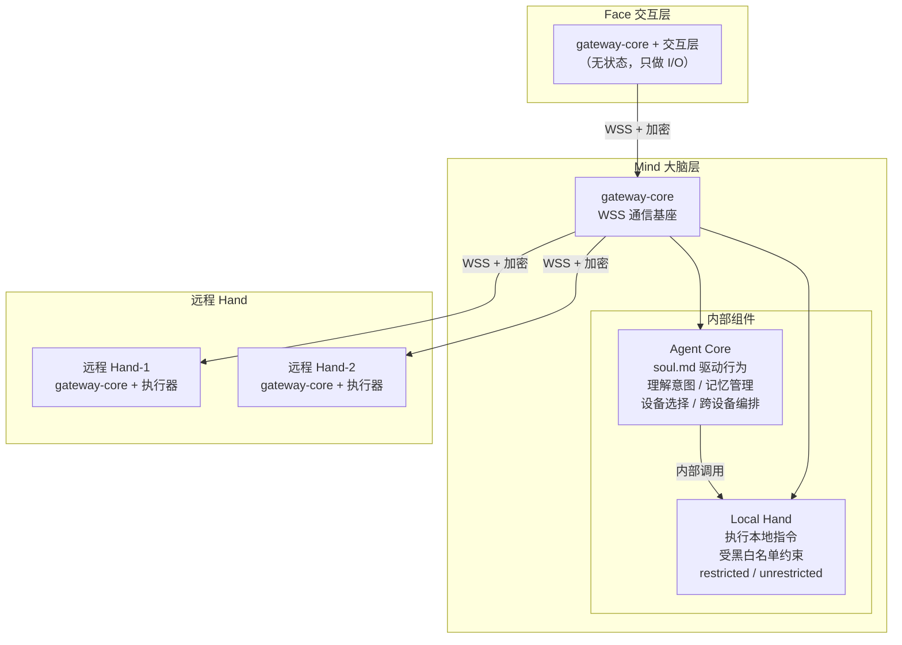
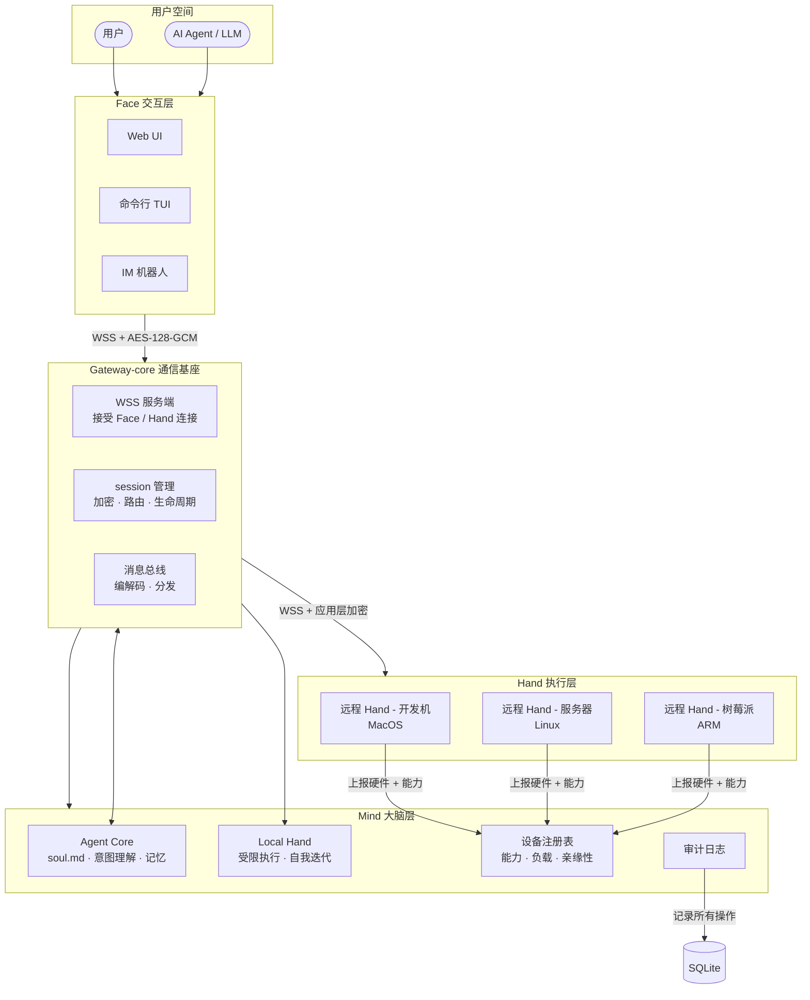
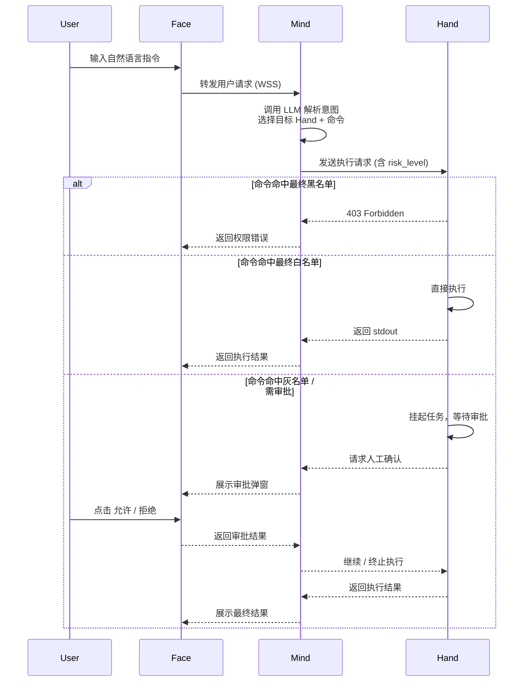

Half-Pi （重置版） 远程设备操控系统 · 设计文档

---

一、项目背景与目标

构建一套让 AI Agent 通过多台远程设备感知和行动的系统。核心命题是：

> **让一个 AI 意识（Mind）作为唯一的记忆与决策核心，通过多台远程设备（Hand）精准执行，用户通过统一的交互界面（Face）与之对话。跨设备的上下文与记忆始终保持全局一致。**

这不是一个「远程控制台 + AI 插件」——Mind 不是辅助工具，而是整个系统的中心：它记住每台 Hand 上发生过什么，理解用户的跨设备意图，编排多步操作，并在下一次交互中保持连续性。

用户可以选择精确指定目标设备（「在 dev-01 上跑 pytest」），也可以让 Mind 基于设备的能力、负载和历史记录自主选择最优设备（「把这项目部署一下」）。两种模式在同一框架下共存，由 Mind 统一决策。

系统强调安全性、可插拔性、透明审计，并支持从「纯聊天」到「全自动运维」的多种运行模式。

核心设计哲学

**「关注点分离」**——将系统解耦为三层，每层承担独立的职责：

- **Face（脸面）**：只负责与用户交互，不做任何逻辑决策。Face 不持有任何状态——所有会话上下文、审批记录、操作历史都在 Mind 端统一管理。用户从 Telegram 换到 WebUI，**同一个上下文无缝衔接**。Face 仅仅是 gateway-core + 交互层。
- **Mind（大脑）**：整个系统的唯一智能节点。维护全局记忆、理解用户意图、选择执行设备、编排跨设备流程、管理安全规则。三层中只有 Mind 是「有状态的」——所有上下文在此沉淀。Mind 是 gateway-core + agent-core + local-hand。
- **Hand（手脚）**：纯执行者，常驻在被控设备上。不关心用户的意图是什么，只负责接收指令、执行、上报结果。设计目标是轻量、安全、可靠。Hand 是 gateway-core + 执行器。
- **Gateway-core（通信基座）**：所有包的公共依赖。提供 WSS 客户端/服务端、应用层加密、session 管理、消息序列化。Face/Mind/Hand 各包以此为基础叠加业务逻辑打包。

三层之间通过标准化协议通信，技术上可独立部署、自由组合，但**架构上 Mind 是唯一的中心**——Face 和 Hand 都是它的外延。

---

## 二、术语定义

## 三、三端分离 + Mind 内部分层

### 1. 整体架构角色

| 组件 | 代号 | 职责 | 示例实现 |
|------|------|------|---------|
| Face | 脸面 | 用户交互层。负责输入（CLI/TUI/GUI/WebUI）与输出展示。不持有任何状态——所有会话上下文、审批记录、操作历史都在 Mind 端统一管理。 | Vue3 WebUI / Rich TUI / Telegram Bot |
| Mind | 大脑 | **系统唯一的智能节点与记忆中心。** 内部进一步拆分为 Agent Core、Gateway、Local Hand 三层（见下方）。所有对话历史、操作记录、设备亲缘关系在此沉淀。 | Go / Python 服务端 |
| Hand | 手脚 | 执行层。常驻在被控设备上，接收指令并执行，上报硬件信息与本地规则。不关心意图，只负责执行。 | Go 编译的单一二进制守护进程 |

### 2. Mind 内部结构

Mind 由两个组件构成：Agent Core（大脑）和 Local Hand（内置的手脚）。通信不内嵌在 Mind 中——所有包通过共同的 gateway-core 互连。



### 3. 各组件职责

**Agent Core**（Mind 的大脑）
- 加载 soul.md 作为行为准则与人格设定——不硬编码 prompt
- 维护对话上下文与跨设备记忆
- 理解用户意图，做设备选择决策
- 编排跨 Hand 的多步骤流程
- 通过 gateway-core 接收来自 Face 的消息，通过 gateway-core 下发命令给 Hand

**Local Hand**（Mind 内置的手脚——自我迭代的执行器）
- 与远程 Hand 运行同样的协议和约束，与 Gateway 在同一进程内或 Unix socket 通信
- **默认模式：restricted（受限）**
  - 仅允许操作 `${MIND_DATA_DIR}`（soul.md、config.toml 等）和部分数据库表
  - 受完整黑白名单约束，自我修改也需要通过审批流程
  - 当有远程 Hand 连接时，Agent Core 优先使用远程 Hand 执行用户任务
- **退化模式：unrestricted（非受限）**
  - 解除目录权限限制，可执行本地任意命令
  - 在没有远程 Hand 连接时自动启用（可配置）
  - 此时 Half-Pi 退化为一个普通单机 agent 的工作方式
  - 添加第一台远程 Hand 后，Local Hand 自动或手动切回 restricted 模式

**Gateway-core**（公共通信基座——所有包的公共依赖）
- WSS 客户端：连接其他模块（Face 连 Mind，Mind 连远程 Hand）
- WSS 服务端：接受其他模块的连接（Mind 接受 Face 连入，远程 Hand 连 Mind）
- 应用层加密原语：AES-128-GCM + AAD（ChaCha20-Poly1305 规划中）
- 连接级 session 管理：注册成功响应、session_id、严格递增 seq 防重放
- 消息编解码与序列化：Envelope / Register / RPC / RPCResult / Error
- Face/Mind/Hand 各包的二进制嵌入此基座后叠加各自业务层打包

这个设计的关键含义：
- Agent Core 不区分 Local Hand 和远程 Hand——发出的执行请求格式完全一致
- gateway-core 根据 `client_id` 路由：`__self__` 走 Local Hand，`hand-xxx` 走 WSS
- 同一套安全模型（黑白名单 + 审批）覆盖所有 Hand，包括 Local Hand
- 从单机 agent 到多机操控系统的过渡无需改动架构——只需添加远程 Hand

---

四、总体架构图（Mermaid）



---

五、端到端通信流程



---

六、各端详细设计

1. Face（脸面）—— 交互层

· 职责：只负责 I/O，不做逻辑判断。
· 实现形态：
  · WebUI（Vue/React）：对话式界面 + 设备列表 + 审批弹窗。
  · TUI（Textual / Bubble Tea）：终端内的交互面板。
  · CLI（argparse）：单次命令执行。
  · IM Bot（Telegram/WeChat）：通过消息交互。
· 通信协议：与 Mind 之间使用 WSS + AES-128-GCM 应用层加密（不依赖 TLS 证书）。

2. Mind（大脑）—— 决策层

· 设备注册表（Registry）—— Mind 的决策知识库，支撑「选对」：
  · 硬件指纹区（只读，由 Hand 上报）：cpu_model, memory_gb, disk_gb, os, mac_address
  · 动态状态区（系统维护）：last_seen, public_ip, status (online/offline)
  · 能力标记区（Hand 与 Mind 协同维护）：
    runtimes: ["python3.11", "node20", "go1.22"]
    services: ["docker", "postgres15", "nginx"]
    ports: [3000, 5432, 8080]
  · 实时负载区（Hand 周期性心跳上报）：
    cpu_usage, mem_usage, disk_usage, running_processes
  · 亲缘性区（Mind 在运行中学习维护）：
    "syy/project-alpha": 3,  /* 部署次数，体现亲缘性 */
    "category:web": ["hand-dev-01", "hand-server"]
    当用户不指定目标设备时，Mind 综合能力、负载、亲缘性三
    个维度选择最优 Hand。
  · 元数据区（AI/User 可写）：tags, description, maintenance_mode
· 工具集（暴露给 AI）：
  · query_devices：按标签/硬件/状态查询设备列表。
  · remote_execute：在指定 Hand 上执行命令，需携带 risk_level 和 action_rule。
  · update_device_meta：更新设备的 tags 或 description。
  · set_maintenance：开启/关闭设备的维护模式。
· 审计日志：记录所有操作（谁、何时、对哪台设备、执行了什么命令、结果如何）。
· 跨平台会话管理：
  · 所有 Face 共享 Mind 中的同一会话上下文。用户在 Telegram 上发起操作，可以在 WebUI 上继续——Mind 不区分 Face 来源。
  · 会话数据包括：对话历史、审批请求与状态、当前执行中的任务列表、用户偏好设置。
  · 审批状态跨 Face 同步：Telegram 上生成的审批请求，可在 WebUI 上批准或拒绝。审批结果实时推送到所有相关 Face。
  · Face 连接时无需恢复本地状态——所有状态在 Mind 端，Face 只需展示当前快照。

3. Hand（手脚）—— 执行层

· 常驻进程：开机自启，保持与 Mind 的长连接（WSS）。
· 本地规则文件：hand_rules.toml，用户可手动编辑白名单/黑名单。
· 多 session 执行环境：
  · 每个 session 是一个独立的 shell 执行语境，拥有自己的 cwd、env、运行中的进程树。
  · session 之间完全隔离——一个 session 的 cd 不影响其他 session，pkill 不会误杀隔壁进程。
  · session 生命周期：由 Gateway 创建，Hand 执行 create_session、exec_in_session、kill_session。
  · 长任务（后台 build、持续 tail）在 session 内独立运行，不阻塞其他 session 的消息。
  · 无 session 时默认使用一个匿名会话（cwd=$HOME, env=继承 Hand 进程）。
· 启动流程：
  1. 连接 Mind，完成 ClientID + 密钥认证。
  2. 上报本机硬件信息与本地黑白名单。
  3. 接收 Mind 下发的"最终黑白名单（会话缓存）"。
  4. 进入指令监听循环。
· 执行保障：
  · 命令超时强行 kill（按 session 粒度）。
  · 输出截断（防止内存/上下文溢出）。
  · 绝对黑名单硬拦截（本地物理熔断）。

---

七、通信协议与安全模型

1. 传输层

· 协议：WebSocket（ws://）。
· 加密：应用层 AES-128-GCM 或 ChaCha20-Poly1305。
· 认证：ClientID + 预共享密钥（由 Mind 生成，用户手动复制配置）。

2. 密钥管理

· Mind 为每个 Hand 生成唯一 16 字节随机密钥。
· 用户在 WebUI 上复制密钥，粘贴到 Hand 的配置文件。
· Hand 首次连接时完成密钥验证，后续通信全程加密。

3. 消息格式（Envelope）

每条消息携带完整的路由和加密上下文。

```json
{
  "msg_id":     "uuid-v7",
  "type":       "register | rpc | rpc_result | ping | pong | error",
  "session_id": "32-char hex",
  "from":       "发送方 client_id",
  "to":         "接收方 client_id",
  "seq":        1,
  "payload":    { ... }
}
```

字段说明：
- `session_id` — 连接级别的随机 ID，每次重连重新生成，用于重放防护和消息隔离
- `from` / `to` — 发送方和接收方的 client_id，消息不接受来源不明的投递
- `seq` — 从 1 开始的单调递增序号，同一 session 内每发一条 +1

4. 会话与防重放

4.1 会话创建（Handshake）

```
Hand ──reg──→ Mind
  { type: "register", payload: { client_id, type, token } }

Mind → 校验 token → 生成 32 字节随机 session_id
     → 创建 Peer（seq 计数器归零）
     → 替换旧连接（当 client_id 冲突时）

后续所有消息必须携带此 session_id。
```

4.2 连接层防重放（Hub.Accept）

每条到达 Mind 的业务消息在进入处理逻辑前，通过 `Accept()` 校验：

| 检查项 | 规则 | 违反则拒绝 |
|--------|------|-----------|
| type | 非空，不能是 register | 401 |
| session_id | 必须与握手分配的完全一致 | 401 |
| from | 必须等于 peer 的 client_id | 401 |
| to | 必须等于当前 hub 的 ID | 401 |
| seq | `seq == inSeq + 1`（严格递增） | 409 replay/out-of-order |

拒绝 Register 消息走业务通路——它只能在握手阶段出现一次。

4.3 序号模型

- `seq` 从 1 开始，每条消息严格 +1
- 采用严格匹配（`==` 而非 `>`）而非窗口：收到错误的 seq 直接拒绝，重连后新 session 自动重置计数器
- Hub 发消息时自动调用 `stampOutgoing()` 填充 `from`/`to`/`session_id`/`seq`
- 对端（Hand/Face）必须自行维护 outgoing seq 并填充 `from`/`to`/`session_id`

5. 加密上下文绑定（AAD）

加密时使用的附加认证数据（AAD）是 Envelope 的结构化 JSON：

```json
{"v":1,"msg_id":"...","type":"rpc","session_id":"...","from":"...","to":"...","seq":42}
```

这确保密文不可跨消息挪用：
- 改 `type` 或 `seq` → AAD 变化 → GCM tag 校验失败
- 改 `from` 或 `to` → 同上
- 跨 session 重放 → 同上

🔐 Encrypt(payload, env.AAD()) 和 Decrypt(ciphertext, env.AAD()) 在 gateway-core/wss/crypto.go 中实现。MVP 阶段加密为实验性功能。重放防护由 Envelope session/seq + Hub.Accept 独立保障，不依赖加密层。生产环境建议配合 TLS 使用。

---

八、风险控制矩阵（黑白名单 + 四模式）

1. 黑白名单合并机制（联邦规则）

· 最终白名单 = 服务端全局白名单 ∩ 客户端本地白名单
· 最终黑名单 = 服务端全局黑名单 ∪ 客户端本地黑名单
· 红线：服务端黑名单拥有最高优先级，不可被客户端覆盖。

2. 四模式定义（模式由用户设定，在此基础上由 AI 在调用工具时填写参数来表示是否信任，最后取两者交集，这里的实现方式实际上类似与cluade code 的切换plan模式和build模式一样，本身是一个工具）

模式 核心原则 AI 行为引导（System Prompt） 客户端执行动作
Strict 零信任 只允许调用白名单命令，其他一律拒绝 直接拒绝非白指令
Normal 人机回环 未知/灰色命令标记为 require_approval 挂起等待用户审批
Trust AI 代理决策 AI 自行判断风险，极危险才标记审批 直接执行（除非显式标记审批）
YOLO 最大自动化 所有命令一律标记 allow，仅作风险备注 无条件执行（物理黑名单除外）

---

九、自由组合部署模式

| 组合 | 形态 | 适用场景 |
|------|------|---------|
| gateway-core + Face + Mind + Hand | `half-pi-mind` + `half-pi-face` + 远程 Hand | 最终完整形态 |
| gateway-core + Face + Mind | `half-pi-mind` + `half-pi-face`，无远程 Hand | Local Hand unrestricted 退化模式，单机 agent |
| gateway-core + Mind + Hand | `half-pi-mind`（无 Face 层）+ 远程 Hand | 后台定时任务、CI/CD、集群巡检 |
| gateway-core + Face + Hand | `half-pi-hand` + 透传 Face | 传统 SSH 直连，Mind 故障时的逃生通道 |

---

十、数据模型（SQLite / MySQL）

sessions 表（执行环境上下文）

```sql
CREATE TABLE sessions (
    session_id      VARCHAR(64) PRIMARY KEY,
    face_session_id VARCHAR(64),             -- 关联的 Face 对话 ID（可选）
    hand_id         VARCHAR(64),             -- 绑定的 Hand
    cwd             TEXT DEFAULT '$HOME',    -- 当前工作目录
    env             TEXT DEFAULT '{}',       -- JSON，自定义环境变量
    status          VARCHAR(20) DEFAULT 'idle',  -- idle / busy / detached
    created_at      DATETIME,
    last_active     DATETIME,
    FOREIGN KEY (hand_id) REFERENCES devices(client_id)
);
```

devices 表（设备注册表）

```sql
CREATE TABLE devices (
    client_id       VARCHAR(64) PRIMARY KEY,
    device_name     VARCHAR(100),
    os              VARCHAR(50),
    cpu_model       VARCHAR(100),
    memory_gb       INT,
    disk_gb         INT,
    mac_address     VARCHAR(64),
    public_ip       VARCHAR(45),
    last_seen       DATETIME,
    status          ENUM('online', 'offline') DEFAULT 'offline',
    tags            JSON,                   -- ['gpu', 'dev']
    description     TEXT,
    maintenance     BOOLEAN DEFAULT FALSE,
    aes_key         VARCHAR(64),            -- Base64 编码
    created_at      DATETIME,
    updated_at      DATETIME
);
```

audit_log 表（审计日志）

```sql
CREATE TABLE audit_log (
    id              BIGINT AUTO_INCREMENT PRIMARY KEY,
    client_id       VARCHAR(64),
    operator        ENUM('user', 'ai', 'system'),
    action          VARCHAR(50),            -- exec / update_meta / set_maintenance
    detail          JSON,                   -- 完整请求体
    result          VARCHAR(20),            -- success / denied / timeout
    created_at      DATETIME
);
```

---

十一、异常处理与高可用设计

异常场景 处理策略
Hand 断线 Mind 标记 status=offline，尝试自动重连（指数退避）
Mind 崩溃重启 从 Redis/SQLite 恢复会话状态，Hand 主动重连后自动同步
AI API 超时 Mind 返回友好错误信息，建议用户切换至 Face+Hand 直连模式
命令执行超时 Hand 强制 kill 进程，返回 partial_output + timeout 事件
审批超时（用户未响应） 默认拒绝执行，并通知 AI 重新规划

---

十二、开发路线图

Phase 1：核心引擎（2周）

· Mind + Hand 基础通信（WSS + AES-128-GCM）
· 设备注册与密钥分发
· Hand 执行器（超时 + 截断）

Phase 2：安全与规则（1周）

· 黑白名单联邦合并机制
· Strict / Normal 模式实现
· 基础审计日志

Phase 3：Face 交互层（1.5周）

· WebUI 对话界面
· 审批弹窗组件
· 设备列表与状态展示

Phase 4：AI 集成（1周）

· Mind 注册 AI 工具（remote_execute / query_devices / update_meta）
· Normal / Trust / YOLO 模式的 System Prompt 调优

Phase 5：生产加固（1周）

· 自动重连机制
· 配置文件热加载
· Docker 一键部署脚本

---

十三、总结

本设计通过 Face-Mind-Hand 三端分离，构建了一个安全、灵活、可插拔的 AI 远程设备操控系统。其核心优势在于：

1. 安全：应用层加密 + 联邦黑白名单 + 物理熔断。
2. 灵活：四种风险模式 + 自由组合部署。
3. 透明：全链路审计日志，用户可随时追溯 AI 操作。
4. 低成本：纯 WS 无需证书，AES-128-GCM 性能极佳，个人开发者友好。

---

文档版本：v1.0 | 更新日期：2026-07-06 | 状态：设计定稿，准备进入 Phase 1 开发
