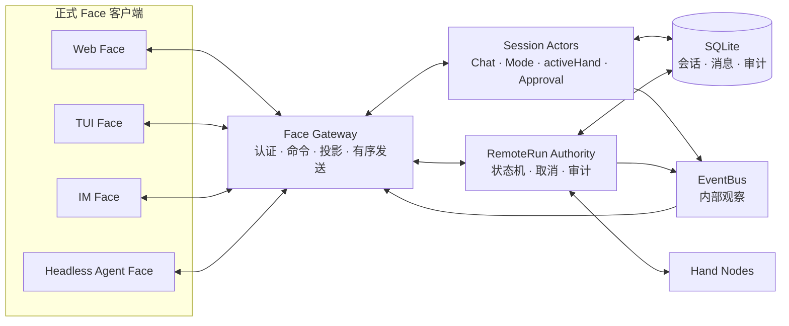

# Face 接入与统一协议设计

> Face 核心 wire contract、身份凭据、四步挑战握手、应用层加密和后台 task 协议的最终冻结实施规格见 [`archived/face-core-closure-plan.md`](archived/face-core-closure-plan.md)。本文保留完整 Face Alpha runtime 设计。

## 状态

Face Alpha P0-P4 runtime 已落地。`gateway-core` 已提供 Web、TUI、IM Bot 和 Headless Agent Face 共用的 typed payload、独立凭据、四步挑战握手、强制加密和严格验证；Mind 已提供 Conversation Manager、scope 驱动的 Face Gateway、快照、订阅、有序队列、Chat/cancel、异步审批、run/task cancel 以及结构化事件；Headless JSONL 与人类终端 Face 已通过真实 Mind/Hand/Face 进程级 E2E。AI/自动化客户端接入约定见 [`ai-face-protocol.md`](ai-face-protocol.md)。

当前正式 command runtime 支持 Chat/cancel、conversation list/create/rename/snapshot、subscribe、approval resolve、Hand list/get、run get/cancel 和 task list/get/log/cancel。

## 目标

Face 是用户或其他 Agent 进入同一个 Mind 的无状态入口。它负责：

- 认证并连接 Mind。
- 创建、选择和恢复对话。
- 提交输入并接收最终回答。
- 展示工具调用、远程任务和设备状态。
- 接收并处理审批请求。
- 断线后通过 Mind 快照恢复状态。

Face 不保存权威历史，不裁决工具安全，不直接调用 Hand，也不自行推断远程任务终态。Mind 始终是会话、审批、任务和设备关系的权威来源。

```text
Face Protocol
├── Web Face
├── TUI Face
├── IM Face
└── Headless Agent Face
```

Headless Agent Face 不是测试后门。它是不渲染 UI、直接读写结构化消息的正式客户端，供其他 Agent、自动化脚本和端到端测试使用。

## 原则

### 一套正式协议

人类客户端和自动化测试使用同一协议。不得为了测试绕过会话、Approval、RemoteRun registry、Hand 最终守门或 SQLite 审计。

### 命令、响应和事件分离

- **Command**：Face 要求 Mind 执行某个动作。
- **Response**：Mind 确认 command 是否被接受并返回直接结果。
- **Event**：Mind 中已经发生的状态变化，可投递给多个 Face。

三者都使用 `protocol.Envelope`，但不能混用语义。收到 accepted 只表示请求进入处理流程，不表示任务成功。

### 结构化数据优先

`message` 只用于人类展示。Face 和测试 Agent 必须依赖稳定的消息类型、错误码和结构化 `data`，不得解析日志文本。

### 快照加增量事件

Face 首次打开或断线重连后先获取权威快照，再消费实时事件。SQLite 是恢复依据；EventBus 只负责进程内实时通知，不是唯一事实来源。

### 审批显式授权

能聊天不代表能批准敏感操作。Face token 必须携带明确 scope，审批必须绑定对话、请求、工具和参数摘要。

## 现有基础与边界

### Envelope 可以复用

现有 `protocol.Envelope` 继续作为传输包装，提供消息类型、消息 ID、路由、连接级 session、严格递增序号、JSON payload 和 AAD 上下文。Hub 已支持 `PeerFace`，无需新增网络栈。

### Event 可以复用但必须结构化

现有 `events.Event` 可以继续作为内部事件模型。关键事件必须填充 `Data`。例如远程执行变化不能只发布：

```text
run=xxx hand=dev-01 tool=exec_command status=running
```

而应提供：

```json
{
  "run_id": "run-123",
  "hand_id": "dev-01",
  "tool": "exec_command",
  "status": "running",
  "duration_ms": 120
}
```

### EventBus 只作为进程内总线

现有 EventBus 不直接承担远程 Face 的可靠投递，因为它目前：

- 没有取消订阅和会话过滤。
- 异步发布不保证连续事件顺序。
- 没有慢客户端背压策略。
- 没有事件游标和重放。
- Writer 失败后不会自动清理远程连接。

Face 不直接注册为 EventBus Writer。Mind 应增加 Face Gateway，由它接收 command、读取权威状态，并把内部事件投影成有序的正式 Face Event。

## 标识符模型

当前代码中连接和对话都使用过 `session_id`。Face 接入后必须区分：

| 标识 | 生命周期 | 用途 |
|---|---|---|
| `connection_session_id` | 一次 WebSocket 连接 | 防重放和路由，对应当前 `Envelope.SessionID` |
| `conversation_id` | 一个持久化对话 | 历史、Mode、active Hand 和审批边界 |
| `request_id` | 一次 Face command 或 Chat | 关联 accepted、事件、结果和取消 |
| `run_id` | 一次远程执行 | 关联审批、RPC、取消和审计 |

约束：

- `Envelope.SessionID` 保持连接级语义。
- Face payload 一律使用 `conversation_id`，不新增含糊的 `session_id`。
- `Envelope.MsgID` 是传输消息 ID，不替代 `request_id`。
- 同一 Face identity 下的 `request_id` 必须幂等。
- 一个 Chat 请求可以产生零个或多个 `run_id`。

## 总体架构



### Face Gateway

- 处理 `PeerFace` 鉴权和连接生命周期。
- 校验 command 类型、scope、payload 和 `request_id`。
- 路由到正确的 Session Actor 或 RemoteRun Authority。
- 为每个连接维护有序出站队列。
- 按 identity、conversation 和事件类型过滤。
- 将内部 Event 投影成稳定 Face Event。
- 处理慢客户端和断线清理。
- 从 store 生成快照，不把 EventBus 当作权威存储。

### Session Actor

每个 `conversation_id` 串行管理 `Core.Chat()`、history、Mode、active Hand、auto allow/deny 和当前审批。不同 conversation 可以并发，同一 conversation 的状态变更必须有确定顺序。

### RemoteRun Authority

Face 查询和取消 run 必须复用现有 Authority。Face Gateway 不直接向 Hand 发送 RPC，也不复制 `use_hand` 的安全与审计逻辑。

## Face 鉴权与权限

Face 与 Hand 必须使用不同的 token 类型和校验路径。当前 `remoteexec.Authority` 对所有 Peer 使用 Hand token 验证，只能视为 Hand 专用实现，Face 接入前必须拆分。

建议 Face identity 至少包含：

```go
type FaceIdentity struct {
	ID     string
	Label  string
	Scopes []string
}
```

Alpha 最小 scope：

| Scope | 能力 |
|---|---|
| `face:chat` | 发起和取消 Chat |
| `face:sessions:read` | 列出会话和读取快照 |
| `face:sessions:write` | 创建和重命名会话 |
| `face:runs:read` | 查看远程执行 |
| `face:runs:cancel` | 取消远程执行 |
| `face:approve` | 批准或拒绝操作 |
| `face:hands:read` | 查看 Hand 与能力 |

约束：

- 默认 token 不自动拥有 `face:approve`。
- 审批审计必须包含 Face identity、时间和决定。
- Headless Agent Face 普通测试使用只读或非审批 token。
- 对抗测试需要审批能力时使用独立测试身份和隔离环境。
- Face token 可单独撤销，不得复用 `hand_tokens`。

公网 Face 会传输完整对话和审批信息，必须使用 TLS/WSS 或完成应用层加密接入。token 不得写入日志和事件，Web Face 还需限制 Origin。

## 消息集

Face 消息使用 `face.` 前缀，避免和 Hand RPC 混淆。

### Face 到 Mind

```text
face.chat
face.chat.cancel
face.conversation.list
face.conversation.create
face.conversation.snapshot
face.conversation.rename
face.subscribe
face.approval.resolve
face.run.get
face.run.cancel
face.hand.list
face.hand.get
face.task.list
face.task.get
face.task.log
face.task.cancel
```

### Mind 到 Face

```text
face.accepted
face.result
face.error
face.snapshot
face.event
```

`face.event` payload 中携带稳定的业务事件类型：

```text
chat.started
chat.tool_called
chat.tool_completed
chat.completed
chat.failed
chat.cancelled
approval.requested
approval.resolved
remote_run.changed
hand.connected
hand.disconnected
conversation.changed
task.changed
```

## 通用格式

所有 command 必须包含 `request_id`：

```go
type FaceCommandMeta struct {
	RequestID      string `json:"request_id"`
	ConversationID string `json:"conversation_id,omitempty"`
}
```

通用错误：

```go
type FaceError struct {
	RequestID      string `json:"request_id,omitempty"`
	ConversationID string `json:"conversation_id,omitempty"`
	Code           string `json:"code"`
	Message        string `json:"message"`
	Retryable      bool   `json:"retryable"`
}
```

Alpha 错误码：

```text
invalid_request
unauthorized
forbidden
conversation_not_found
request_conflict
request_in_progress
approval_not_found
approval_expired
run_not_found
hand_not_found
busy
cancelled
timeout
internal_error
```

客户端只能依赖 `code` 做逻辑判断，`message` 不属于兼容契约。

## Chat 生命周期

发起 Chat：

```json
{
  "type": "face.chat",
  "payload": {
    "request_id": "req-123",
    "conversation_id": "conv-1",
    "content": "在开发机上运行测试"
  }
}
```

Mind 完成鉴权、conversation 查找和请求登记后立即返回 `face.accepted`：

```json
{
  "type": "face.accepted",
  "payload": {
    "request_id": "req-123",
    "conversation_id": "conv-1",
    "operation": "chat"
  }
}
```

最终返回 `face.result`：

```go
type FaceResult struct {
	RequestID      string `json:"request_id"`
	ConversationID string `json:"conversation_id"`
	Status         string `json:"status"`
	Content        string `json:"content,omitempty"`
	ErrorCode      string `json:"error_code,omitempty"`
	Error          string `json:"error,omitempty"`
}
```

`status` 取值为 `succeeded`、`failed`、`cancelled` 或 `timed_out`。每个已接受 Chat 必须恰好产生一个终态 `face.result`，中间工具事件不能代替最终结果。

### Chat 并发

- Alpha 中同一 conversation 同时只允许一个 active Chat。
- 第二个请求返回 `busy`，不隐式并发修改 history。
- 不同 conversation 可以并发。
- 工具结果和 run 永远归属创建它们的 conversation/request，不受 Face 后续切换影响。

### Chat 取消

```go
type FaceChatCancel struct {
	RequestID       string `json:"request_id"`
	TargetRequestID string `json:"target_request_id"`
	ConversationID  string `json:"conversation_id"`
	Reason          string `json:"reason,omitempty"`
}
```

取消必须传播到 `Core.Chat()` context。若 Chat 正等待远程 run，还应复用现有 `rpc_cancel` 链路，不得只停止 Face 等待而留下失控远端任务。

## 会话快照与订阅

快照至少包含：

```go
type ConversationSnapshot struct {
	ConversationID   string             `json:"conversation_id"`
	Name             string             `json:"name"`
	Mode             string             `json:"mode"`
	ActiveHand       string             `json:"active_hand,omitempty"`
	Messages         []FaceMessage      `json:"messages"`
	PendingChats     []ChatSummary      `json:"pending_chats"`
	PendingApprovals []ApprovalSummary  `json:"pending_approvals"`
	ActiveRuns       []RemoteRunSummary `json:"active_runs"`
	SnapshotVersion  int64              `json:"snapshot_version"`
}
```

`SnapshotVersion` 是业务快照版本，不等于连接级 `seq`。Alpha 可只保证单个 Mind 进程内递增；持久化事件游标属于后续增强。

订阅命令：

```go
type FaceSubscribe struct {
	RequestID       string   `json:"request_id"`
	ConversationIDs []string `json:"conversation_ids,omitempty"`
	EventTypes      []string `json:"event_types,omitempty"`
}
```

- 空 conversation 列表表示订阅该身份可访问的全部会话。
- 空事件类型表示订阅全部正式 Face Event，不包括内部 debug 日志。
- 订阅只影响增量事件，不改变 command response。
- Face Gateway 必须先安装订阅，再返回 accepted，避免状态窗口丢失。

推荐同步流程：

```text
connect and authenticate
  → face.subscribe
  → face.accepted(snapshot_version=N)
  → face.conversation.snapshot
  → face.snapshot(version>=N)
  → consume face.event
```

## Face Event

```go
type FaceEvent struct {
	EventSeq       int64           `json:"event_seq"`
	ConversationID string          `json:"conversation_id,omitempty"`
	RequestID      string          `json:"request_id,omitempty"`
	Type           string          `json:"type"`
	Source         string          `json:"source"`
	Level          string          `json:"level"`
	Message        string          `json:"message"`
	Data           json.RawMessage `json:"data,omitempty"`
	Timestamp      time.Time       `json:"timestamp"`
}
```

`EventSeq` 由 Face Gateway 对每个连接分配，只保证该连接内有序，不用于跨重连防重放，也不替代数据库事件序号。

Alpha 必须结构化的事件：

| Event Type | 必需 Data |
|---|---|
| `chat.started` | `request_id` |
| `chat.tool_called` | `request_id`, `tool`, `args_digest` |
| `chat.tool_completed` | `request_id`, `tool`, `success` |
| `chat.completed` | `request_id` |
| `chat.failed` | `request_id`, `code` |
| `approval.requested` | 审批 ID、工具、原因、参数摘要和过期时间 |
| `approval.resolved` | 审批 ID、decision 和 actor |
| `remote_run.changed` | `run_id`, `hand_id`, `tool`, `status`, `duration_ms` |
| `hand.connected` | `hand_id`, `hostname`, `os`, `arch` |
| `hand.disconnected` | `hand_id` |

内部 LLM 原始请求、完整工具参数、token 和敏感输出默认不得投递给 Face。调试能力需要显式 scope 和脱敏规则。

## 审批生命周期

审批由进程级 Broker 表示为可异步裁决的 conversation 对象；REPL 和 Face 共用同一个 Broker：

```go
type ApprovalRequest struct {
	ApprovalID     string    `json:"approval_id"`
	ConversationID string    `json:"conversation_id"`
	RequestID      string    `json:"request_id"`
	RunID          string    `json:"run_id,omitempty"`
	Tool           string    `json:"tool"`
	Reason         string    `json:"reason"`
	ArgsDigest     string    `json:"args_digest"`
	ExpiresAt      time.Time `json:"expires_at"`
}
```

Face 裁决：

```go
type FaceApprovalResolve struct {
	RequestID  string `json:"request_id"`
	ApprovalID string `json:"approval_id"`
	Decision   string `json:"decision"`
	Reason     string `json:"reason,omitempty"`
}
```

decision 取值：

```text
allow_once
deny_once
allow_session
deny_session
```

约束：

- 只有 `face:approve` identity 可以裁决。
- 首个合法裁决生效，后续裁决返回 `request_conflict`。
- 过期审批返回 `approval_expired`。
- 结果写入审计并包含 Face identity。
- 审计只保存 tool、reason、参数摘要、identity、decision 和时间；不保存原始工具参数。reason 最多 1024 UTF-8 字节。
- session 级决定只能影响所属 conversation。
- Hand 仍验证 Approval 摘要并保留最终守门权。

## Run 查询与取消

```go
type FaceRunGet struct {
	RequestID      string `json:"request_id"`
	ConversationID string `json:"conversation_id"`
	RunID          string `json:"run_id"`
}

type FaceRunCancel struct {
	RequestID      string `json:"request_id"`
	ConversationID string `json:"conversation_id"`
	RunID          string `json:"run_id"`
	Reason         string `json:"reason,omitempty"`
}
```

Face Gateway 必须验证 run 属于该 identity 可访问的 conversation。取消只能通过 RemoteRun Authority 发起。

后台任务取消通过 `face.task.cancel` 发起，同时要求 `face:tasks:read` 与 `face:tasks:cancel`。Gateway 校验 task 的 conversation 归属后复用 TaskService，Hand 确认取消后再次查询状态，最终 `face.result.data` 返回取消 outcome 与脱敏 task 快照。

## 顺序、背压与断线

### 顺序

每个 Face 连接只有一个出站发送循环。其他 goroutine 只向有界队列写入，不直接并发写 WebSocket。

保证：

- accepted、相关事件和 result 按产生顺序发送。
- 同一 `request_id` 终态只发送一次。
- 同一 run 的状态不会在该连接上倒退。

不保证不同 conversation 间的全局业务顺序，也不保证断线前最后一条未确认写入一定被客户端收到。

### 背压

- 每个连接使用固定容量队列。
- command response、审批和终态事件不可静默丢弃。
- debug 和可重建中间事件可优先丢弃，但应记录计数。
- 关键事件无法入队时关闭慢连接，由客户端通过快照恢复。
- 慢 Face 不得阻塞 Chat、Authority 或其他 Face。

### 断线恢复

Alpha 通过重新认证、安装订阅和获取快照恢复。断线期间的瞬时事件可以不完整回放，但 snapshot 必须包含权威消息、pending 状态和 run 终态。

## 幂等与并发

Mind 按 Face identity 和 `request_id` 记录近期 command：

- 相同 ID 和相同 payload：返回已有 accepted 或最终结果。
- 相同 ID 和不同 payload：返回 `request_conflict`。
- 已开始 Chat 不重复调用 LLM。
- 已发起 cancel 不重复创建取消流程。
- 已裁决 approval 不重复改变结果。

多个 Face 可以订阅同一 conversation。一个 Face 发起的 Chat 和 run 状态应推送给所有有权限订阅者。Face 断开默认不取消已经接受的 Chat。

## Headless Agent Face

Headless Agent Face 用于其他 Agent 和自动化测试，至少支持两种模式。

### 用户行为模式

通过 `face.chat` 提交自然语言，观察模型是否理解任务、选择正确 Hand、使用正确工具、触发必要审批并得到正确结果。

### 确定性基础设施模式

系统测试不依赖真实模型。Alpha 应提供 Scripted LLM 或 fixture provider，按脚本返回固定 tool calls，确定性验证 Face → Mind → Hand → Mind → Face 链路。

若后续增加 `face.tool.execute`，它必须复用 LLM 工具调用的 Approval、registry 和审计链路。不得提供以下旁路：

- 跳过 Face 鉴权。
- 直接修改 Session Actor 状态。
- 直接向 Hand 发送未经 Authority 管理的 RPC。
- 跳过 Approval digest。
- 仅在测试构建中使用另一套消息语义。

### 机器输出

- stdout 只输出 JSONL 协议消息。
- 日志写 stderr。
- 每条输出独占一行。
- 以成功注册响应作为 ready 条件，或输出明确 ready marker。
- 进程非零退出表示连接或协议失败；被测任务失败通过 `face.result.status` 表达。

## 最小端到端场景

### 跨 Face 恢复

```text
Face A 打开 conversation
  → 发送 Chat 并收到回答
  → Face A 断开
  → Face B 获取同一 conversation snapshot
  → 历史包含该轮对话
```

### 远程执行成功

```text
Face 发起 Chat
  → Scripted LLM 调用 list_hands/get_hand_info/use_hand
  → Hand accepted/running/succeeded
  → Face 收到有序 remote_run.changed
  → Face 收到唯一 chat result
  → SQLite 存在消息和 run 审计
```

### 审批

```text
Chat 请求敏感工具
  → Face 收到 approval.requested
  → 无 approve scope 的 Face 被拒绝
  → 有 approve scope 的 Face allow_once
  → Hand 验证摘要后执行
  → 审计记录审批 identity 和结果
```

### 取消

```text
Face 发起长任务
  → run 进入 running
  → Face 发送 face.run.cancel
  → Authority 发送 rpc_cancel
  → run 收敛为 cancelled
  → Face 收到唯一终态
```

### 断线恢复

```text
Face 在任务 running 时断开
  → Hand 继续执行并到达终态
  → Face 重连获取 snapshot
  → snapshot 显示正确终态
```

### 幂等

```text
Face 重复发送相同 request_id 和 payload
  → 只启动一次 Chat 或远程副作用
  → 返回同一 accepted 或 result
  → 相同 request_id 不同 payload 返回 request_conflict
```

## 测试要求

### 协议单测

- 所有 payload 可无损 JSON 编解码。
- 必填字段、枚举和错误码有验证测试。
- 连接 session 与 conversation ID 不混用。
- `request_id` 幂等和冲突行为确定。

### Face Gateway 单测

- Face/Hand 鉴权路径隔离。
- scope 校验和 conversation 过滤。
- 有序出站队列。
- 慢客户端断开且不阻塞其他客户端。
- 断开后订阅和 waiter 被清理。

### 多入口 race 测试

- 两个 Face 同时访问同一 conversation。
- 不同 conversation 并发 Chat 不串历史。
- 多 Face 同时裁决一个 approval 只有一个成功。
- Face 切换 conversation 与 Hand result 同时发生时，run 仍归属原 conversation。

### 进程级端到端测试

2026-07-19 已落地于 `modules/half-pi-mind/e2e/`，并纳入 Mind race 测试与全仓 `make test`。

- 使用临时目录和端口启动真实 Mind、Hand、Headless Face 和 TUI Face。
- 使用 Scripted LLM，不调用真实模型。
- 等待结构化 registered/ready 消息，不使用固定 sleep。
- 验证 SQLite、最终响应和远程进程退出。
- 所有 Go 测试使用 `-race -count=1`。

### 真实模型 Eval

真实模型 Eval 与确定性系统测试分开，建议统计任务完成率、Hand 选择率、工具参数正确率、不必要调用数、审批触发率、耗时和 token 用量。真实模型不要求固定轨迹，只要求满足成功条件和安全约束。

## Alpha 实施顺序

### F0：协议与身份

- 增加 Face typed payload 和验证函数。
- 区分 Face token 与 Hand token。
- 定义 scope 和错误码。

验收：Face 独立鉴权，Hand token 不能获得 Face 权限。

### F1：Face Gateway 与快照

2026-07-18 已完成。

- 服务模式初始化 Session Actor/Core 工厂。
- 实现 conversation list/create/snapshot。
- 实现订阅和每连接有序队列。
- 投影关键结构化事件。

验收：两个 Headless Face 可读取同一 conversation，重连后通过快照恢复。

### F2：Chat 闭环

2026-07-18 已完成。

- 实现 chat、accepted、result 和 cancel。
- 管理 `request_id -> context/status/result`。
- 实现同一 conversation 的 busy 语义。
- 增加 Scripted LLM。

验收：Headless Face 可确定性驱动完整工具循环，每个 Chat 只有一个终态。

### F3：审批与 run 同步

2026-07-19 已完成。

- 将阻塞式 Approver 升级为 conversation 级审批对象。
- 实现 approval requested/resolve。
- 完成 run cancel、审批关联和更完整的 run 同步；run get 与结构化 run 事件已在 F1 落地。
- 审计 Face identity。

验收：Face 可完成敏感远程执行审批，越权、过期和重复裁决均被拒绝。

### F4：进程级 E2E 与首个 UI

2026-07-19 已完成。

- 实现 Headless Agent Face JSONL 客户端。
- 增加真实二进制进程级测试。
- 在同一协议上实现首个 Web 或 TUI Face。
- 补充断线、慢客户端和 race 测试。

验收：人类 Face 和 Headless Face 对同一 conversation 观察到一致状态，不存在测试专用旁路。

## Alpha 完成定义

- Web/TUI/Headless 中至少两个 Face 共用同一正式协议。
- Face 与 Hand 使用独立鉴权路径。
- Face 可创建、列出、打开和恢复 conversation。
- Chat 有 `request_id`、accepted、唯一终态和取消能力。
- 多 Face 可观察同一 conversation 的任务和 run 状态。
- 审批可结构化展示和裁决，并记录审批 identity。
- run 取消经过 RemoteRun Authority。
- 重连通过快照恢复，不依赖本地 Face 权威状态。
- 关键事件使用结构化 Data，不解析日志文本。
- Headless Agent Face 能运行确定性端到端场景。
- `make test` 在 race 模式下通过。

## Alpha 非目标

- 无限事件历史和任意游标回放。
- 多用户组织、完整 RBAC、SSO。
- 跨 Mind 联邦同步。
- 离线 Face 写入和冲突合并。
- Chat token 级流式输出。
- 所有 IM 平台适配。
- 将 EventBus 改造成分布式消息队列。

这些能力不应阻塞首个跨设备闭环。
