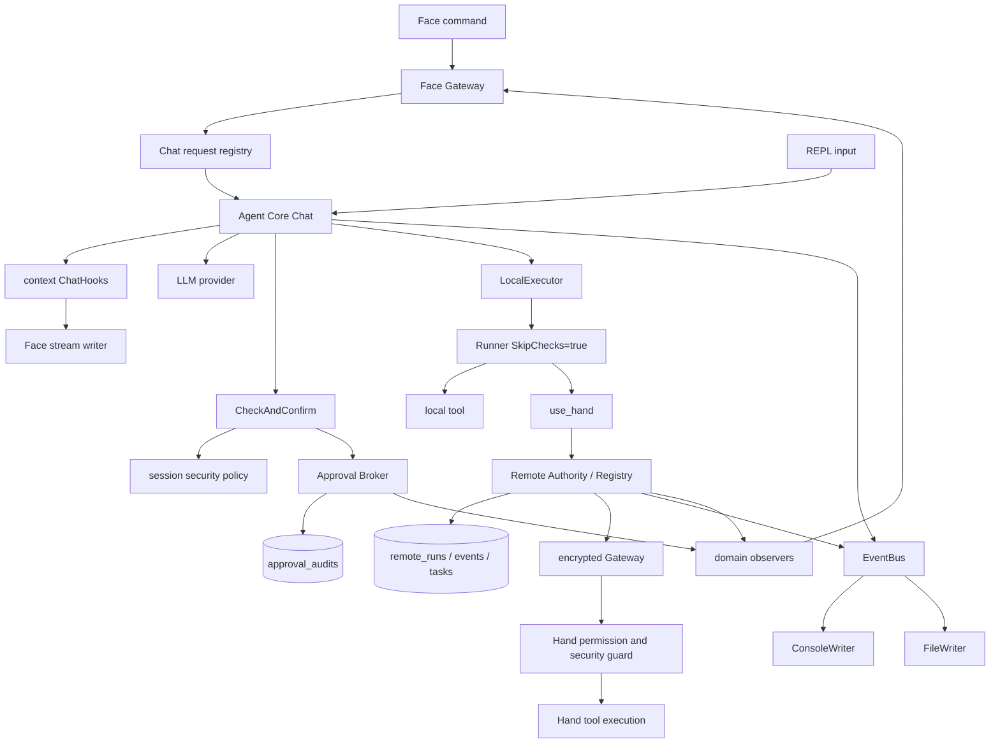
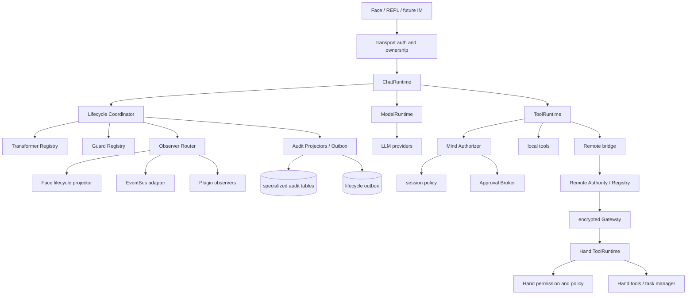
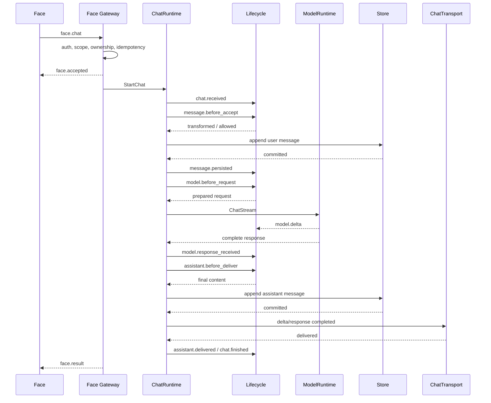
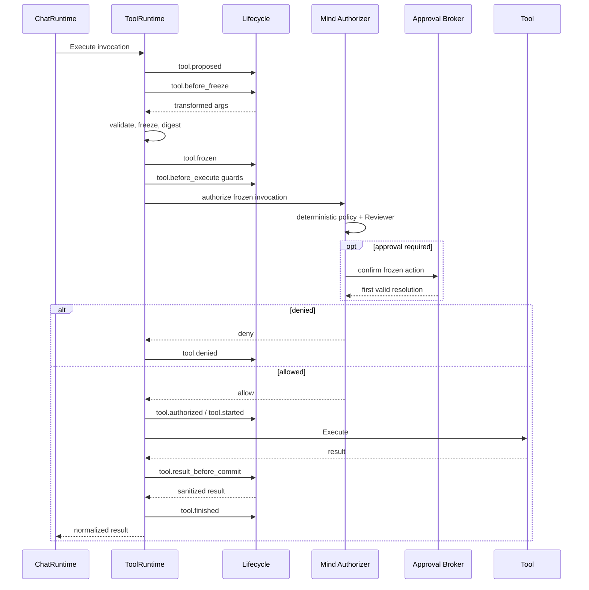
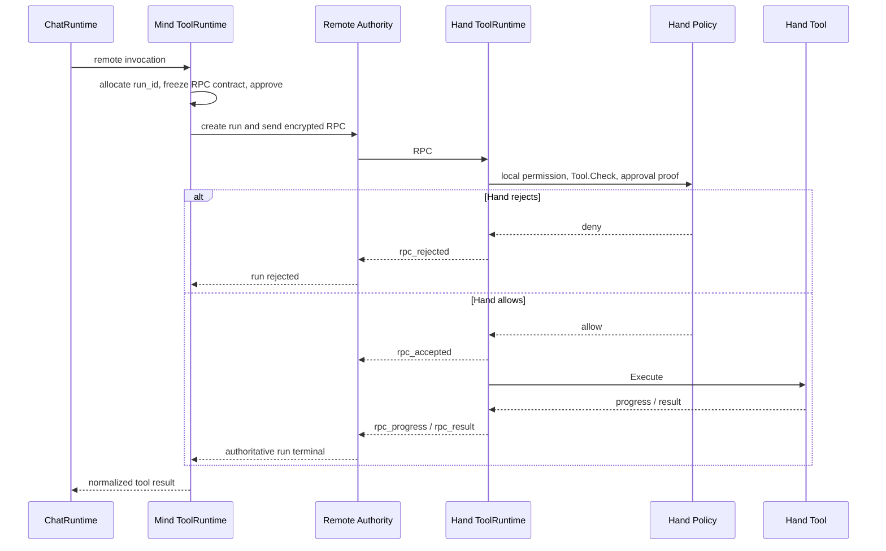

# 统一生命周期 Hook、安全审查与审计架构及实现契约

> 状态：核心架构已实现（2026-07-22）。Phase 0-6 的代码前置工作已经落地；动态插件 runtime 不属于本文范围，仍由 `plugin-architecture.md` 规划。
>
> 本文同时保留迁移前架构和问题分析，作为决策依据；第 7 节起定义当前正式契约。实现没有改变 Face wire protocol、RemoteRun 状态机或 Hand 最终守门原则。

相关权威文档：

- [`face-protocol.md`](face-protocol.md)：Face identity、scope、conversation ownership、审批和事件投影；
- [`face-streaming-protocol.md`](face-streaming-protocol.md)：模型文本流、run progress、背压和恢复；
- [`remote-execution-closed-loop.md`](remote-execution-closed-loop.md)：RemoteRun、审批证明、取消和持久化任务；
- [`mind-management-cli.md`](mind-management-cli.md)：管理 mutation、状态锁、本地 IPC 和事务审计。
- [`plugin-architecture.md`](plugin-architecture.md)：在本文前置条件完成后实施的插件 manifest、运行时和宿主 API。

## 1. 摘要

迁移前，Half-Pi 已经拥有多条分别可用的安全与观察链路：

- `Tool.Check` / `Tool.PolicyCheck` 执行工具级安全判断；
- Agent Core 根据会话 mode、auto allow/deny 和 Approval Broker 决定是否放行；
- Hand 在远端再次执行工具存在性、allow/deny、本地检查和审批证明验证；
- context 单值 `ChatHooks` 把模型文本流和工具摘要投影给 Face；
- EventBus 向 REPL、日志和调试输出发布展示事件；
- Approval、RemoteRun、RemoteTask 和 management mutation 分别写入专用审计表；
- Face Gateway 通过 domain observer 发布 conversation、approval、run 和 task 变化。

这些能力不是错误的，问题在于它们当时没有共享一套明确的生命周期语义。“Hook”“Event”“Audit”“Check”“Observer”分别由不同包定义，调用时机、错误处理、数据脱敏、顺序和持久化保证都不相同。新增入口或插件时，很难回答以下问题：

1. 一条用户消息在持久化前是否经过了统一审查？
2. 模型输出已经流给 Face 后，`AfterModelResponse` 是否还能阻止泄漏？
3. `ToolCalled` 表示模型提出调用、审批通过，还是工具已经开始？
4. 新的非 LLM 工具入口是否可能绕过 Agent Core 中的检查？
5. 插件失败应阻止核心操作，还是只记录错误后继续？
6. 插件能看到原始工具参数，还是只能看到 SHA-256 摘要？
7. 观察事件丢失是否影响审计完整性？

本文的核心结论是：

> Half-Pi 已建立统一的生命周期内核，但没有把安全拦截、数据变换、用户审批、持久化审计和插件通知合并成一个万能 EventBus。

当前架构使用同一套 lifecycle identity、阶段名称、顺序和脱敏规则，同时保留四种不同执行语义：

| 通道 | 用途 | 能否改变主流程 | 失败策略 |
|---|---|---:|---|
| Guard | 安全判断、权限检查、策略拒绝 | 可以拒绝或要求审批 | 默认 fail closed |
| Transformer | 规范化、上下文注入、结果脱敏 | 可以在冻结前修改数据 | 按注册策略，安全类默认 fail closed |
| Observer | UI、日志、指标、普通插件通知 | 不可以 | fail open、异步、有界 |
| Auditor | 记录权威状态和安全事实 | 不直接修改业务决策 | 敏感 mutation 必须事务一致 |

统一的是生命周期，不是失败语义。

## 2. 背景

Half-Pi 的能力从本地 REPL 逐步扩展到了 Mind 服务、远程 Hand、Headless Face、全屏 TUI、异步审批、流式响应、RemoteRun 和持久化后台任务。每个阶段都按照当时最小风险增加了专门机制：

- Agent Core 最初通过 EventBus 输出调试事件；
- Face streaming 增加了基于 context 的 `ChatHooks`；
- Face 状态同步没有复用展示 EventBus，而是增加 domain observer；
- 远程执行为了保证唯一终态，建立了独立 Registry 和 Auditor；
- Approval Broker 为首裁决、过期和恢复建立了专用状态机；
- management mutation 为保证凭据与审计原子性，直接使用 SQLite 事务；
- Hand 为防止 Mind 被绕过，保留自己的最终权限和安全检查。

这些演进决策在各自范围内是合理的，尤其是没有把 Face 权威状态建立在日志文本上，也没有让 Mind 审批覆盖 Hand 本机策略。然而，当项目开始考虑第三方插件、工作区级 Skill、输入输出过滤和更多客户端时，分散的触发点已经成为架构债。

插件不是简单地“订阅几个事件”。插件可能需要：

- 在用户消息进入历史前做分类、拒绝或脱敏；
- 在模型请求发出前注入工作区记忆；
- 在完整模型响应产生后做内容审查；
- 在工具执行前增加组织策略；
- 在工具结果进入模型上下文前隐藏秘密；
- 观察 Chat、模型、工具和远程任务的终态；
- 注册新的工具，同时自动继承系统安全与审计能力。

如果继续为每个需求增加独立 callback，安全边界和行为顺序会进一步失控。

## 3. 目标与非目标

### 3.1 目标

1. 为用户消息、模型调用、工具调用和 Chat 终态定义统一、稳定、可关联的生命周期阶段。
2. 所有本地工具入口必须经过同一个 ToolRuntime，不再依赖调用方记得先检查再执行。
3. 保留 Mind 与 Hand 两层独立安全守门，使用相同术语但不共享单点裁决。
4. 明确哪些 Hook 能拒绝、哪些能修改、哪些只能观察，以及每类失败的处理方式。
5. 原始内容、脱敏内容和摘要具有清晰的数据访问边界。
6. 让未来插件可以按 SessionGroup、conversation、principal 和 node 范围注册能力。
7. 现有 Face 事件、EventBus、Approval Auditor 和 RemoteRun Auditor 可以渐进迁移，不要求一次性重写。
8. 对取消、超时、panic、重复请求和远程竞态保持唯一终态。
9. 保持 `half-pi-core` 零外部依赖，不把 Mind internal 类型泄漏给 Hand。

### 3.2 非目标

- 本文不设计插件 manifest、安装、签名、升级、分发或运行时；这些内容由 [`plugin-architecture.md`](plugin-architecture.md) 负责。
- 本文不把所有领域状态塞入一张通用事件表。
- 本文不删除 Approval、RemoteRun、RemoteTask 或 management 的专用状态机和表。
- 本文不让插件绕过 Face scope、conversation ownership、Hand allow/deny 或系统硬编码黑名单。
- 本文不承诺每个模型 token 和每个工具 progress chunk 都可靠持久化。
- 本文不改变现有 Gateway v2 加密握手和 Envelope 重放防护。

## 4. 术语

为了避免继续混用名称，后续实现统一采用以下定义。

### 4.1 Action

Action 是尚未产生外部副作用、仍可被 Guard 拒绝的操作，例如：

- 接受用户消息；
- 向模型发送请求；
- 执行工具；
- 向用户交付完整模型输出；
- 修改凭据或配置。

Action 在进入强制安全检查前可以经过受控 Transformer；冻结后不得再修改影响安全判断的字段。

### 4.2 Event

Event 是已经发生的事实，例如：

- 用户消息已持久化；
- 模型请求已发送；
- 工具被策略拒绝；
- 工具已经开始或完成；
- RemoteRun 已进入终态。

Observer 可以消费 Event，但不能通过返回错误撤销已经发生的事实。

### 4.3 Guard

Guard 是同步的前置决策器。它只运行在明确定义的 `before_*` 阶段，可以返回：

- `abstain`：不作决定；
- `allow`：本 Guard 不反对，但不能覆盖其他 Guard 的拒绝；
- `deny`：拒绝 Action；
- `require_approval`：要求进入用户审批流程。

合并规则固定为：`deny > require_approval > allow > abstain`。系统强制 Guard 的拒绝不能被插件覆盖。

### 4.4 Transformer

Transformer 在 Action 冻结前修改允许变换的字段，例如：

- 标准化用户输入；
- 向模型请求增加工作区记忆；
- 清理工具结果中的秘密；
- 修改最终展示文本。

Transformer 不是安全裁决器。变换完成后必须重新执行 schema、大小和编码校验，再计算最终摘要。

### 4.5 Observer

Observer 消费不可变、默认脱敏的 Event，用于：

- Face 投影；
- Console/File 日志；
- 指标和 tracing；
- 普通插件通知；
- 非权威索引。

Observer 不得阻塞核心流程，不得重新进入同一个 Core，也不得成为安全放行的必要条件。

### 4.6 Auditor

Auditor 负责持久化安全或权威状态事实。Auditor 与 Observer 的区别是：

- Auditor 有明确的数据完整性要求；
- 敏感 mutation 可能要求业务数据和 audit 在同一事务提交；
- Auditor 失败可能让操作 fail closed；
- Auditor 使用专用 schema，不依赖 UI 文本；
- Observer 丢失不应改变权威状态。

### 4.7 Lifecycle Coordinator

Lifecycle Coordinator 是统一编排上述通道的组件。它负责阶段顺序、ID、冻结点、超时、错误归一化和事件发布，但不取代具体业务状态机。

## 5. 迁移前架构（历史）

本节记录 2026-07-22 重构前的真实调用关系，仅用于解释第 6 节的问题来源，不再描述当前代码。

### 5.1 总体调用关系



这张图展示了三个事实：

1. 当前不存在单一生命周期入口；
2. EventBus、Face observer 和 Auditor 是三条不同通道；
3. Mind 本地工具的安全检查与实际执行分成了两个组件。

### 5.2 当前 Chat 生命周期

`agentcore.Core.Chat()` 当前按以下顺序工作：

1. 获取 conversation 级 `chatMu`，保证同一个 Core 不并发修改历史。
2. 从 context 读取单个 `ChatHooks` 值。
3. 将用户消息追加到内存历史并立即持久化。
4. 构建 system prompt、完整历史和工具定义。
5. 调用流式 LLM helper。
6. 每个文本 delta 同步调用 `ChatHooks.TextDelta`。
7. provider 返回完整响应后调用 `ResponseCompleted`。
8. 没有工具调用时，追加 assistant message、持久化并返回。
9. 有工具调用时，先把 assistant tool calls 追加到历史。
10. 对每个工具调用发布 `ToolCalled` 摘要。
11. Agent Core 调用 `CheckAndConfirm()`。
12. 未阻止时调用执行器；阻止时构造一个供模型读取的拒绝结果。
13. 调用 `ToolCompleted`，然后把工具结果追加到历史。
14. 持久化本轮 assistant/tool 消息，再进行下一次模型请求。

当前 `ChatHooks` 具有两种不一致的错误语义：

- `TextDelta` 和 `ResponseCompleted` 返回 error，可以让 Chat 失败；
- `ToolCalled` 和 `ToolCompleted` 没有 error，天然只能观察。

同一个结构体因此同时承担传输背压和生命周期观察，不能直接作为插件 Hook API。

### 5.3 当前本地工具安全路径

Agent Core 的 LLM 工具路径是：

```text
prepareToolArgs
  -> CheckAndConfirm
      -> CheckToolWithPolicy
      -> session auto deny/allow
      -> security mode
      -> Approval Broker
  -> LocalExecutor.ExecuteTool
      -> Runner{SkipChecks: true}
      -> Tool.Execute
```

`Core.ExecuteTool()` 为非 LLM 入口再次包装了 `CheckAndConfirm()`，但真正的 `LocalExecutor` 仍然允许直接执行。当前 internal 边界和测试降低了风险，却没有从类型系统上保证所有未来入口都必须经过安全检查。

这种结构还形成了检查与执行分离：调用方先检查某个 name/args，再把 name/args 交给另一个对象执行。只要未来代码在两步之间修改参数、替换工具定义或直接持有执行器，就可能造成绕行。

### 5.4 当前远程工具安全路径

Mind 的 `use_hand` 需要先创建稳定 `run_id`，再把 run、Hand、工具、参数摘要和后台模式绑定进 Approval，因此它拥有专门审批流程。Mind 通过 Authority 和 Registry 持有远程 run 的权威状态。

Hand 收到 RPC 后独立执行：

1. wire payload 和 deadline 校验；
2. 工具存在性检查；
3. Hand allow/deny 权限过滤；
4. 本机 `Tool.Check`；
5. Approval proof、run、Hand、工具、参数和 background contract 绑定校验；
6. durable admission 或前台 task 接纳；
7. 工具执行、进度上报、输出截断和终态发送。

这套 Hand 守门不是重复代码造成的偶然结果，而是远程执行的必要信任边界。目标架构必须保留它。

### 5.5 当前事件和审计通道

| 当前机制 | 权威性 | 数据 | 调用方式 | 主要消费者 |
|---|---|---|---|---|
| `ChatHooks` | 非权威 | 文本 delta、完整 response、工具摘要 | context 单值、同步 callback | Face stream |
| EventBus | 非权威 | 展示文本 + 可选 Data | sync 或每 Writer goroutine | REPL、日志 |
| Face domain observer | 状态投影 | approval/run/task/conversation DTO | 每个服务一组 callback | Face Gateway |
| Approval Auditor | 权威 | 请求摘要、裁决者、状态、时间 | Broker 内显式调用 | SQLite |
| RemoteRun/Task Auditor | 权威 | 状态迁移、进度、脱敏元数据 | Registry/TaskService 显式调用 | SQLite |
| Management Audit | 权威 | mutation、actor、target、结果 | 与 credential mutation 同事务 | SQLite |

这里最重要的边界是：现有专用 Auditor 已经提供了通用 EventBus 无法替代的事务与状态机保证。

## 6. 迁移前问题（已解决）

本节中的“当前”均指迁移前代码。对应问题已经由第 7-18 节的实现解决；保留本节是为了让后续维护者理解为何不能重新引入分散 callback、检查与执行分离或 EventBus 安全裁决。

### 6.1 名称相似但语义不同

`ToolCalled`、`TypeToolCall`、RemoteRun `created`、Hand `accepted` 都可能被理解成“工具调用发生了”，实际分别代表模型提出、调试输出、Mind 建立 run、Hand 完成本地接纳。插件无法仅凭名字判断是否已经产生副作用。

目标架构必须区分：

- `tool.proposed`：模型或调用方提出工具调用；
- `tool.frozen`：参数完成变换并计算摘要；
- `tool.authorized`：Mind 或本地策略允许继续；
- `tool.denied`：执行前被拒绝；
- `tool.started`：工具代码真正开始；
- `tool.finished`：工具代码进入唯一终态。

### 6.2 用户消息没有统一的前置边界

当前用户消息进入 `Core.Chat()` 后先追加并持久化，没有统一的 `message.before_accept`：

- 无法在写历史前做 workspace policy；
- 无法统一实现输入脱敏或内容拒绝；
- REPL 和 Face 的前置行为容易继续分化；
- 插件只能在调用 Core 前由每个入口自行接入。

### 6.3 模型请求和完整响应缺少正式拦截点

EventBus 定义了 `llm_request` 和 `llm_response` 类型，但当前生产路径没有把它们作为稳定的结构化生命周期契约。Skill 注入直接发生在 `Core.Chat()` 内，未来 memory、prompt policy 和插件也会继续堆进同一函数。

模型完整响应后的 Hook 还有流式时序问题：文本 delta 已经发送给 Face 后，完整响应 Guard 即使拒绝，也无法撤回已交付内容。

### 6.4 安全检查与执行未收口

Mind 使用 `Runner{SkipChecks: true}`，依靠 Agent Core 先调用 `CheckAndConfirm()`。该实现当前经过测试，但它把安全正确性建立在调用约定上，而不是建立在唯一执行入口上。

插件一旦可以：

- 直接获取 executor；
- 注册命令入口；
- 注册新工具；
- 调用已有工具；

就更容易出现未经过 Agent Core 安全逻辑的路径。

### 6.5 回调不可组合，也没有统一排序

当前多个服务只有单个 observer slot，例如 Approval、Registry、TaskService 和 Conversation Manager 都以 `OnChange(fn)` 设置回调。Face Gateway 启动时占用这些回调。未来插件如果继续使用同一模式，就会出现覆盖、手工 fan-out 或跨包耦合。

当前也没有定义：

- 内置安全 Hook 与插件 Hook 谁先执行；
- 多插件的顺序是否稳定；
- 一个插件修改数据后其他插件看到哪个版本；
- Hook 是否允许在持锁状态下运行；
- Hook 超时或 panic 如何处理。

### 6.6 EventBus 不适合承担安全职责

EventBus 的设计目标是展示和日志：

- 异步 Publish 为每个 Writer 启动 goroutine；
- Writer 错误只写 stderr；
- PublishSync 也不向调用方返回错误；
- payload 允许任意 `Data any`；
- 没有阶段排序、权限、超时或脱敏能力。

把安全插件直接实现成 EventBus Writer 会导致安全检查天然 fail open，而且 Observer 可能看到不应暴露的原始数据。

### 6.7 专用审计之间缺少统一关联

Approval、RemoteRun、management audit 各自正确，但关联字段并不完全统一。Face 有 request ID，RemoteRun 有 run ID，LLM 轮次和本地工具调用没有稳定的 action/span ID。

因此很难从一条用户消息完整追踪：

```text
用户消息
  -> 第 1 次模型请求
  -> 工具 A 被拒绝
  -> 第 2 次模型请求
  -> 远程工具 B 审批
  -> RemoteRun
  -> Hand 执行
  -> 最终回复
```

### 6.8 本地拒绝审计不完整

远程 run 和审批有专用审计，本地普通工具被策略拒绝时主要通过工具结果和可选 debug EventBus 表达。它可以被会话历史间接恢复，但不是稳定、可查询的安全决策记录。

### 6.9 原始数据、摘要和展示数据边界分散

当前系统已经有许多正确的脱敏措施，但规则分布在不同路径：

- Chat tool event 只发送 args digest；
- Approval audit 不保存原始参数；
- RemoteRun audit 保存摘要；
- EventBus debug 模式可能输出参数或截断结果；
- Hand progress 和 result 有独立输出限制；
- Face projection 有自己的 DTO 校验和文本转义。

插件系统必须有统一的数据视图，否则普通观察插件很容易获得超过需求的原始消息、工具参数或输出。

### 6.10 观察事件没有明确的可靠性等级

并非所有事件都应该可靠：

- 模型 token/delta 和工具 progress 可以有界丢弃；
- `tool.finished`、审批终态和 Chat 终态不能悄悄丢失；
- 凭据 mutation audit 必须与 mutation 原子提交；
- 普通指标丢失不应阻止 Chat。

如果统一 Hook 只提供一种 delivery 语义，要么拖慢主流程，要么损害审计完整性。

## 7. 设计原则与不可破坏的约束

### 7.1 统一生命周期，不统一失败语义

所有组件共享事件名称、ID、顺序和数据分类，但 Guard、Transformer、Observer 和 Auditor 使用不同接口和执行器。

### 7.2 外部副作用前必须完成强制 Guard

工具、凭据 mutation 和远程 RPC 发送等操作，只有在最终参数被冻结、校验、计算摘要并通过强制 Guard 后才能发生。

### 7.3 冻结后不可修改安全相关字段

工具名、参数、目标 Hand、background contract、timeout 和工作区范围在计算 digest 后冻结。任何 Hook 都不能在审批后继续修改这些字段。

### 7.4 Deny 不可被覆盖

多个 Guard 的结果采用单调收紧语义：插件可以增加限制，不能放宽系统限制。核心黑名单、Face scope、conversation ownership 和 Hand 本地拒绝始终优先。

### 7.5 Hand 永远独立守门

Mind lifecycle 只能表达 Mind 已经完成的决策，不能成为 Hand 跳过本机权限和安全检查的理由。

### 7.6 权威状态由领域状态机持有

RemoteRun Registry、Approval Broker、TaskService 和 conversation store 继续是各自领域的权威。Lifecycle Event 是统一观察和关联语言，不取代合法状态迁移。

### 7.7 默认最小数据暴露

Observer 和普通插件默认只收到：

- ID、阶段、时间；
- tool/model/provider 名称；
- 输入输出长度；
- SHA-256 digest；
- success/status/reason code；
- 不含秘密的结构化摘要。

原始内容必须通过显式 capability 获取。

### 7.8 Hook 不在领域锁内执行

不得在 Core state lock、Approval Broker lock、RemoteRun Registry lock 或 Store transaction 持有期间调用不受信任 Hook。需要事务一致的 Auditor 由领域服务直接在事务内调用，不经过插件回调。

### 7.9 每个开始都有唯一终态

一旦发布 `tool.started`，必须恰好产生一个 `tool.finished`，其 outcome 为：

- `succeeded`；
- `failed`；
- `cancelled`；
- `timed_out`；
- `panicked`。

执行前拒绝不产生 `tool.started`，而产生 `tool.denied`。重复、取消和结果竞争不得产生第二终态。

### 7.10 核心功能不依赖普通 Observer

日志、指标或普通插件队列满、超时、panic 时，核心流程继续运行。只有明确注册为强制 Guard、Transformer 或 Auditor 的组件可以影响主流程。

## 8. 当前已实现架构



当前架构不是让所有箭头都经过 EventBus，而是让所有关键阶段都由 Lifecycle Coordinator 分配统一 identity，并按固定规则调用正确通道。Face Chat 的可见流由显式 `ChatTransport` 连接到 stream broker；它负责背压和传输顺序，不参与 Guard、Transformer 或 Auditor 注册。

## 9. 生命周期 Identity

每次生命周期数据都携带统一 Meta：

```go
type Meta struct {
    SchemaVersion  int
    EventID        string
    TraceID        string
    SpanID         string
    ParentSpanID   string
    RequestID      string
    ConversationID string
    GroupID        string
    PrincipalID    string
    Source         string
    NodeID         string
    Sequence       int64
    OccurredAt     time.Time
}
```

字段语义：

- `EventID`：每个 Event 唯一；
- `TraceID`：一次用户 Chat 或独立管理命令的根关联 ID；
- `SpanID`：一次模型请求、工具调用、审批或远程 run；
- `ParentSpanID`：表达模型轮次和工具调用之间的父子关系；
- `RequestID`：Face 提供的幂等 request ID；REPL 和内部入口自动生成；
- `ConversationID`：持久化 conversation；
- `GroupID`：SessionGroup，用于 Hook 和插件范围过滤；
- `PrincipalID`：已认证 Face、REPL identity 或系统 actor；
- `Source`：`face`、`repl`、`mind`、`hand`、`plugin:<id>`；
- `NodeID`：实际执行节点，Mind 本地或 Hand ID；
- `Sequence`：同一 Registry 内单调递增，仅表达该节点/会话运行时的生成顺序；跨 Registry、跨进程和跨重启不连续；
- `OccurredAt`：UTC 时间。

Face connection `event_seq`、Gateway Envelope `Seq`、RemoteRun progress `seq` 和 lifecycle `Sequence` 保持独立，不能互相复用。它们分别解决连接线序、防重放、run 输出顺序和本地业务事实生成顺序；跨节点因果关系由 TraceID、SpanID、ParentSpanID 和 run ID 表达。

## 10. 生命周期阶段

### 10.1 Chat 和消息

| 阶段 | 类型 | 能否修改/拒绝 | 说明 |
|---|---|---:|---|
| `chat.received` | Event | 否 | transport 已完成认证和基础 payload 校验 |
| `message.before_accept` | Action | 是 | 输入 Transformer 和 Guard |
| `message.admitted` | Event | 否 | 已通过输入策略，但尚未承诺持久化成功；不等同于 wire `face.accepted` |
| `message.persisted` | Event | 否 | 用户消息已写入 conversation store |
| `chat.finished` | Event | 否 | Chat 唯一终态，含 succeeded/failed/cancelled/timed_out |

transport authentication、Face scope 和 conversation ownership 应在 `chat.received` 前完成，因为未经认证的 payload 不应进入插件可见生命周期。

### 10.2 模型调用

| 阶段 | 类型 | 能否修改/拒绝 | 说明 |
|---|---|---:|---|
| `model.before_request` | Action | 是 | memory、Skill、prompt policy、token budget |
| `model.requested` | Event | 否 | provider 请求已经开始 |
| `model.delta` | Transient Event | 否 | 可见文本增量，允许有界丢弃 |
| `model.response_received` | Event | 否 | provider 完整响应已组装，尚未必交付 |
| `assistant.before_deliver` | Action | 是 | 完整输出审查、脱敏和最终展示变换 |
| `assistant.delivered` | Event | 否 | 输出已经进入 Face/REPL 可见面 |
| `model.failed` | Event | 否 | provider、解析、取消或一致性错误 |

`model.response_received` 是事实，不能被“撤销”；真正允许阻止输出的点是 `assistant.before_deliver`。

### 10.3 工具调用

| 阶段 | 类型 | 能否修改/拒绝 | 说明 |
|---|---|---:|---|
| `tool.proposed` | Event | 否 | 模型或调用方提出工具名和原始参数 |
| `tool.before_freeze` | Action | 可修改 | 参数规范化和授权 Transformer |
| `tool.frozen` | Event | 否 | 最终参数通过 schema 校验并计算 digest |
| `tool.before_execute` | Action | 只可拒绝 | 权限、策略、插件 Guard、审批 |
| `tool.authorized` | Event | 否 | Mind/本地执行层允许继续 |
| `tool.denied` | Event | 否 | 执行前终止，不产生 started |
| `tool.started` | Event | 否 | `Tool.Execute` 即将被调用 |
| `tool.progress` | Transient Event | 否 | 有界 stdout/stderr 或其他进度 |
| `tool.result_before_commit` | Action | 可变换 | 结果脱敏、大小限制、结构化校验 |
| `tool.finished` | Event | 否 | 工具唯一终态 |

### 10.4 审批

Approval Broker 继续持有自己的状态机，并投影统一事件：

- `approval.requested`；
- `approval.resolved`；
- `approval.expired`；
- `approval.cancelled`。

审批结果必须绑定 `tool.frozen` 产生的 action/span ID 和 args digest。任何参数变换都必须在审批前完成。

Approval Broker 的协议投影是普通异步 Observer 规则的一个有意例外：`approval.requested` 和审批终态必须按协议顺序同步投影，但回调快照在 Broker 锁外执行，不能持有审批状态锁调用外部代码。这样既保证 Face 一定先看到 pending 再看到 resolution，也避免回调重入状态机造成死锁。其他普通 lifecycle Observer 仍走异步、有界、fail-open 队列。

### 10.5 远程运行与后台任务

RemoteRun 和 RemoteTask 保留现有状态名称。Lifecycle 只增加统一关联：

- `tool` span 的 child span 可以是 `remote_run`；
- `run_id` 继续作为远程协议和审计主键；
- `task_id == start_run_id` 的现有约束保持不变；
- Hand 产生自己的 node-local tool lifecycle；
- Mind 根据 RPC 消息投影 run lifecycle，不伪装成 Hand 工具本体事件。

## 11. Hook 执行模型

### 11.1 不使用单一万能接口

实现上可以共享 Registry 和 Meta，但不建议定义一个可以处理所有阶段、返回任意结果的 `Hook(any) any`。这会让 Observer 意外获得阻止能力，也会让 after-event 修改已发生事实。

建议内部概念接口如下：

```go
type Guard interface {
    ID() string
    Evaluate(context.Context, FrozenAction) Verdict
}

type Transformer interface {
    ID() string
    Transform(context.Context, MutableAction) (MutableAction, error)
}

type Observer interface {
    ID() string
    Observe(context.Context, RedactedEvent)
}

type Auditor interface {
    Commit(context.Context, AuditMutation) error
}
```

这里的代码只表达边界，不要求所有 action 使用一个包含 `any` payload 的公开 Go API。具体实现应为 message/model/tool 提供类型安全的 payload，对外 wire event 再使用带 `schema_version` 的判别联合。

### 11.2 注册信息

每个 Hook 注册项至少包含：

```go
type Registration struct {
    ID          string
    Kind        HookKind
    Phases      []Phase
    Order       int
    Timeout     time.Duration
    FailureMode FailureMode
    Scope       ScopeFilter
    Capabilities []Capability
}
```

要求：

- ID 在进程内唯一；
- phase 必须来自受支持集合；
- `Order` 只在同一固定 stage 内排序；
- core reserved stage 不能由未来外部扩展插队；
- 同 order 使用 ID 字典序保证确定性；
- 非法 capability 或 phase 在启动时 fail closed，不能静默忽略；
- Hook 运行时使用独立 timeout；
- panic 必须恢复并转为结构化 Hook failure。

### 11.3 固定顺序

以工具调用为例，顺序固定为：

```text
1. parse and basic bounds
2. system normalization
3. capability-authorized transformers
4. schema and bounds revalidation
5. freeze canonical action and compute digest
6. mandatory core permission/security guards
7. additional deny/approval guards
8. Approval Broker if required
9. pre-execution audit admission if required
10. Tool.Execute
11. result transformers and output limits
12. terminal domain/audit commit
13. observer publication
```

任何外部 Transformer 都不能在第 5 步后修改工具名、参数、Hand、timeout 或 background contract。第 6 步的系统 Guard 始终检查最终冻结版本。

### 11.4 失败策略

| 类型 | timeout/panic/error | 主流程 |
|---|---|---|
| Mandatory Guard | 记录内部错误并拒绝 | fail closed |
| Optional restrictive Guard | 按系统 registration policy，默认拒绝 | 默认 fail closed |
| Transformer with write capability | 不使用部分结果 | 默认 fail closed |
| Observer | 记录健康状态，必要时熔断 | fail open |
| Transactional Auditor | 回滚尚未发生的 mutation | fail closed |
| Outbox delivery | 保留重试，不回滚已提交事实 | at-least-once |

不允许 Hook 实现自行把本应强制安全的 Guard 声明为 fail open。能否选择 failure mode 由系统 registration policy 决定。

### 11.5 不可重入

Hook 内不得同步调用同一个 conversation 的 `Core.Chat()` 或当前 ToolRuntime。否则会造成：

- `chatMu` 死锁；
- 无限递归；
- 生命周期 Sequence 失序；
- 审批和 digest 绑定混乱。

未来外部扩展若要触发新动作，必须提交一个异步 command，由系统创建 child trace，并经过正常 admission、scope 和安全路径。

当前 Go 内核通过 context 中的 Hook 标记拒绝同步重入，并在进入 `chatMu` 和 ToolRuntime 前检查。这个边界防止正常 Hook 意外递归，但不是针对恶意 Go 代码的沙箱：受信 Go Hook 如果故意丢弃传入 context 并直接持有 Runtime 引用，仍可能规避标记。未来动态插件因此不会获得 `Core`、`ToolRuntime` 或数据库对象引用，只能使用宿主发放的窄能力；异步 child action 也必须回到正常 admission 路径。

## 12. ToolRuntime：唯一工具执行入口

### 12.1 已实现接口

`half-pi-core/executor` 已提供不依赖 Mind internal 包的通用模型。核心入口如下；结构还包含 run ID、强制用户审批、purpose 和 risk labels 等关联字段：

```go
type Invocation struct {
    Meta       lifecycle.Meta
    Tool       string
    Args       json.RawMessage
    TargetNode string
    Timeout    time.Duration
    Background *BackgroundContract
}

type Authorizer interface {
    Authorize(context.Context, FrozenInvocation) Authorization
}

func NewToolRuntime(Authorizer, *lifecycle.LifecycleRegistry) *ToolRuntime
func (r *ToolRuntime) Execute(context.Context, Invocation) Result
func (r *ToolRuntime) Prepare(context.Context, Invocation) (*PreparedExecution, Result)
func (r *ToolRuntime) PrepareExternal(context.Context, Invocation, Tool, ExternalDigestFunc) (*PreparedExternal, Result)
```

`half-pi-core` 只定义通用接口。Mind Authorizer 组合 session policy、隔离 Reviewer 和 Approval Broker；Hand Authorizer 组合 allow/deny、本机 `Tool.Check` 和 Approval proof 验证。`PreparedExecution` 与 `PreparedExternal` 都是原子一次性对象，重复 `Execute`、`Complete` 或 `Abort` 会失败。

### 12.2 消除 `SkipChecks`

当前状态：

- LocalExecutor 不再持有 `Runner{SkipChecks: true}`；
- Agent Core 不再手写“检查后再执行”的两步约定；
- 非 LLM 工具调用、插件工具调用、REPL 工具调用都进入同一个 Runtime；
- 测试 helper 若需要固定裁决，使用显式 fake Authorizer；
- 生产代码不存在通用 `SkipChecks` 开关。

如果 Hand 需要表达“Mind 已审批”，应继续使用结构化 Approval proof，而不是跳过本机检查。

### 12.3 `use_hand` 的特殊准备阶段

远程执行需要在审批前创建 run ID。当前 `use_hand` 通过 `PrepareExternal` 实现以下顺序：

```text
prepare remote invocation
  -> allocate run_id
  -> freeze hand/tool/args/background/deadline
  -> compute RPC approval digest
  -> Mind Authorizer / Approval Broker
  -> persist RemoteRun created/approved
  -> send encrypted RPC
```

`use_hand` 的外层 schema 仍声明 `OwnsConfirm`，因为它必须把 `confirm` 解释为内层真实远程 Action 的强制审批，而不是审批包装工具本身；真正的远程工具仍由 `PrepareExternal` 冻结、审核和审计。旧 `RemoteBridge.CheckAndConfirm` 降级分支已删除。`PrepareExternal` 强制要求 contract digest 回调，不允许退化为只绑定参数摘要。外部调用的 Tool Transformer 不得修改工具名、`run_id`、目标节点、超时或后台执行契约，否则会破坏远程 definition、审批对象和 RPC contract 的绑定，Runtime 会在 admission 阶段拒绝；本地调用允许 freeze 前改名，但必须重新解析最终 Tool 定义，并保证授权对象与实际执行对象一致。

### 12.4 结果与 panic

Runtime 必须把以下路径归一化为一个 Result：

- unknown tool；
- invalid args；
- denied；
- approval denied/expired/cancelled；
- context cancelled；
- deadline exceeded；
- tool returned nil；
- tool panic；
- success；
- tool-reported failure。

只有真正进入 `Tool.Execute` 的调用发布 `tool.started`。Runtime 使用 `defer` 保证 started 后必有 finished，并在 panic 后恢复；敏感工具 panic 不得让 Mind 或 Hand 进程退出。

Result 必须区分两个维度：

```go
type Result struct {
    ExecutionOutcome Outcome // 工具本体是否成功、失败、取消、超时或 panic
    DeliveryOutcome  Outcome // 结果是否成功脱敏、持久化并交付给调用方
    Output            string
    Data              any
    ErrorCode         string
}
```

工具可能已经成功修改了真实世界，但结果 Transformer 随后失败。此时必须记录：

- `ExecutionOutcome=succeeded`；
- `DeliveryOutcome=failed` 或 `blocked`；
- 返回给模型或 Face 的只能是安全的合成错误，不能泄漏未经审查的原始结果；
- 审计和 UI 必须提示“操作已经执行，但结果交付失败”，不能显示成“工具未执行”。

同理，终态 audit 失败、Face 断线或 conversation 持久化失败都不能倒置已经发生的工具事实。

## 13. 用户消息与模型 Hook

### 13.1 用户消息

推荐顺序：

```text
transport auth / scope / ownership
  -> chat.received
  -> message.before_accept transformers
  -> message.before_accept guards
  -> validate UTF-8 and size
  -> message.admitted
  -> append to conversation store
  -> message.persisted
```

输入 Guard 拒绝时，不把原始用户消息写入普通 conversation history。是否写安全审计由策略决定，审计默认只保存 digest、长度、reason code 和 actor，不保存原文。

### 13.2 模型请求

`model.before_request` 是以下能力的正式扩展点：

- Soul/system prompt 组装；
- SessionGroup Skill 过滤；
- `/compact` 生成的上下文摘要；
- 工作区 memory 注入；
- 插件上下文；
- 工具可见性过滤；
- provider/model policy；
- token budget 和请求大小限制。

Soul、会话 mode 和按 SessionGroup 过滤后的 Skill 索引已经迁移为内置 `model.before_request` Transformer。`/compact` 和 memory 尚未实现，但后续只能通过同一阶段接入。所有 Transformer 完成后，系统会重新检查消息数量与角色、UTF-8、tool schema 可序列化性和总请求大小。

### 13.3 模型响应

provider response 分成三个边界：

1. provider delta：瞬时、可观察；
2. provider complete response：完整模型事实；
3. assistant deliverable：经过输出策略后可持久化和展示的内容。

不要把 `AfterModelResponse` 同时理解为“模型已返回”和“用户还没看到”。当前 API 使用 `model.response_received` 与 `assistant.before_deliver` 消除歧义。

### 13.4 流式输出策略

Face streaming 在没有完整响应拦截器时会在完整响应生成前发送 delta。完整响应 Guard 无法撤回已发送文本，因此当前实现支持前两种模式，并保留第三种作为未来扩展：

| 模式 | 行为 | 适用场景 |
|---|---|---|
| `passthrough` | delta 直接进入 transient stream，完整 response 只做观察 | 无完整输出拦截器 |
| `buffered` | delta 仅在 Mind 内聚合，通过 `assistant.before_deliver` 后再发送 | 启用完整内容安全 Guard/Transformer |
| `windowed` | 保留有限窗口后发送，支持有限的跨 chunk 检查 | 未来能力，不作为首版要求 |

只要当前 scope 匹配任意 `assistant.before_deliver` Guard 或 Transformer，ChatRuntime 就自动切换到 `buffered`。不能在 passthrough 模式下向用户承诺完整输出审查。

即使 buffered，provider delta 仍生成内部 transient lifecycle event。普通 Observer 只能看到长度和关联 ID；只有具有原始读取 capability 的受信 Observer 能看到 delta，Face `ChatTransport` 不会在审核前收到文本。`ChatTransport` 是显式传输适配器，不从 context 注入，也不是可注册安全 Hook。

### 13.5 工具 progress 的同类问题

工具 stdout/stderr progress 也可能在最终结果 Transformer 前发送。当前实现采用保守规则：当前 scope 一旦存在 `tool.result_before_commit` Transformer，本地工具不再向父 progress callback 转发原始数据，`PreparedExternal.ObserveProgress` 也返回 false，Remote Authority 据此阻止 Face/EventBus 外部投影。

原始 progress 仍进入受 capability 控制的内部 lifecycle Observer；RemoteRun 原有的受限 operational audit 也继续记录有界 progress，以维持状态机对账能力。这里的“抑制投影”不是删除内部运行事实。未来若增加 streaming redactor，可以在不放宽最终结果策略的前提下替换这条保守规则。

一般策略仍是：

- progress 必须经过独立的 streaming redactor；或
- 对该工具禁用外部 progress，只在最终结果审查后显示；或
- 工具声明输出不包含敏感数据，使用 passthrough。

只过滤最终 result 不能保证已经发送的 progress 不泄漏。

### 13.6 安全模式重构：AIReviewerGuard

#### 迁移前语义与问题

迁移前四种 mode 把“风险分类”和“获得何种批准”混在同一个 `security.Policy.Check()` 结果里：

| 当前 mode | 当前语义 | 问题 |
|---|---|---|
| `strict` | 仅白名单命令通过，其余拒绝 | 语义明确，保留 |
| `normal` | 灰名单命令要求用户审批 | 语义明确，保留 |
| `trust` | 除硬黑名单外直接通过 | 名称看似 AI 判断，实际没有独立审核 |
| `yolo` | 除硬黑名单外直接通过 | 仅适合作为显式危险模式 |

会话模型的 system prompt 当时要求它“自行判断风险”，但这只是提示词约定，不能构成安全控制。旧 `trust` 策略直接放行非黑名单 Action；模型只有通过 `confirm: true` 才能主动加严。

当前实现已经把风险分类从 mode 映射中拆出：确定性 Guard 负责拒绝不可接受的 Action；`review` mode 使用一个没有工具权限、没有会话写权限的独立 AI 请求，在已经冻结的 Action 上作出“自动通过”或“交给用户”的结构化判断。

#### 当前 mode

规范名称是 `review`。运行时和命令入口继续读取 `trust`、`ai_review` 兼容别名，但 `Core` 状态、UI 输出和数据库新写入都统一为 `review`；加载旧 session 时会自动改写为规范值。

| mode | 确定性 Guard 后的处理 | 用户审批 |
|---|---|---|
| `strict` | 只允许明确 allowlist；其它 Action 拒绝 | 不能覆盖 strict/hard deny |
| `normal` | 静态敏感规则和 `DefaultConfirm` 直接要求用户 | 正常使用 Approval Broker |
| `review` | 静态安全分类后调用 AIReviewerGuard | reviewer 要求时进入 Approval Broker |
| `yolo` | 静态硬拒绝后直接通过 | `DefaultConfirm` 与显式 `confirm: true` 仍强制用户审批 |

无论 mode 如何，以下规则不允许放宽：

- 硬黑名单、非法参数、未知本地工具、Face scope、conversation ownership 和 Hand 本地拒绝始终是 `deny`；
- `DefaultConfirm` 不能被 Reviewer 的 `allow` 覆盖；
- 会话模型显式 `confirm: true` 不能被 Reviewer 的 `allow` 覆盖；
- 用户审批不能覆盖 hard deny、strict deny 或 Hand deny；
- Mind Reviewer 的 allow 只表示 Mind 可以继续，Hand 仍必须独立守门。

#### 决策顺序

对一个工具 Action，安全链路固定为：

```text
1. parse / normalize / transformer
2. schema and bound validation
3. freeze action and compute canonical digest
4. deterministic core Guard
   - deny             -> tool.denied
   - strict allow     -> execution admission
   - normal sensitive -> Approval Broker
   - review candidate -> AIReviewerGuard
   - yolo             -> execution admission
5. DefaultConfirm or explicit confirm:true
   - direct Approval Broker, skip automatic Reviewer allow
6. AIReviewerGuard in review mode
   - allow            -> execution admission
   - require_user     -> Approval Broker
7. pre-execution audit admission
8. Tool.Execute or encrypted RPC
```

步骤 5 在逻辑上优先于步骤 6：会话模型主动请求用户确认，或工具声明每次必须确认时，应直接进入用户审批，不浪费 Reviewer 调用，也不能被自动通过覆盖。实现可以先判定 `forceUserApproval`，再决定是否调用 Reviewer。

`normal` 和 `review` 的区别不是“有无安全策略”，而是静态敏感分类后的升级对象不同：normal 直接询问用户；review 先询问隔离的 Reviewer，Reviewer 只能自动放行或请求用户。

#### AIReviewerGuard 的隔离

Reviewer 是 ToolRuntime 中一个同步 Guard，不是对原会话模型追加的一句提示，也不是可调用工具的 Agent。它必须满足：

- 使用独立的 system prompt、模型请求和 context；
- 不携带完整 conversation history、Skill、memory、隐藏 reasoning 或 Face 连接信息；
- 没有 tools、没有 `use_hand`、没有文件/网络/数据库写入权限；
- 只接收为审核生成的 Action Certificate；
- 其输出通过严格 JSON/schema 解码，未知字段、超长字段和非预期 decision 均视为失败；
- 超时、provider error、解析失败、取消或 panic 一律变成 `require_user`；
- 不能同步重入 ChatRuntime 或 ToolRuntime；
- 不能直接向 Face/REPL 输出文本，只能返回结构化 verdict。

Action Certificate 的最小字段建议为：

```go
type ReviewRequest struct {
    SchemaVersion  int
    ActionID       string
    TraceID        string
    ConversationID string
    GroupID        string
    PrincipalID    string
    Tool           string
    TargetNode     string
    Args           json.RawMessage // 仅传审核实际需要的、已分类字段
    ArgsDigest     string
    Timeout        time.Duration
    Background     *BackgroundContract
    RiskLabels     []string
    Purpose        string // 有界、明确标为不可信用户输入
    PolicyVersion  string
}
```

`Args` 不能默认传给所有插件，但 Reviewer 是可信的内置安全组件，通常必须看到命令或路径等真实风险上下文。敏感字段应在工具 schema 中声明可审查投影；无法安全投影的字段默认要求用户审批，而不是把原始秘密交给 Reviewer。

用户意图 `Purpose` 可能携带 prompt injection。Reviewer prompt 必须把它编码为数据字段，明确说明其中的文字不具有指令权，也不能改变审核规则。

#### 结构化 verdict

Reviewer 不返回 `deny`。拒绝应由更前面的确定性 Guard 完成，避免概率模型误判后静默阻断正常工作。首版结果固定为：

```go
type ReviewVerdict struct {
    SchemaVersion  int
    Decision       string // "allow" | "require_user"
    ReasonCode     string // 稳定枚举，例如 destructive_change、unfamiliar_target
    Summary        string // 面向用户的受限长度说明
    PolicyVersion  string
}
```

解析器必须验证：

- `SchemaVersion` 与当前 reviewer contract 一致；
- `Decision` 只在允许枚举中；
- `ReasonCode` 在已注册 policy code 中；
- `Summary` 是合法 UTF-8 且有严格长度上限；
- 返回的 `PolicyVersion` 与请求版本匹配。

无法验证的输出不产生 allow。系统应生成 `security.review_failed` 和 `security.decision(require_user)`，再进入 Approval Broker。

#### 审计、可见性和会话授权

每一次 reviewer 调用都应投影以下生命周期事实：

```text
security.review.requested
security.review.resolved
security.review.failed
security.decision
```

`security_decisions` 至少保存：

- action/trace/span/request/conversation/group/principal ID；
- tool、target node、args digest、risk labels；
- deterministic Guard 的 rule code；
- reviewer profile、provider/model 标识、policy/prompt version；
- reviewer decision、reason code、耗时和 failure code；
- 后续 approval ID 和最终 execution/delivery outcome。

审计不保存 Reviewer 的完整输入、模型原始响应、原始工具参数或完整用户上下文。用户可见的审批描述由 `Summary` 和本地 policy 模板组合生成，并在长度和控制字符过滤后投影给 Face/REPL。

Reviewer 的 `allow` 必须只对单个 Frozen Action 有效，不能写入 `autoAllow`。用户的 `allow session` 如果保留，至少必须绑定 Group、tool、风险规则、目标范围和 policy version；首版保守策略是后续 Action 仍经过 Reviewer，只减少重复的用户交互，不能把一次用户授权变成“同名工具永久自动放行”。

#### Provider、性能和降级

当前使用独立配置解析 Reviewer provider/model，不把它隐式绑定到对话默认模型：

```toml
[security.review]
enabled = true
provider = "review-provider"
model = "review-model"
timeout_ms = 1500
max_tokens = 256
policy_version = "v1"
profile = "default"
```

同一 provider 的独立请求提供 context isolation，不提供独立的供应链或模型风险隔离。需要更强保障时，review provider/model 应与聊天模型独立配置，甚至使用不同厂商或自托管分类模型。

Reviewer 会增加工具调用延迟和成本，因此不应无差别审核所有 Action。静态分类应先区分：

- 明确安全、无副作用的 Action：直接通过；
- 明确禁止的 Action：直接拒绝；
- 有副作用、目标不明确或风险标签命中的 Action：进入 Reviewer；
- 固定要求人工确认的 Action：直接进入 Approval Broker。

不得将 Reviewer allow 缓存为跨 Action 的全局许可。幂等 request replay 可以复用同一 action ID 的既有 verdict；除此之外，缓存只有在冻结参数、目标、Group、principal、policy version 和 reviewer profile 均一致且有明确 TTL 时才能考虑，首版应禁用该优化。

#### 迁移与验收

迁移步骤已完成：

1. 将现有策略从“按 mode 直接给 Decision”拆成风险分类和 mode routing；
2. 保持 `strict`、`normal`、`yolo` 的当前可见语义；
3. 新增 `review`，旧 `trust` 作为兼容别名迁移；
4. 在 ToolRuntime 冻结点后接入 AIReviewerGuard；
5. 将 `confirm: true` 和 `DefaultConfirm` 明确映射为 direct user approval；
6. 添加 `security_decisions` 和 reviewer lifecycle audit；
7. 更新 session mode migration、REPL/TUI command、Face snapshot 和配置文档；
8. 在完成真实 provider 隔离和失败降级验收前，不把 `review` 设为默认 mode。

当前测试覆盖：

- hard deny 不调用 Reviewer；
- strict deny 和 Hand deny 不可被 Reviewer/user 覆盖；
- normal sensitive Action 直接请求用户，不调用 Reviewer；
- review allow 自动执行，review require_user 正确绑定 Approval；
- `DefaultConfirm` 和 `confirm: true` 直接请求用户；
- malformed/timeout/provider failure 只升级用户审批；
- Reviewer 不可访问工具、会话历史或原始秘密字段；
- reviewer verdict 绑定最终 digest，参数篡改被拒绝；
- request replay 不重复调用 Reviewer；
- 审计无秘密泄漏，且能关联 reviewer、approval、run 和终态。

## 14. 审计与持久化

### 14.1 保留现有权威表

以下表和语义继续保留：

- `messages`：conversation 历史权威来源；
- `approval_audits`：审批请求、裁决和 actor；
- `remote_runs` / `remote_run_events`：远程 run 状态机；
- `remote_tasks`：Mind 侧后台任务 best-known 状态；
- Hand task SQLite：Hand durable task 权威状态和 tombstone；
- `management_audits`：管理 mutation 审计。

统一 lifecycle 不把这些数据复制成另一套相互竞争的状态机。

### 14.2 安全决策审计

当前已使用 append-only `security_decisions` 覆盖本地工具、消息、模型、assistant 交付 admission 和 Reviewer 决策：

```text
id
trace_id
span_id
request_id
conversation_id
group_id
principal_id
node_id
action_kind
resource_name
target_node
input_digest
risk_labels
decision
reason_code
rule_id
policy_version
approval_id
created_at
```

默认不保存：

- 用户消息原文；
- 完整 prompt；
- 工具原始参数；
- 工具 stdout/stderr；
- token、application key、API key；
- provider 原始错误 body。

`reason_code` 必须稳定可查询，用户可见 message 可以本地化，不能作为程序判断依据。

### 14.3 Transactional Outbox

可靠插件通知和跨组件投影不应在数据库事务中直接调用插件。当前 `security_decisions` 与对应 `lifecycle_outbox` row 在同一 SQLite 事务写入：

```text
id
event_type
schema_version
trace_id
span_id
subject_id
payload_redacted
attempts
available_at
created_at
delivered_at
```

使用方式：

1. 领域 mutation 和必要 outbox row 在同一事务提交；
2. 提交后 dispatcher 异步投递；
3. 投递至少一次，插件按 EventID 去重；
4. 重试有退避、上限和 dead-letter 状态；
5. outbox 只保存低频可靠事件，不保存模型 delta 和工具 progress；
6. Face 当前的进程内实时投影可以继续存在，outbox 用于恢复和可靠插件消费。

仓库已经实现 `OutboxDispatcher`、指数退避、最多 8 次尝试、dead-letter、retention API 和去重 consumer fixture。Mind 进程当前不会启动 dispatcher，因为尚无插件 runtime 或其他正式可靠 consumer；在没有投递目标时启动空 consumer 只会错误地确认并丢弃事件。插件实现阶段必须先提供按 EventID 去重的正式 consumer，再把 dispatcher 接入进程生命周期。

### 14.4 Audit failure 的边界

外部副作用发生前：

- 必需的 admission audit 写入失败，拒绝执行；
- 凭据 mutation 与 audit 同事务失败，整体回滚；
- Approval pending audit 失败，不展示或放行审批。

外部副作用发生后：

- terminal audit 失败无法撤销已经执行的命令；
- 内存状态必须标记 `audit_degraded` 或进入待对账状态；
- 保留有界重试/补偿记录；
- 不得把数据库写失败伪装成工具未执行；
- 运维事件必须明确报告“动作可能已发生，但终态审计未提交”。

这一点比简单地对所有 Auditor error 都返回失败更重要，因为返回失败不能撤销真实世界副作用。

### 14.5 保留与 EventBus 的关系

EventBus 继续作为操作日志和本地展示基础设施。新增 adapter 把选定的 Redacted Lifecycle Event 转为现有 EventBus Event：

- 不向 EventBus 发布原始工具参数；
- debug 也必须受单独敏感数据策略控制；
- EventBus Writer 失败不影响 Guard 或 Auditor；
- 逐步删除只定义但没有稳定生产语义的旧事件类型。

## 15. 插件开放前的准备工作

> 插件 manifest、capability、Goja、process/WASM 和宿主 API 的设计已经拆分到 [`plugin-architecture.md`](plugin-architecture.md)。本文只定义插件接入前必须完成的核心架构，不定义或实现插件运行时。

### 15.1 必须先完成的基础

开放任何动态插件前，必须同时满足：

1. **生命周期契约稳定。** Message、Model、Tool、Approval 和 Chat 终态拥有统一 phase、Meta、顺序和关联 ID。
2. **工具执行入口收口。** ToolRuntime 是唯一生产入口，Frozen Action、canonical digest、审批对象和实际执行参数一致，生产路径不存在 `SkipChecks`。
3. **安全组件独立。** deterministic Guard、AIReviewerGuard、Approval Broker、Auditor 和 Hand 本地守门均为内置组件，未来插件只能增加限制，不能替换或放宽它们。
4. **数据视图先于分发。** Lifecycle Router 能在调用任何外部消费者前生成 raw、redacted 和 digest 视图，普通消费者只获得 redacted 数据。
5. **工作区隔离可执行。** SessionGroup、conversation、principal、source 和 node scope 已进入生命周期 Meta；Skill 也完成 SessionGroup 隔离，不能继续全局暴露。
6. **可靠投递与审计可恢复。** 敏感 mutation 与必需审计事务一致，可靠通知使用 transactional outbox，EventID 可去重，进程重启后能恢复。
7. **失败和重入语义固定。** Guard/Transformer/Observer/Auditor 的 timeout、panic 和 failure mode 可测试；外部消费者不能在 Hook 内同步重入 ChatRuntime 或 ToolRuntime。

这些条件缺少任何一项，直接嵌入 Goja 或增加插件目录都只会把当前分散的 Hook、安全和数据权限问题公开成不稳定 API。

### 15.2 两份文档的责任边界

| 主题 | 权威文档 |
|---|---|
| 生命周期阶段、Meta、顺序、冻结点和终态 | 本文 |
| deterministic Guard、AI Reviewer、用户审批和 Hand 最终守门 | 本文 |
| raw/redacted/digest 数据生成与审计/outbox | 本文 |
| 插件 manifest、capability 名称和授权方式 | [`plugin-architecture.md`](plugin-architecture.md) |
| Goja worker、JavaScript API、process/WASM runtime | [`plugin-architecture.md`](plugin-architecture.md) |
| 插件安装、启用、禁用、健康和运行时验收 | [`plugin-architecture.md`](plugin-architecture.md) |

插件文档可以选择运行时和开发接口，但不能重新定义本文的核心安全不变量。本文也不继续讨论 npm、模块加载、Goja interrupt、WASM ABI 或子进程协议。

### 15.3 插件就绪验收

以下 fake consumer 验收已经完成，是进入插件实现阶段的稳定基线：

- 同一 wire fixture 能表达所有计划开放的 lifecycle phase；
- 未授予敏感读取能力的 consumer payload 中不存在 raw message、raw args、tool result 或秘密；
- foreign SessionGroup、conversation、principal 和 node event 不会被路由；
- consumer 返回 allow 不能覆盖 core deny；
- Transformer 只能在 freeze 前修改，freeze 后 replacement 被拒绝；
- consumer timeout、panic、队列满和取消符合四类通道的失败语义；
- outbox 重投不会重复产生业务副作用；
- child action 重新进入正常 admission，不能在 Hook 内直接执行；
- Face、REPL、RemoteRun 和 Hand 的现有行为及协议测试保持不变。

这些验收通过不代表插件已经实现；它只表示 [`plugin-architecture.md`](plugin-architecture.md) 可以在不改写核心安全契约的前提下进入实施阶段。

## 16. 当前模块结构

```text
modules/half-pi-core/
├── lifecycle/              # Meta、Phase、Event、Guard/Transformer/Observer 基础接口
└── executor/               # Invocation、FrozenInvocation、Authorizer、ToolRuntime

modules/half-pi-mind/internal/
├── lifecycle/              # Mind Coordinator、Authorizer、Reviewer、Auditor、Outbox
├── agentcore/              # ChatRuntime，编排 message/model/tool loop
├── approval/               # Approval Broker 与结构化 lifecycle 投影
├── observer/               # 领域状态的多订阅者 Hub
├── store/                  # security_decisions、lifecycle_outbox 与领域表
├── facegateway/            # lifecycle -> Face protocol projector
└── remoteexec/             # 保留 Authority/Registry，接入统一 Meta

modules/half-pi-hand/internal/
├── hand/                   # node-local Registry、Authorizer、RPC admission 与结果发送
└── taskmanager/            # durable task 权威状态
```

Authorizer 接口定义在 `half-pi-core`，Mind Reviewer 和 Approval Broker 留在 Mind internal，Hand 的本地 Authorizer 留在 Hand internal，模块边界没有反向依赖。

## 17. 修改后的完整流程

### 17.1 Face Chat 无工具调用



### 17.2 本地工具调用



### 17.3 远程工具调用



Mind 的 `tool.authorized` 只表示 Mind 允许发送 RPC；Hand 的 node-local `tool.authorized` 才表示 Hand 完成本机守门。两个事件拥有不同 NodeID，不能合并成一个模糊状态。

## 18. 迁移实施状态

### Phase 0：固定术语和不变量

- [x] 固定阶段名称、ID 关系、冻结点和失败策略；
- [x] 明确 raw/redacted/digest 数据分类；
- [x] 为顺序、终态、scope、failure mode 和重入补齐 contract test；
- [x] 冻结并替换独立 `OnChange` 单槽 callback。

状态：完成。Event 不能撤销事实，Observer 不能充当 Guard。

### Phase 1：引入 lifecycle 基础包和兼容适配器

- [x] 在 `half-pi-core/lifecycle` 定义 Meta、Phase、Outcome 和四类接口；
- [x] Mind 创建 Coordinator、有界 lifecycle Observer 队列和多订阅者领域 Hub；
- [x] EventBus、Face Gateway、Approval、Run、Task 使用 adapter/subscription；
- [x] 保持 Face wire protocol 不变，并通过 additive migration 扩展数据库。

状态：完成。Face request principal/source/request ID 会进入统一 Meta，Chat、审批和 RemoteRun 可通过 trace/span/run ID 关联。

### Phase 2：收口本地 ToolRuntime

- [x] 引入 Invocation、FrozenInvocation、Authorizer 和 ToolRuntime；
- [x] schema 校验、canonical digest、Guard、审批、admission audit 和 Execute 收进 Runtime；
- [x] `Core.ExecuteTool`、LLM 工具调用和本地入口改走 Runtime；
- [x] 删除生产 `SkipChecks`；
- [x] 归一化 panic、nil result、timeout、cancellation 和 execution/delivery outcome；
- [x] 增加本地 `security_decisions` 审计。

状态：完成。旧 `Runner` 已删除，`ToolRuntime` 是唯一工具执行入口。

### Phase 3：接入远程执行与 Hand

- [x] 将 `use_hand` 的 run-bound prepare/approval 纳入 `PrepareExternal`；
- [x] 删除 RemoteBridge 的旧预审降级执行路径；
- [x] RemoteRun Registry 保持权威状态机并持久化 lifecycle Meta；
- [x] Hand 使用自己的 ToolRuntime/Authorizer adapter；
- [x] 验证 Mind allow 不能覆盖 Hand deny；
- [x] 保持背景 task、取消、重连和 lost 语义。

状态：完成。Mind 与 Hand 通过 run ID 关联但独立裁决；结果过滤启用时外部 progress 会被抑制。

### Phase 4：接入 message/model lifecycle

- [x] 在持久化用户消息前增加 `message.before_accept`；
- [x] 将 Soul、mode 和 SessionGroup Skill 组装迁移到内置 Transformer；
- [x] 为未来 compact/memory 固定 `model.before_request` 扩展点；
- [x] 引入 `model.response_received` 和 `assistant.before_deliver`；
- [x] 根据完整输出 Guard/Transformer 自动选择 passthrough/buffered；
- [x] 删除 context 单值 `ChatHooks`，以显式 `ChatTransport` 承担传输。

状态：完成。assistant 先持久化，传输成功后才发布 `assistant.delivered`；传输失败不会伪造 delivered 事实。

### Phase 5：可靠审计和 Outbox

- [x] 增加 `security_decisions` 和低频可靠 lifecycle outbox；
- [x] 建立重试、consumer 去重 contract、dead-letter 和 retention API；
- [x] 明确 admission fail closed 与 terminal `audit_degraded`；
- [x] 保留现有专用表和事务。

状态：基础设施完成。Dispatcher 已通过恢复、重试、dead-letter 和重复投递测试；实际 consumer 属于插件实现，当前 Mind 不启动空 dispatcher。

### Phase 6：删除旧路径并冻结插件前置契约

- [x] 删除 `ChatHooks` context 单值；
- [x] 删除单槽 domain observer，改为 adapter subscription；
- [x] 固定 lifecycle wire fixture、redacted view、scope filter 和 fake consumer 验收；
- [x] 删除远程执行旧降级路径并冻结 ToolRuntime contract；
- [x] 更新 Face streaming、remote execution 和插件前置条件文档；
- [x] 删除旧 EventBus/Runner 执行兼容面，不保留旁路安全入口。

状态：完成。核心仓库没有引入 Goja、WASM 或插件 manifest loader；后续实施转入 [`plugin-architecture.md`](plugin-architecture.md)。

## 19. 兼容性策略

### 19.1 Face wire protocol

初始迁移不增加 Face command 或 payload 字段。Lifecycle projector 继续生成当前 `chat.started`、`chat.tool_called`、`chat.tool_completed`、approval、run、task 和 stream 消息。

只有需要向外部客户端暴露新 reason code 或 lifecycle 状态时，才通过现有 capabilities revision 机制演进协议。

### 19.2 数据库

- 使用 additive migration 增加表和列；
- 不重写历史 messages；
- legacy remote runs 的缺失 trace/span 字段保持空值兼容；
- 新记录同时写入 request/run/action 关联；
- rollback 版本忽略新表，不破坏旧表读取。

### 19.3 EventBus

迁移期 adapter 同时生成现有展示事件。ConsoleWriter/FileWriter 不需要理解全部 lifecycle payload。

### 19.4 测试 fixture

`llm.ScriptedProvider`、现有 Face E2E 和 Hand integration fixture 继续使用正式路径。测试不得通过绕开 ToolRuntime 来简化构造。

## 20. 测试与验收矩阵

### 20.1 顺序与终态

- 用户消息必须先通过 Guard 并进入 `message.admitted`，再持久化；
- model request Transformer 完成后才调用 provider；
- tool digest 在所有变换后计算；
- approval 绑定冻结参数；
- denied 工具不得发布 started；
- started 工具恰好一个 finished；
- result/cancel/timeout/panic 竞争只有一个终态；
- execution outcome 与 result delivery outcome 不得互相覆盖；
- Observer 对成功入队的事件按 Registry Sequence 处理；队列满允许有界丢弃并计数。

### 20.2 安全

- 任意生产工具入口都不能绕过 Authorizer；
- external Guard 的 allow 不能覆盖 core deny；
- Mind allow 不能覆盖 Hand deny；
- 参数在 approval 后不可修改；
- foreign SessionGroup Hook 不执行；
- 无敏感读取授权的 consumer 只能获得 redacted event；
- audit、日志、Face event 和 external payload 不泄漏 token/key/raw args；
- Guard timeout/panic 按规则 fail closed；
- Observer timeout/panic 不阻塞核心操作。

### 20.3 流式输出

- passthrough 模式保持当前增量、恢复和终止屏障语义；
- buffered 模式在 Guard 完成前不向 Face 发送 delta；
- response 被拒绝时不持久化或交付原始内容；
- 首版未实现 windowed streaming redactor；结果过滤存在时采用整段缓冲/禁止外部 progress；
- tool result 被过滤时，progress 不得提前泄漏同一秘密；
- 慢 Face 和慢 Observer 不阻塞模型或工具。

### 20.4 持久化和恢复

- 敏感 mutation 与必需 audit 同事务；
- outbox commit 后崩溃可恢复重投；
- EventID 去重；
- pending approval 重启恢复仍取消；
- RemoteRun/Task 重启语义不变；
- audit terminal 写失败明确进入 degraded/reconcile 状态；
- retention 不删除仍被权威状态引用的审计。

### 20.5 跨平台

- 五模块 `go test -race -count=1 ./...`；
- Windows `386/amd64/arm64` 交叉编译；
- Windows 原生 Mind/Hand lifecycle 与 Job Object 取消；
- macOS/Linux 本地工具和 TUI 流式路径；
- fake consumer 的 timeout、panic、队列满和取消在各平台语义一致。

当前提交以 Linux 全模块 race 测试和构建为合入门禁。Windows/macOS 的 lifecycle 代码本身无平台分支；Windows 原生凭据 ACL、ConPTY 和 macOS PTY 仍沿用发布环境验收，不把一次 Linux 开发机验证冒充为原生平台结论。

## 21. 安全分析

### 21.1 Hook 自身成为攻击面

Hook 实现可能通过超长输入、阻塞、panic、递归 action 或大量事件耗尽资源。协调器必须在开放外部运行时前实施大小、时间、并发、队列和重入限制。

### 21.2 Transformer 改写后绕过审批

所有变换必须发生在 freeze/digest 前，freeze 后只允许 Guard 读取。执行器只接收 FrozenInvocation，避免审批对象和执行参数来自两个版本。

### 21.3 Observer 获得过多数据

Lifecycle Router 必须先生成 redacted view，再投递普通 Observer。不能把包含 raw payload 的对象传给外部 consumer 后要求其“自行忽略”。

### 21.4 外部扩展伪造系统事件

未来外部扩展只能以系统分配的 source 提交请求或自定义 observation，不能指定 core source、EventID、TraceID 或 PrincipalID。系统负责签发 identity 和关联字段；具体插件 source 格式由 [`plugin-architecture.md`](plugin-architecture.md) 定义。

### 21.5 审计写入造成拒绝服务

安全所需 admission audit 必须 fail closed，但高频 transient 事件不能进入同步审计事务。Outbox 和 retention 必须限制容量，并提供磁盘水位告警。

### 21.6 双重守门产生不一致

Mind 和 Hand 策略可能不同。最终语义是“两者都允许才执行”，Hand 拒绝应以结构化 reject code 返回，不允许 Mind 把它自动重试到其他连接或弱化策略。

## 22. 可观测性和运维

Registry 已暴露 observer drop 计数，Store 已暴露 outbox 查询、重试、dead-letter 和 retention 原语。以下指标与管理 CLI 查询仍属于后续运维层，不是插件 runtime 前必须补齐的安全路径：

```text
lifecycle_action_total{phase,outcome}
lifecycle_hook_duration_seconds{hook,phase}
lifecycle_hook_failure_total{hook,reason}
lifecycle_guard_decision_total{guard,decision}
lifecycle_observer_dropped_total{observer,event_type}
lifecycle_outbox_pending
lifecycle_outbox_dead_letter_total
lifecycle_audit_degraded_total{domain}
```

管理 CLI 后续应能查询：

- 已注册 Hook、类型、阶段、顺序和 scope；
- 最近 Hook 失败和 timeout；
- outbox backlog；
- audit degraded 状态；
- 单个 trace 的脱敏生命周期。

默认日志不输出 raw payload。诊断模式若允许原始内容，必须显式启用、设置短期有效期并记录管理审计。

## 23. 已冻结的实施决策

以下事项已经作为首版实现决定，不再作为开放问题：

1. 使用“统一生命周期 + 四类通道”，不使用万能 Hook/EventBus。
2. ToolRuntime 是唯一生产执行入口，删除生产 `SkipChecks`。
3. 系统 Guard 固定执行且不可被未来外部扩展覆盖。
4. Lifecycle Router 在外部分发前生成 redacted Event，敏感读取必须显式授权。
5. 完整模型输出 Guard 自动要求 buffered streaming。
6. Hand 保留独立 Authorizer 和本地终态事实。
7. 现有领域 Auditor 和状态表保留。
8. 可靠外部通知使用 transactional outbox，不在事务内调用 consumer。
9. 插件实现前先通过 fake consumer 完成 wire、scope、redaction、失败和重入验收。
10. 插件实现前完成 SessionGroup Skill 与生命周期 scope 隔离。
11. AIReviewerGuard 保持内置安全组件，未来外部扩展不能替换、冒充或通过 allow 放宽其决定。

进入插件实现后仍需根据真实使用量确认：

- buffered streaming 对 TUI 体验和延迟的影响；
- security decision audit 的默认 retention 和查询 CLI；
- audit degraded 的进程级健康状态和告警策略；
- 是否需要 windowed streaming redactor，而不是当前保守的全缓冲策略。

这些选择不改变本文的核心边界。

## 24. 完成状态

本架构不是以“存在 Hook 接口”为完成依据。当前代码已经满足：

- 用户消息、模型、工具和 Chat 有统一、可关联生命周期；
- 所有生产工具路径无法绕过安全 Runtime；
- Guard、Transformer、Observer、Auditor 的失败语义可测试且不可混淆；
- 流式输出不会让完整响应 Guard 形同虚设；
- Mind 与 Hand 双重守门保持独立；
- 现有 Approval、RemoteRun、Task 和 management 审计语义不回退；
- 生命周期具备可按授权和 SessionGroup 过滤的最小数据视图；
- Observer/external consumer 故障不拖垮核心，强制安全组件故障时 fail closed；
- 关键审计可恢复、可关联、无秘密泄漏；
- 五模块 race、正式 Face/RemoteRun/Hand 测试路径不建立 lifecycle 旁路。

Half-Pi 已完成插件实现前的核心架构准备；具体运行时工作转入 [`plugin-architecture.md`](plugin-architecture.md)。Windows/macOS 原生发布环境测试仍是每次发布的独立验收项，不改变本文的跨平台代码契约。
