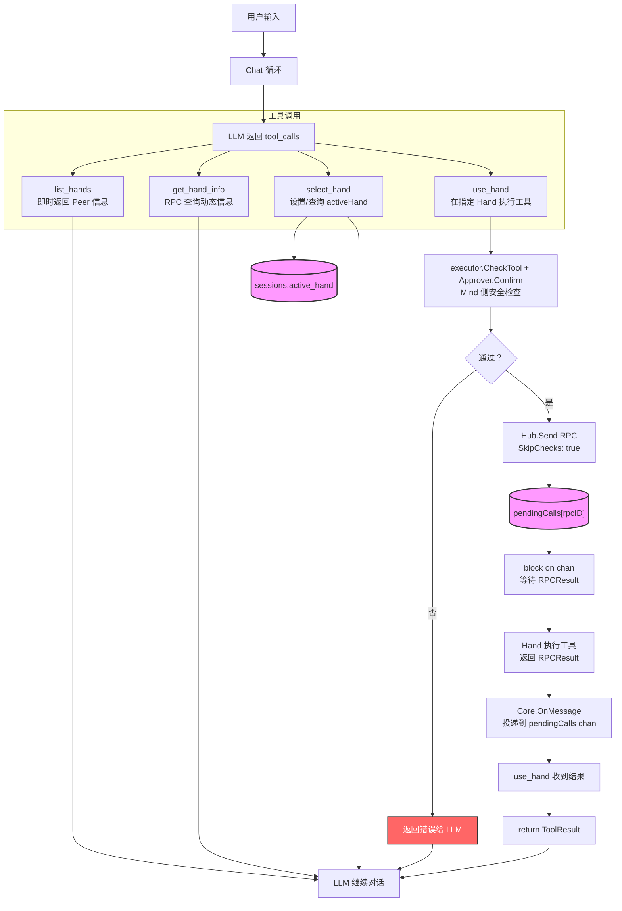

# Mind → Hand 远程执行设计

## 问题

当前 Hand 已能连接 Hub、接收 RPC、执行工具并回传 `RPCResult`，但 Mind 的 `Core.Chat()` 工具调用循环只用 `LocalExecutor`，完全不看远程 Hand。`Core.OnMessage()` 收到 `RPCResult` 后仅打日志，不喂回对话循环。

需要让 LLM 能感知并在远程 Hand 上执行工具。

## 方案：LLM 可调用的 Hand 管理工具

不修改 Chat 循环或 executor 接口，而是提供四个 Mind 本地工具，让 LLM 自主决定何时、在哪个 Hand 上执行什么操作：

```
LLM 决策层
  ├── list_hands    → 快速列出所有在线 Hand（静态信息，无 RPC 查询）
  ├── get_hand_info → 感知有哪些 Hand、各自能做什么
  ├── select_hand   → 设定/查询会话级默认 Hand
  └── use_hand      → 在指定 Hand 上执行工具
         │
         └── Hub.Send(RPC) → 等 RPCResult → 返回 ToolResult
```

**设计原则：**
- Chat 循环零改动。`use_hand` 是一个普通 Tool，在 Execute 中阻塞等远程结果
- LLM 持有全部调度权——选择哪台机器、执行哪个工具
- 会话级 activeHand 持久化到 SQLite，跨重启恢复

---

## 1. 协议扩展

### 1.1 扩展 Register payload

Hand 连接时带上静态设备信息，Mind 存到 `Peer` 上：

```go
type Register struct {
    ClientID string   `json:"client_id"`
    Token    string   `json:"token"`
    Type     string   `json:"type"`
    Info     HandInfo `json:"info,omitempty"`
}

type HandInfo struct {
    OS       string `json:"os"`
    Hostname string `json:"hostname"`
    WorkDir  string `json:"work_dir"`
}
```

### 1.2 RPC 增加 SkipChecks 标志

Mind 侧已完成安全检查后，通知 Hand 跳过二次检查：

```go
type RPC struct {
    ID         string         `json:"id"`
    Tool       string         `json:"tool"`
    Args       map[string]any `json:"args"`
    SkipChecks bool           `json:"skip_checks"` // Mind 已确认 → Hand 直接执行
}
```

### 1.3 新增动态查询消息

```go
const (
    TypeHandInfoReq  = "hand_info_req"
    TypeHandInfoResp = "hand_info_resp"
)
```

`HandInfoReq`（Mind → Hand）：
```go
type HandInfoReq struct {
    ID string `json:"id"` // 请求 ID，用于匹配响应
}
```

`HandInfoResp`（Hand → Mind）：
```go
type HandInfoResp struct {
    ID    string   `json:"id"`    // 匹配 HandInfoReq.ID
    Tools []string `json:"tools"` // 可用工具名称列表
    OS    string   `json:"os"`
    Host  string   `json:"host"`
    WorkDir string `json:"work_dir"`
}
```

---

## 2. 数据结构变更

### 2.1 Peer 增加 Info 字段

```go
type Peer struct {
    // ... existing ...
    Info *protocol.HandInfo // 从 Register 握手获取
}
```

`Hub.Register()` 从 Register payload 提取 `Info` 填入 peer，Hand 连接时无需重复查询即可拿到 `OS`/`Hostname`/`WorkDir`。

### 2.2 Core 增加 activeHand 和 pendingCalls

```go
type Core struct {
    // ... existing ...
    activeHand   string                                 // 当前默认 Hand ID
    pendingCalls map[string]chan protocol.RPCResult      // RPC ID → 结果通道
    pendingMu    sync.Mutex
}
```

### 2.3 Hub 增加按 PeerType 过滤

```go
func (h *Hub) PeersByType(pt PeerType) []*Peer
```

---

## 3. 四个工具

### 3.1 `list_hands` — 列出在线 Hand

| 项 | 值 |
|---|---|
| 位置 | `modules/half-pi-mind/internal/executor/local/tool_list_hands.go` |
| 参数 | 无 |

从 `Hub.PeersByType(PeerHand)` 实时读取当前在线的所有 Hand，直接返回 Register 握手时上报的基础信息（无需 RPC 查询，瞬时返回）：

**返回示例：**
```json
{
  "hands": [
    { "id": "dev-01", "os": "linux", "hostname": "dev-server", "work_dir": "/home/hanpai" },
    { "id": "mac-02", "os": "darwin", "hostname": "macbook", "work_dir": "/Users/hanpai" }
  ]
}
```

### 3.2 `get_hand_info` — 获取 Hand 详细信息

| 项 | 值 |
|---|---|
| 位置 | `modules/half-pi-mind/internal/executor/local/tool_get_hand_info.go` |
| 参数 | `hand_id`（可选，不传返回全部 Hand） |

**执行流程：**

1. 若 `hand_id` 指定 → 从 `Hub.Peers()` 读该 Peer 的静态 `Info`（OS/Hostname/WorkDir）
2. 发送 `TypeHandInfoReq` RPC 获取动态信息（tools 列表）
3. 阻塞等 `TypeHandInfoResp`（设置超时）
4. 若 `hand_id` 为空 → 遍历所有 `PeerHand`，逐个查询后返回列表

**返回示例：**
```json
{
  "hands": [
    {
      "id": "dev-01",
      "os": "linux",
      "hostname": "dev-server",
      "work_dir": "/home/hanpai",
      "tools": ["read_file", "write_file", "edit_file", "exec_command", "grep", "grep_regex", "list_files"]
    }
  ]
}
```

### 3.3 `select_hand` — 设置/查询活跃 Hand

| 项 | 值 |
|---|---|
| 位置 | `modules/half-pi-mind/internal/executor/local/tool_select_hand.go` |
| 参数 | `hand_id`（可选，不传返回当前 activeHand） |

**执行流程：**

1. 若 `hand_id` 指定 → 校验该 Hand 在线（`Hub.Peers()`）
2. 写入 `c.activeHand`，持久化到 `sessions.active_hand`
3. 若 `hand_id` 为空 → 返回当前 `c.activeHand`

**返回示例：**
```json
{ "active_hand": "dev-01" }
```

### 3.4 `use_hand` — 在 Hand 上执行工具

| 项 | 值 |
|---|---|
| 位置 | `modules/half-pi-mind/internal/executor/local/tool_use_hand.go` |
| 参数 | `tool`（必填）、`args`（必填）、`hand_id`（可选，默认 activeHand）、`confirm`（可选） |

**安全审批由 Mind 统一处理，Hand 不再重复检查。**

**执行流程：**

```
use_hand.Execute()
  │
  ├─ 1. 确定 hand_id：参数指定 || c.activeHand，校验在线
  ├─ 2. executor.CheckTool(targetTool, args) → 安全策略检查
  ├─ 3. DefaultConfirm / confirm 参数检查
  ├─     ├─ 需确认 → c.approver.Confirm() → REPL/Face 用户交互
  │       └─ 拒绝 → 返回错误给 LLM（不发送 RPC）
  ├─ 4. 构造 protocol.RPC{ID, Tool, Args, SkipChecks: true}
  ├─ 5. 注册 pending: c.pendingCalls[rpcID] = ch
  ├─ 6. Hub.Send(handID, env)
  ├─ 7. select { result := <-ch | <-ctx.Done() }
  └─ 8. 返回 result → LLM
```

**关键点：** 第 2-3 步与 `chat.go` 中本地工具执行的检查路径一致——安全策略、DefaultConfirm、Approver 均复用，Face（REPL/Web UI/IM Bot）统一处确认。Hand 侧 `SkipChecks: true` 直接执行。

**RPCResult 投递路径：**

```
Hub.OnMessage → Core.OnMessage()
  → 匹配 c.pendingCalls[result.ID]
    → ch <- result
    → delete(c.pendingCalls, result.ID)
```

**超时处理：**

执行参数带 `timeout_ms`（默认 `30000`），`use_hand` 创建 `context.WithTimeout` 并取两者较小值。超时返回错误信息告知 LLM。

---

## 4. 数据库变更

`sessions` 表增加 `active_hand` 字段：

```sql
ALTER TABLE sessions ADD COLUMN active_hand TEXT NOT NULL DEFAULT '';
```

在 `migrate()` 中加入 `ALTER TABLE`（SQLite 不支持 `IF NOT EXISTS`，用 `PRAGMA table_info` 检测）：

```go
// store.go migrate()
// 检查 active_hand 列是否存在，不存在则添加
```

新增 store 方法：

```go
func (s *Store) SetActiveHand(sessionID, handID string) error
func (s *Store) GetActiveHand(sessionID string) (string, error)
```

`Core.SetStore()` 加载 session 时恢复 `c.activeHand`。

---

## 5. Hand 端变更

### 5.1 配置文件扩展

`~/.half-pi/hand/config.toml` 新增权限和限制配置：

```toml
[server]
url = "ws://localhost:8080/ws"
token = ""

[hand]
id = ""
work_dir = ""    # 工作目录，空则取 os.Getwd()

[hand.permission]
allow_tools = [] # 白名单，空 = 全部允许
deny_tools  = [] # 黑名单，deny 优先于 allow

[hand.limits]
max_output_size = 1048576  # 工具输出上限（字节），默认 1MB
```

对应 Go 结构体：

```go
type HandConfig struct {
    ID         string         `toml:"id"`
    WorkDir    string         `toml:"work_dir"`
    Permission PermissionConfig `toml:"permission"`
    Limits     LimitsConfig   `toml:"limits"`
}

type PermissionConfig struct {
    AllowTools []string `toml:"allow_tools"`
    DenyTools  []string `toml:"deny_tools"`
}

type LimitsConfig struct {
    MaxOutputSize int64 `toml:"max_output_size"`
}
```

默认值（未配置时生效）：
- `allow_tools` 为空 → 全部工具可用
- `max_output_size` 为 0 → 默认 1MB

### 5.2 安全审批由 Mind 统一

Hand 不再做安全检查和确认提示。`Runner` 改为 `SkipChecks: true`：

```go
func New(conn *wss.SessionConn, cfg *config.Config) *Hand {
    return &Hand{
        conn: conn,
        cfg:   cfg,
        runner: executor.NewRunner(executor.ExecutionPolicy{
            Confirm:    nil,
            SkipChecks: true,
        }),
    }
}
```

### 5.3 扩展注册信息

`HandInfo` 从配置文件取 `WorkDir`（空则 `os.Getwd()`）：

```go
func (h *Hand) collectHandInfo() protocol.HandInfo {
    host, _ := os.Hostname()
    wd := h.cfg.Hand.WorkDir
    if wd == "" {
        wd, _ = os.Getwd()
    }
    return protocol.HandInfo{
        OS:       runtime.GOOS,
        Hostname: host,
        WorkDir:  wd,
    }
}
```

### 5.4 工具黑白名单过滤

`HandleHandInfoReq` 只返回权限允许的工具；`handleRPC` 拒绝权限外的调用：

```go
func (h *Hand) checkToolAllowed(name string) bool {
    for _, d := range h.cfg.Hand.Permission.DenyTools {
        if d == name {
            return false
        }
    }
    if len(h.cfg.Hand.Permission.AllowTools) == 0 {
        return true
    }
    for _, a := range h.cfg.Hand.Permission.AllowTools {
        if a == name {
            return true
        }
    }
    return false
}
```

### 5.5 并发执行 RPC

`Serve()` 中收到 RPC 后启动 goroutine 执行，不阻塞消息读取：

```go
case protocol.TypeRPC:
    go h.handleRPC(env)
```

并发数暂不做限制（安全策略由 Mind 控制，Hand 侧假设 Mind 不会滥用）。后续如需要可加入 semaphore 限制。

### 5.6 输出大小限制

执行完成后截断输出：

```go
func (h *Hand) handleRPC(env protocol.Envelope) {
    // ... execute ...
    maxSize := h.cfg.Hand.Limits.MaxOutputSize
    if maxSize <= 0 {
        maxSize = 1 << 20 // 默认 1MB
    }
    output := truncateBytes(result.Output, maxSize)
    errMsg := truncateBytes(result.Error, maxSize)
    h.sendRPCReply(rpc.ID, env.MsgID, result.Success, output, errMsg)
}

func truncateBytes(s string, max int64) string {
    if int64(len(s)) <= max {
        return s
    }
    return s[:max] + "\n…(truncated)"
}
```

### 5.7 Hand 结构体

```go
type Hand struct {
    conn   *wss.SessionConn
    cfg    *config.Config
    runner *executor.Runner
}
```

### 5.8 主动事件上报

Hand 启动时根据配置启动一组后台监控 goroutine，定时执行用户定义的检查命令，满足条件时主动向 Mind 推送事件。

**配置扩展：**

```toml
# ... 以上配置保留 ...

[[hand.monitors]]
name = "disk_high"
interval = 60                          # 检查间隔（秒）
command = "df / | awk 'NR==2{print $5}' | tr -d '%'"
condition = "> 85"                     # 触发条件，空 = exit code != 0 即触发

[[hand.monitors]]
name = "nginx_down"
interval = 30
command = "systemctl is-active nginx"
condition = "!= active"
```

对应结构体：

```go
type MonitorConfig struct {
    Name      string `toml:"name"`
    Interval  int    `toml:"interval"`
    Command   string `toml:"command"`
    Condition string `toml:"condition"`
}

type HandConfig struct {
    // ... existing ...
    Monitors []MonitorConfig `toml:"monitors"`
}
```

**协议：**

```go
TypeHandEvent = "hand_event"

type HandEvent struct {
    Name      string `json:"name"`
    HandID    string `json:"hand_id"`
    Status    string `json:"status"`      // "triggered" | "ok"
    Output    string `json:"output"`      // 命令 stdout
    Timestamp int64  `json:"ts"`
}
```

**Hand 端实现：**

```go
func (h *Hand) startMonitors(ctx context.Context) {
    for _, m := range h.cfg.Hand.Monitors {
        go h.runMonitor(ctx, m)
    }
}

func (h *Hand) runMonitor(ctx context.Context, m MonitorConfig) {
    ticker := time.NewTicker(time.Duration(m.Interval) * time.Second)
    defer ticker.Stop()
    for {
        select {
        case <-ctx.Done():
            return
        case <-ticker.C:
            h.checkAndSend(m)
        }
    }
}

func (h *Hand) checkAndSend(m MonitorConfig) {
    cmd := exec.Command("sh", "-c", m.Command)
    out, err := cmd.Output()
    output := strings.TrimSpace(string(out))
    triggered := err != nil

    if m.Condition != "" {
        triggered = evalCondition(m.Condition, output)
    }

    status := "ok"
    if triggered {
        status = "triggered"
    }

    env, _ := protocol.NewEnvelope("", protocol.TypeHandEvent, protocol.HandEvent{
        Name:      m.Name,
        HandID:    h.conn.Session().LocalID,
        Status:    status,
        Output:    output,
        Timestamp: time.Now().Unix(),
    })
    _ = h.conn.Send(*env)
}
```

**condition 表达式：** 解析单个比较符（`>`、`<`、`>=`、`<=`、`==`、`!=`）+ 右值。左值取 stdout 第一行。如 stdout 无法解析为数字则降级为字符串 `==` / `!=` 比较。

**Mind 侧处理：**

`Core.SetHub()` 的 `OnMessage` 收到 `TypeHandEvent` 后发布到 EventBus（独立于会话）：

```go
case protocol.TypeHandEvent:
    evt, _ := protocol.DecodePayload[protocol.HandEvent](&msg)
    level := events.LevelInfo
    if evt.Status == "triggered" {
        level = events.LevelWarn
    }
    c.publish(level, events.TypeSystem,
        fmt.Sprintf("[%s/%s] %s\n%s", peer.ID, evt.Name, evt.Status, evt.Output))
```

事件与 LLM 对话独立，由 Mind 上层决定后续处理（通知 / 规则引擎 / 注入上下文）。

---

## 6. Mind 启动变更

`Core.SetHub()` 的 `OnMessage` 回调增加 RPCResult → pendingCalls 投递逻辑：

```go
case protocol.TypeRPCResult:
    result, _ := protocol.DecodePayload[protocol.RPCResult](&msg)
    c.pendingMu.Lock()
    ch, ok := c.pendingCalls[result.ID]
    if ok {
        delete(c.pendingCalls, result.ID)
        c.pendingMu.Unlock()
        ch <- result
    } else {
        c.pendingMu.Unlock()
        c.publish(events.LevelDebug, events.TypeToolResult,
            fmt.Sprintf("[%s] 孤立 RPCResult: %s", peer.ID, result.ID))
    }
```

`Core.SetStore()` 中恢复 `c.activeHand`：

```go
if ah, err := s.GetActiveHand(sessionID); err == nil {
    c.activeHand = ah
}
```

---

## 7. 数据流总览


## 8. 文件变更清单

| 文件 | 变更 |
|---|---|
| `gateway-core/protocol/protocol.go` | 扩展 `Register` 加 `HandInfo`，RPC 加 `SkipChecks`，新增 `HandInfoReq`/`HandInfoResp`/`HandEvent` 类型 |
| `gateway-core/hub/peer.go` | `Peer` 加 `Info *protocol.HandInfo` |
| `gateway-core/hub/hub.go` | `Register()` 提取 `Info`，新增 `PeersByType()` |
| `half-pi-mind/internal/agentcore/core.go` | 加 `activeHand`/`pendingCalls`、`SetHub` 增加 RPCResult 投递和 HandEvent 处理 |
| `half-pi-mind/internal/store/store.go` | `sessions` 表加 `active_hand` 列，新增 setter/getter |
| `half-pi-mind/internal/store/session.go` | `SetActiveHand`/`GetActiveHand` |
| `half-pi-mind/internal/executor/local/tool_list_hands.go` | 新文件 |
| `half-pi-mind/internal/executor/local/tool_get_hand_info.go` | 新文件 |
| `half-pi-mind/internal/executor/local/tool_select_hand.go` | 新文件 |
| `half-pi-mind/internal/executor/local/tool_use_hand.go` | 新文件 |
| `half-pi-hand/internal/config/config.go` | 扩展 `HandConfig`：`WorkDir` / `Permission` / `Limits` / `Monitors` |
| `half-pi-hand/internal/hand/hand.go` | 注入配置、白黑名单过滤、并发执行、输出截断、事件监控 |

## 9. 实现步骤

1. **协议层** — 扩展 `Register` 加 `HandInfo`、RPC 加 `SkipChecks`、新增 `HandInfoReq`/`HandInfoResp`/`HandEvent`
2. **Hand 配置** — 扩展 `config.go`：`WorkDir` / `Permission` / `Limits` / `Monitors`
3. **Hand 执行器** — 注入配置、白黑名单过滤、goroutine 并发、输出截断、`handleHandInfoReq`、监控上报
4. **Core 基础设施** — `activeHand`、`pendingCalls`、`SetHub` 中 RPCResult 投递 + HandEvent 处理
5. **store** — `sessions.active_hand` 列迁移 + Setter/Getter
6. **四个工具** — `list_hands`、`get_hand_info`、`select_hand`、`use_hand`

---

## 架构决策

### 2026-07-16：LLM 可调用工具方案
- 不修改 Chat 循环或 executor 接口，以工具方式暴露远程执行
- LLM 负责全部调度决策，Mind 不预设路由策略
- activeHand 持久化到 sessions 表，可在后续对话中恢复

### 2026-07-16：统一审批流
- 安全策略检查和确认提示统一在 Mind 侧完成，经过 `executor.CheckTool()` + `Approver.Confirm()`
- Hand 侧 `SkipChecks: true` 直接执行，不重复检查
- Face 无论是 REPL、Web UI 还是 IM Bot，所有用户确认请求走同一个 `Approver` 接口

### 2026-07-16：Hand 配置化
- 工具权限通过 `allow_tools` / `deny_tools` TOML 配置，用户编辑文件 + 重启 Hand 生效
- RPC 并发执行通过 goroutine，不阻塞消息读取循环
- 输出大小上限 `max_output_size`，默认 1MB，用户可在配置文件中调整

### 2026-07-16：Hand 主动事件上报
- 用户自定义 shell 命令 + condition 表达式定义监控项，定时执行
- 事件通过 `TypeHandEvent` 推送到 Mind，发布到 EventBus（独立于会话）
- 事件如何影响 LLM 对话属于 Mind 上层决策，Hand 不做假设
