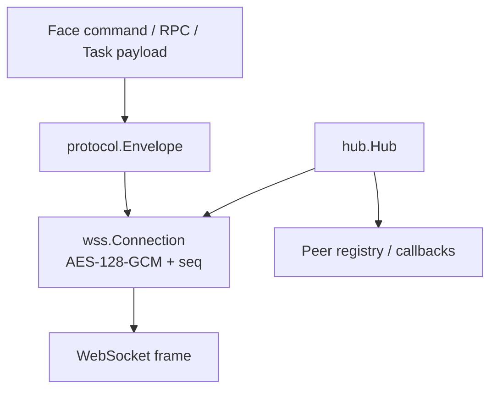

`gateway-core` 是 Face、Mind、Hand 共用的通信基础。它验证「哪个已认证连接发来了哪条完整消息」，不决定 conversation 归属或工具权限。

## 分层

### `protocol/`

定义 Envelope、HandInfo、RPC / RPCResult / progress / cancel、task 和 `face.*` command / event / result。`SessionID` 是连接级防重放会话，不是持久化 conversation ID。

### `wss/`

v3 握手分四步：register 只公开版本、peer type、label 与客户端 X25519 ephemeral 公钥；服务端 challenge 携带自己的公钥；客户端发送加密 proof claims；服务端返回加密 registered。token、application key 与 ECDH 共享秘密共同参与 HKDF-SHA-256，按覆盖全部握手字段的 transcript 派生 proof、C→S、S→C 密钥。ephemeral 私钥用后即弃，因此提供前向保密，录制流重放也无法复现会话密钥。业务帧全部使用 AES-128-GCM，Envelope 头进入 AAD。

### `hub/`

Mind 侧 Hub 管理 peer 连接、发送、广播、OnDisconnect 与握手回调。认证成功后才注册 peer；业务层还要在每条 Face command 上重新检查 principal、scope 和资源归属。

## 失败语义

| 情况 | 结果 |
|---|---|
| v1 或 register 带秘密 / HandInfo | 握手拒绝，不降级 |
| token 或 application key 错误 | proof 验证失败 |
| AAD、密文或角色字段篡改 | AEAD 验证失败，消息不交付 |
| 序号重复或倒退 | connection session 拒绝重放 |
| peer 断线 | Hub 移除对应 connection generation 并通知业务层 |

## 证据入口

- 源码：[`protocol/protocol.go`](https://github.com/Sheyiyuan/half-pi/blob/main/modules/gateway-core/protocol/protocol.go)、[`wss/handshake.go`](https://github.com/Sheyiyuan/half-pi/blob/main/modules/gateway-core/wss/handshake.go)、[`hub/hub.go`](https://github.com/Sheyiyuan/half-pi/blob/main/modules/gateway-core/hub/hub.go)
- 测试：[`wss/crypto_test.go`](https://github.com/Sheyiyuan/half-pi/blob/main/modules/gateway-core/wss/crypto_test.go)、[`hub/hub_test.go`](https://github.com/Sheyiyuan/half-pi/blob/main/modules/gateway-core/hub/hub_test.go)
- 当前 wire contract：[`docs/face-protocol.md`](https://github.com/Sheyiyuan/half-pi/blob/main/docs/face-protocol.md)
