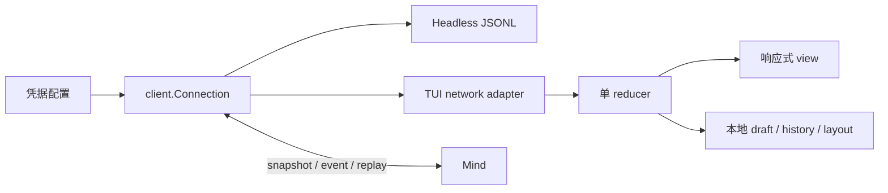

Face 是可替换交互端。它拥有凭据和临时界面状态，但不拥有 conversation、run、task 或 approval 的权威事实。

## 共享客户端

Connection 实现 Gateway v3 握手、加密 Envelope 和收发。Connector 以 generation 隔离重连，凭据由连接层持有，不进入普通渲染事件。

## Headless

Headless 模式使用 stdin / stdout JSONL，stdout 只输出正式协议消息，适合脚本、测试和其他 Agent。它与 TUI 共用 wire contract，不通过 Mind 内部函数旁路。

## TUI

Bubble Tea 单 reducer 处理网络与交互状态；Wide / Standard / Compact / Short 布局适配终端尺寸。conversation picker、草稿、消息分页、命令补全、审批、run、task、Hand 都基于 scope 显示。C0 / C1 控制字符在渲染前转义。

## 恢复策略

首次发送本地草稿时依次 create、subscribe、snapshot、Chat。Chat 保存原 request ID 供重放；非幂等 mutation 只对账。delta gap 或重连后通过 snapshot / replay 恢复，旧 generation 消息被忽略。

## 失败语义

| 情况 | 客户端行为 |
|---|---|
| 非交互 stdin / stdout 启动 TUI | 明确失败，提示 `--mode headless` |
| Mind payload 结构无效 | 拒绝渲染，不信任嵌套 result |
| transient delta 丢失 | 标记不完整并请求权威恢复 |
| 凭据撤销 | 连接断开，新凭据不会继承旧 principal |

证据入口：[`headless/`](https://github.com/Sheyiyuan/half-pi/tree/main/modules/half-pi-face/internal/headless)、[`tui/reducer.go`](https://github.com/Sheyiyuan/half-pi/blob/main/modules/half-pi-face/internal/tui/reducer.go)、[`tui/layout_test.go`](https://github.com/Sheyiyuan/half-pi/blob/main/modules/half-pi-face/internal/tui/layout_test.go)。
