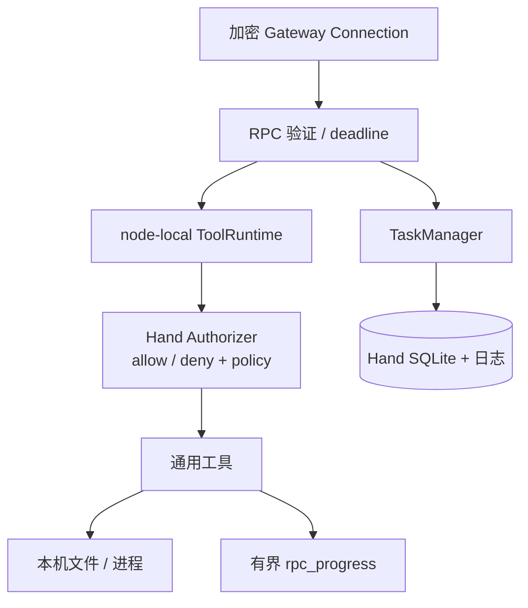

Hand 把 Agent 能力延伸到一台具体设备，同时保留这台设备的最终拒绝权。它不加载 conversation，也不自行选择用户目标。

## 连接与身份

Hand 使用独立 token / application key 连接 Mind，proof claims 内提交 HandInfo 和可用工具。断线按指数退避重连，连接恢复不自动重跑 RPC。

## 节点运行时

RPC 进入 `handleRPC` 后校验 payload、期限和审批绑定，再交给本地 Catalog、ToolRuntime 与 Authorizer。Mind 的外部准入是输入证据之一，不能覆盖 Hand hard deny 或工具 allow / deny。

## 进度与取消

工具通过受限 progress callback 发 stdout / stderr 增量；总块数与字节数有上限。前台 cancel 传播到执行 context；Unix 命令杀进程组，Windows 命令使用 Job Object 终止进程树。

## Durable task

TaskManager 在本地 SQLite 保存不含原始参数的元数据，用受限日志文件分页保存输出。重复 task ID 只有相同绑定可重放；取消 / timeout / result 只产生一个终态。进程重启把非终态标为 lost，不自动重跑。

## 失败语义

| 情况 | Hand 行为 |
|---|---|
| 未知 / 禁止工具 | RPC rejected，不产生副作用 |
| 证明或参数绑定不匹配 | fail closed |
| 前台连接断开 | 当前 RPC 由取消 / deadline 规则收束 |
| durable task 运行中网络断开 | 本机继续执行，重连后可查询 |
| Hand 进程重启 | 遗留非终态 task 标 lost |

证据入口：[`hand/hand_exec.go`](https://github.com/Sheyiyuan/half-pi/blob/main/modules/half-pi-hand/internal/hand/hand_exec.go)、[`taskmanager/manager.go`](https://github.com/Sheyiyuan/half-pi/blob/main/modules/half-pi-hand/internal/taskmanager/manager.go) 与 [`taskmanager/manager_test.go`](https://github.com/Sheyiyuan/half-pi/blob/main/modules/half-pi-hand/internal/taskmanager/manager_test.go)。
