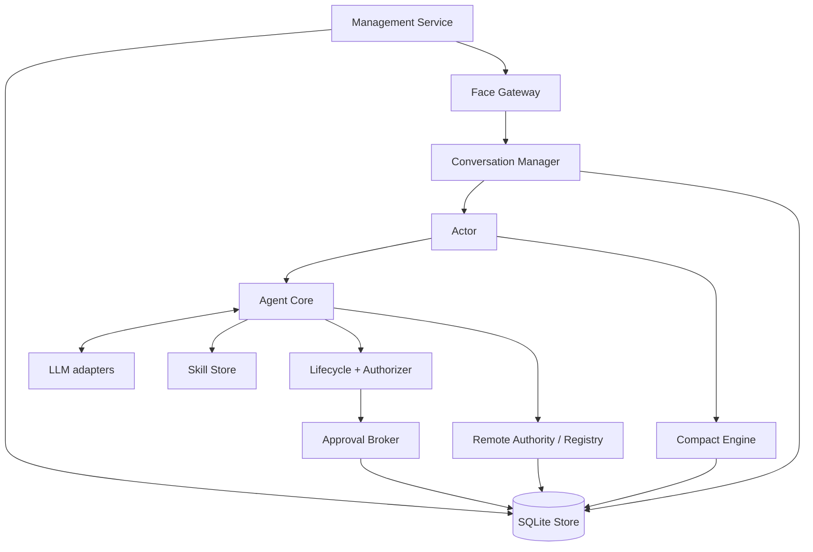

Mind 是智能与协调状态中心。它不拥有目标设备的最终执行许可，也不承担 Face 的具体渲染。

## Agent Core 与 Provider

Core 构造上下文、调用统一 Provider、消费完整流批次并运行工具循环。OpenAI 兼容、Gemini、Anthropic 三种适配器隔离 wire 差异；Scripted Provider 只提供确定性测试 fixture。

## Conversation 与 Store

Manager 恢复每 conversation 独立 Actor。Actor 持有 Core、mode、active Hand 和审批缓存，用 mutation lease 串行化 Chat / compact。SQLite 保存 session group、session、message、approval audit、remote run / task、凭据、管理审计、summary 与 outbox。

工具展示投影也由 Store 保存：admission 记录 conversation、request、tool、冻结的 detail mode、参数摘要和版本化参数投影；terminal 只完成一次并记录结果投影。`summary` admission 不会因为后来连接改用 transparent 而产生原文，透明记录则可以在 Face 侧降级为 summary。投影日志与安全审计分开，后者仍只保存摘要和结构化裁决。

## Skill

Store 递归加载 `.skill.md`，按路径确定重名优先级，支持 `groups` allowlist、`always`、revision / digest。索引只放名称和简介；正文通过 `view_skill` 按需读取。

## Approval 与安全

Authorizer 组合确定性策略、隔离 Reviewer 与进程级 Approval Broker。Reviewer 只返回 allow / require_user；Broker 首裁决持久化成功后才唤醒执行。

## Remote Execution

Authority 是 Hand accepted / rejected / progress / result / cancel 的服务级路由；Registry 仲裁唯一终态并持久化迁移。TaskService 管理 Mind 侧脱敏 task 快照和 Hand 对账。

## Face Gateway

按 principal / scope / ownership 路由 command，提供 snapshot、subscribe、Chat replay、审批和取消。Gateway 在工具、前台 run 或后台 task admission 时把协商的 `detail_mode` 绑定到调用，之后只允许降级投影。每连接独立有界队列与单调 event sequence；领域 hook 直接投影结构化事件。`chat.tool.progress` 可丢，工具终态与 snapshot history 用 Store 恢复。

REPL 是服务上的交互适配器，默认使用 `transparent`；它和 Face、EventBus 共用同一 ToolRuntime/lifecycle 路径，不存在透明模式旁路。透明控制台或文件日志可能包含用户自己传入的秘密。

## Compact

原始消息 append-only，Context Summary 覆盖旧前缀并形成 Provider 视图。Engine 校验预算、完整 tool batch、环境摘要、generation 和版本，再以 CAS 原子提交 summary 与 outbox。

## Management

在线 CLI 经本地 IPC、离线 CLI 经状态锁调用同一 Service。凭据 mutation 与无秘密审计同事务，撤销在线凭据后立即断开 peer。

## 证据入口

核心恢复与隔离看 [`conversation/manager_test.go`](https://github.com/Sheyiyuan/half-pi/blob/main/modules/half-pi-mind/internal/conversation/manager_test.go)；Face 行为看 [`facegateway/gateway_test.go`](https://github.com/Sheyiyuan/half-pi/blob/main/modules/half-pi-mind/internal/facegateway/gateway_test.go)；压缩不变量看 [`compact/engine_test.go`](https://github.com/Sheyiyuan/half-pi/blob/main/modules/half-pi-mind/internal/compact/engine_test.go)。
