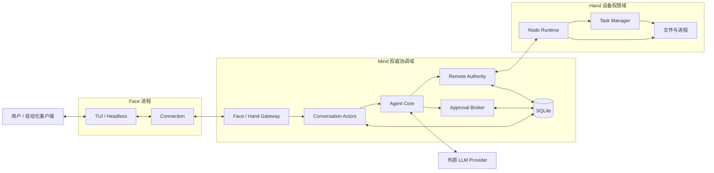

本手册只描述当前代码与测试能够证明的能力。教程按问题演化，手册则按系统边界回查；这里不收录未实现的扩展提案。

## 完整系统边界

## 权威状态在哪里

| 状态 | 权威所有者 | 其他位置是什么 |
|---|---|---|
| conversation、消息、模式、active Hand | Mind Store + Conversation Actor | Face 是快照与显示缓存 |
| Chat request accepted / terminal | Mind Chat Registry，历史消息落 Store | Face 用 replay / snapshot 恢复 |
| Approval 首裁决 | Mind Approval Broker + 审计事务 | 各 Face 只展示 pending / resolved |
| 前台 RemoteRun | Mind Remote Registry + Store | progress 是有界观察 |
| durable task 执行 | Hand TaskManager + Hand SQLite / 日志 | Mind 保存 best-known 脱敏快照 |
| 设备是否允许执行 | Hand node-local ToolRuntime | Mind 审批证明不能覆盖 |
| 凭据与 scope | Mind Store / Management Service | 连接只持有已认证 principal |
| 原始 conversation 历史 | Mind Store append-only messages | Context Summary 只是 Provider 投影 |

## 三条信任边界

**模型边界：** Provider 输出与工具参数都不可信，进入 ToolRuntime 前要变换、校验和冻结。

**协议边界：** Face / Hand 必须完成 v3 握手；业务 Envelope 加密、绑定 AAD 与连接级序号。

**设备边界：** Mind 决定当前用户意图是否获准，Hand 决定本机是否执行。两者拒绝都不可由另一侧覆盖。

## 手册入口

- [五个 module](./modules/)：职责和依赖方向。
- [gateway-core](./gateway-core/)：协议、握手、加密和 Hub。
- [half-pi-core](./half-pi-core/)：ToolRuntime、安全、Lifecycle、事件和通用工具。
- [half-pi-mind](./half-pi-mind/)：智能、状态、协调与管理平面。
- [half-pi-hand](./half-pi-hand/)：设备执行、进度和后台任务。
- [half-pi-face](./half-pi-face/)：加密客户端、Headless 与 TUI。
- [关键状态机与失败语义](./state-machines/)：终态竞争和恢复规则。
- [内容覆盖矩阵](./coverage/)：已实现子系统在教程和手册中的位置。
