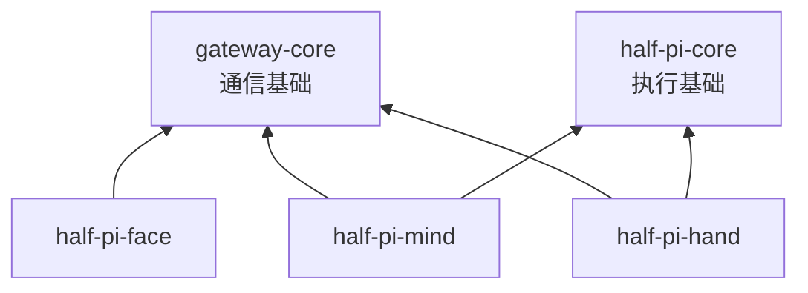

Module 是源码依赖边界，不要求教程读者理解 Go。重要的是：共享基础不反向依赖具体进程，进程之间不能导入对方的 `internal/` 实现。

| Module | 部署归属 | 公开职责 | 不负责 |
|---|---|---|---|
| `gateway-core` | 三端共享 | Envelope、Face / RPC 类型、握手、加密 Connection、Hub | Agent 循环和业务状态 |
| `half-pi-core` | Mind / Hand 共享 | Catalog、ToolRuntime、安全、Lifecycle、EventBus、通用工具 | Provider、conversation 与网络路由 |
| `half-pi-mind` | Mind 进程 | Agent Core、Store、Actor、Approval、Remote Execution、Face Gateway、Compact、Management | 设备本地最终许可和 Face 渲染 |
| `half-pi-hand` | Hand 进程 | RPC 接纳、本地 ToolRuntime、进度、durable task | 用户对话与模型选择 |
| `half-pi-face` | Face 进程 | 加密连接、Headless JSONL、全屏 TUI | conversation 权威状态 |

## 依赖不变量

- 跨 module import 使用 `github.com/Sheyiyuan/half-pi/modules/<module>` 的公开路径。
- `internal/` 仅供本 module 使用；外部通过导出契约交互。
- `half-pi-core` 不依赖第三方包，保持执行与生命周期类型轻量。
- 本地开发通过各 module 的 `replace` 指向工作区路径；发布时仍保持独立 module 身份。

## 按问题回查

想知道「线上传什么」，从 `gateway-core/protocol` 开始；想知道「工具为何获准」，看 `half-pi-core/executor` 与 Mind authorizer；想知道「状态在哪里恢复」，看 Mind Store、Conversation 与 Remote Registry；想知道「真实副作用在哪里发生」，看 Hand runtime。
