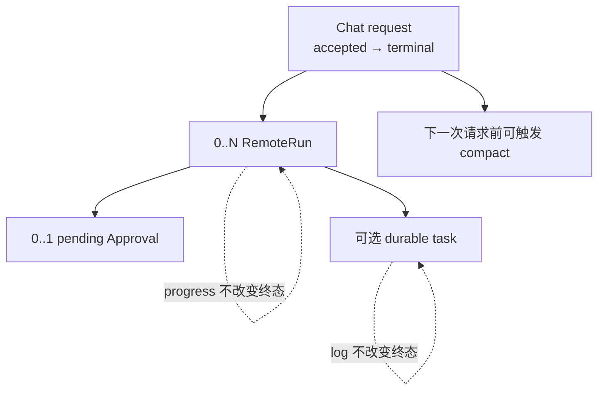

Half-Pi 不用消息「通常按顺序到达」的假设处理取消、结果与断线，而让每个领域对象明确决定哪些转换合法。

## 状态关系

| 对象 | 主要非终态 | 终态 | 重启 / 断线规则 |
|---|---|---|---|
| Chat request | accepted / running | succeeded、failed、cancelled、timed_out | Face 断线不取消；相同 request 可 replay |
| Approval | pending | allowed、denied、expired、cancelled | Broker 恢复时 pending → cancelled |
| RemoteRun | admitted、sent、accepted、running、cancel_requested | succeeded、failed、rejected、cancelled、timed_out、lost | 匹配 Hand 断线可置 lost；结果竞争只留一个终态 |
| Durable task | queued、running、cancel_requested | succeeded、failed、cancelled、timed_out、lost | 网络断开继续；Hand 重启非终态 → lost |
| Compact | requested、pending、started | completed、failed | CAS 冲突不覆盖新上下文；自动 pending 可退避重试 |

## 失败类别

**接纳前拒绝：** 身份、scope、归属、Schema 或 hard deny 不通过。没有业务副作用。

**接纳后业务失败：** Provider、工具或远程执行报错。产生唯一失败终态，并保留可交付的脱敏原因。

**未知外部结果：** 连接断开或取消未确认，无法证明副作用是否完成。使用 lost / stale，而不是伪造 succeeded / cancelled。

**观察丢失：** delta、progress 或普通 Observer 事件可能丢弃。权威状态不变化，通过 snapshot、Registry 或 Store 恢复。

**必需记录失败：** admission audit 或需要原子提交的 outbox 失败时 fail closed；终态审计失败保留已发生的执行事实，并单独表达交付失败。

## 不变量速查

- 取消是状态转换请求，不是撤销现实世界副作用的证明。
- 任一 run / task / approval 只有一个合法终态。
- replay 返回已有事实，不重新执行已接纳副作用。
- 原始参数不进入普通事件、任务快照或安全审计。
- 恢复时不自动重跑无法证明幂等的操作。
