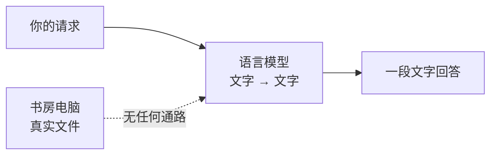
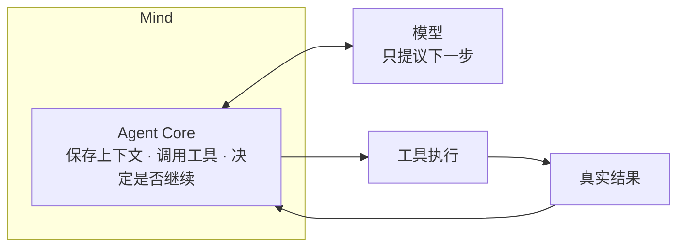

阶段 01 · 从一句做不到的请求开始

整套教程只跟一句话较劲：

> 「请让书房电脑上的 Hand 读取项目的 README，再由 Mind 总结一下。」

这句话现在办不到。本章要弄清它究竟卡在哪里——不是模型不够聪明，而是缺了四类结构。后面 20 章就是把这四类结构逐个补上。

## 同一句请求，两种系统

假设我们把这句话直接发给一个语言模型（Large Language Model，LLM）。模型擅长的是：给定一段文字，生成接下来最合理的文字。它没有文件句柄，没有网络套接字，也没有那台书房电脑的任何访问路径。

于是会出现两种回答，而两种都不算完成任务：

| 模型的回答 | 表面看 | 实际情况 |
|---|---|---|
| 「README 介绍了这是一个 Go 项目，包含五个模块……」 | 像是读到了 | 文本由训练分布生成，不来自那台机器上的文件 |
| 「抱歉，我无法访问你的本地文件。」 | 诚实 | 任务仍然没有完成 |

第一种更危险：它读起来完全像一次成功的读取。**没有任何机制能让你区分「模型读了文件」和「模型编了一段像文件的东西」**，因为两者产生的都只是文字。

模型的输出是<b>关于世界的陈述</b>，不是<b>世界的状态</b>。要让陈述可信，系统必须自己去取得状态，并且能证明取过。

## 补上通路之后，多出来的问题

假设我们给模型接上一个读文件的通路。任务能完成了，但立刻冒出一批新问题，而这些问题模型自己解决不了：

**它得先知道有哪些设备。** 「书房电脑」是人类的说法，系统里对应哪个节点、在不在线，要先查。

**它得能看到自己动作的结果。** 读文件可能成功，也可能路径不存在、权限不足、文件是 2GB 的二进制。模型要根据实际结果决定下一步，而不是假设成功。

**它得知道什么时候停。** 一次读取不够就再读一次，可以；无限读下去不行。

**读取本身得先获准。** README 无所谓，但同一个通路也能读 `~/.ssh/id_rsa`。「能读文件」和「该读这个文件」是两件事。

这四条对应了整套教程的四个方向，也是后面章节的由来：

| 缺的东西 | 补在哪一章 |
|---|---|
| 观察结果后继续决策的循环 | [第 2 章 Agent 循环](../02-agent-loop/) |
| 受控、可描述的动作接口 | [第 4 章 工具](../04-tools/) |
| 「谁允许这次调用」的裁决 | [第 5 章](../05-registration-is-not-safety/)、[第 6 章](../06-tool-runtime/) |
| 跨设备的身份与执行边界 | [第 10 章](../10-face-mind-hand/)–[第 12 章](../12-hand-guard/) |

## Half-Pi 把模型放在哪

Half-Pi 的选择是：模型只负责提议下一步，不持有权威状态，也不直接接触操作系统。

模型说「我要读这个文件」，Agent Core 决定这次调用是否发生、结果是什么、要不要再问一次模型。这条分工贯穿全书：**模型是不可信输入源，不是权威。**

## 但不是所有场景都该做成 Agent

这一点值得单独说，因为「Agent 更高级」是个常见误解。三种情况下，单次模型调用是更好的选择：

<section>
<h3>纯知识问答</h3>

「解释一下什么是 HKDF」——答案完全在模型的知识里，不需要观察外部世界。

单次调用即可

</section>
<section>
<h3>改写已给内容</h3>

用户已经把文本粘贴进来，要求翻译或润色。输入完整，无需取数据。

单次调用即可

</section>
<section class="is-chosen">
<h3>需要观察和行动</h3>

要读那台机器上的真实文件，根据内容决定下一步，还要能被审计。

才需要 Agent 结构

</section>

Agent 结构的成本是真实的：要处理循环终止、失败分类、并发、取消、审批和状态一致性。它不会让模型变聪明，只会让系统的能力边界变诚实。**如果任务不需要观察外部世界，这些成本就是净亏损。**

检查点：模型回答「我已经读取了 README，内容是……」，能当作读取成功的证据吗？

不能。除非系统里存在一条真实的工具调用记录及其返回结果，这句话只是模型生成的文本。判断依据永远是系统记录的动作事实，不是模型的自述。这个区分在 [第 7 章](../07-observability/) 会变成「展示事件 vs 权威状态」的正式设计。

检查点：给模型接上 shell 命令执行，是不是就等于有了 Agent？

有了动作能力，但还不是可用的 Agent。缺的是：结果如何回到推理过程（第 2 章）、动作如何被描述和校验（第 4 章）、谁批准这次执行（第 5–6 章）。直接开放 shell 恰好是安全性最差的做法，[第 4 章](../04-tools/) 会解释为什么要用结构化工具替代它。

## 本章的边界

第 1 章只划清一条边界：模型生成文字，系统承担事实。我们还没有循环、没有工具、没有安全、没有状态。

下一章只做一件事：**把动作的结果送回模型，让它能根据实际情况决定下一步**——同时处理这个循环带来的第一个新麻烦，它什么时候该停下来。

## 实现证据地图

不要求阅读源码；想核对时可以看这几处。

| 证据 | 证明什么 |
|---|---|
| [`agentcore/chat.go`](https://github.com/Sheyiyuan/half-pi/blob/main/modules/half-pi-mind/internal/agentcore/chat.go) | 模型请求与工具轮次由 Core 编排，模型不自己执行动作 |
| [`agentcore/core_test.go`](https://github.com/Sheyiyuan/half-pi/blob/main/modules/half-pi-mind/internal/agentcore/core_test.go) | Core 的消息、工具定义和会话行为可独立测试 |

<nav class="tutorial-progress"><a href="../">← 学习路线</a>1 / 21<a href="../02-agent-loop/">下一章 →</a></nav>
