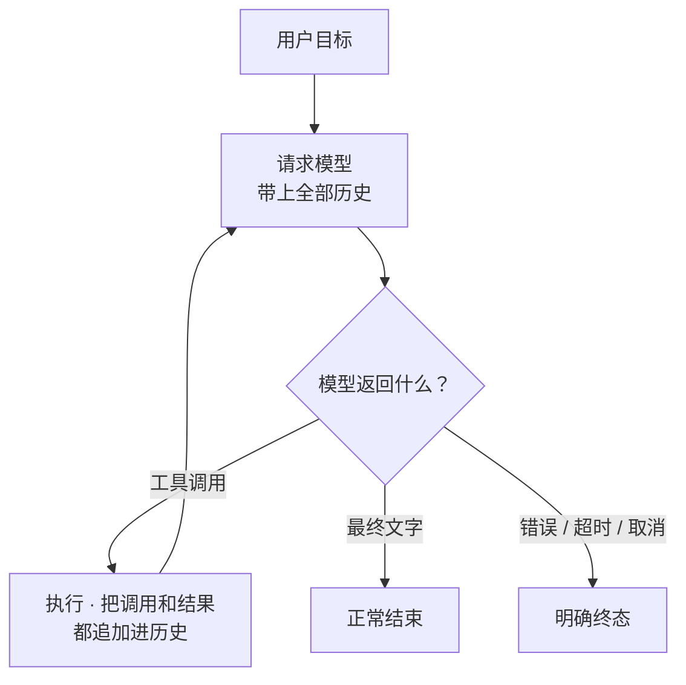

阶段 02 · 让结果回到推理过程

<strong>上一章的结论：</strong>模型只能生成文字，系统必须自己取得事实。

<strong>本章要动的那一块：</strong>假设动作能力已经存在（细节留给第 4 章），现在只解决一个问题——动作的结果怎么回到模型，让它据此决定下一步。

## 逐轮走读一次循环

还是那句请求：「让书房电脑上的 Hand 读取项目 README，再总结。」模型无法一步完成，因为它事先不知道有哪些设备、README 在哪、内容是什么。它需要**边做边看**。

下面是这次请求在循环里的实际推进过程。注意「历史」一列：每一轮的观察都变成下一轮的输入。

| 轮次 | 模型看到的历史 | 模型的输出 | 系统做什么 |
|---|---|---|---|
| 1 | 用户请求 | 调用 `list_hands` | 执行，得到「study-pc 在线」 |
| 2 | + 轮 1 的调用和结果 | 调用 `use_hand(study-pc, read_file, README.md)` | 执行，得到文件内容 |
| 3 | + 轮 2 的调用和结果 | 最终文字：「这个项目是……」 | 无工具调用，循环结束 |

三轮之后循环终止，因为模型返回的是文字而不是工具调用。这就是循环的基本判据：

循环的每一轮都在做同一件事：<b>把上一轮的真实结果变成下一轮的输入</b>。模型的「记忆」不是它自己记住了，而是系统每次都把完整历史重新发过去。

## 走读一次失败，看循环怎么自我修正

循环真正的价值在出错时才显现。假设轮 2 读文件失败了：

| 轮次 | 发生了什么 |
|---|---|
| 2 | 模型调用 `read_file("README.md")`，返回错误：`no such file` |
| 3 | 模型看到错误，改为调用 `list_files(".")` |
| 4 | 结果里有 `readme.md`（小写），模型重新读取，成功 |

如果没有循环，第 2 轮的失败就是整个请求的失败。有了循环，**失败只是一次观察**，模型可以据此换个做法。这是「一次问答」和「Agent」在能力上的实质差别。

## 循环带来的三个新问题

开放循环不是免费的。它引入了三个必须解决的问题，每一个都对应一条约束。

### 问题一：它可能永远不停

模型可能反复调用同一个工具、在两个动作之间来回摆、或者始终不给出最终文字。系统必须自己设上限：最大轮次、总时长、以及一个能从外部打断的取消信号。

**取消必须能穿透整条链路。** 用户点了取消，正在等待的模型请求和正在执行的工具都要收到通知——Half-Pi 用 Go 的 `context` 一路传下去。但要注意：取消是「请求停止」，不是「假装没发生过」。已经写出去的文件不会因为取消而复原。这条区分在 [第 13 章](../13-remote-jobs/) 会变成远程任务的核心难题。

### 问题二：结果和调用可能配错

一轮里模型可能同时发起多个工具调用。如果把 A 的结果贴到 B 的调用下面，模型会基于错误的观察继续推理，而且**它无法发现这个错误**——在它看来那就是事实。所以每个结果必须带上对应调用的标识符，严格配对。

### 问题三：谁拥有这段历史

如果两个人同时向同一个对话发消息，两个循环会交替往同一段历史里追加消息，产生一段谁都没说过的对话。

Half-Pi 的选择是分两层：

<section>
<h3>Agent Core 管一次循环</h3>

负责轮次推进、工具调用配对、终止判断。它只关心「这一次 Chat 怎么跑完」。

</section>
<section>
<h3>Conversation Actor 管一个会话</h3>

持有单会话的操作租约，保证同一对话同时只有一个循环在写历史；不同对话可以并行。

</section>

这个分层现在看起来有点多余——单机单用户时确实如此。它的必要性到 [第 14 章](../14-mind-service-actors/) 才完全显现，那时 Mind 要同时服务多个 Face 和多个并发对话。

## 一个容易忽略的细节：半条回复不算事实

模型的回复是流式到达的。如果连接在中途断开，系统手里就有半句话。

这半句话能不能存进历史？不能。**下一轮请求会把历史原样发回模型**，一条被截断的 assistant 消息会让模型以为自己说完了那句话。Half-Pi 的做法是：只有完整的响应批次才能进入权威历史；半条回复可以当作临时的传输现象展示给用户，但不持久化。

检查点：模型流已经显示了半句话，连接断开，要不要保存成 assistant 回复？

不保存为完整回复。界面上可以显示已经收到的部分（用户确实看到了），但权威历史只接纳完整批次。这是「展示」与「事实」的第一次分岔，[第 7 章](../07-observability/) 会把它变成正式的通道划分。

检查点：给循环设一个「最多 50 轮」的上限，是不是就安全了？

能防死循环，但不够。轮次上限管不住单轮内的长时间阻塞，也管不住上下文增长——每轮都在往历史里加内容，迟早超过模型的输入窗口。所以还需要时间上限和预算检查，后者是 [第 20 章](../20-context-compaction/) 的主题。

检查点：两个用户同时向同一对话发消息，能不能各跑一个循环？

不能直接并行写同一段历史。要么串行接纳，要么明确分叉成两个对话。Half-Pi 选择同一 conversation 同时只允许一个活动操作，理由是历史必须有确定的顺序才能被重放和审计。

## 本章的代价

循环让系统能根据观察调整，代价是把三样东西拉进了核心路径：**模型供应商的协议差异**（每家的流式格式和工具调用表达都不同）、**工具的安全性**（现在动作真的会执行了）、**状态管理**（历史必须有唯一所有者）。

下一章先处理最外层的那个：不同模型服务的接入差异。如果不隔离，Core 会被某一家供应商的 JSON 格式绑死。

## 实现证据地图

| 证据 | 证明什么 |
|---|---|
| [`agentcore/chat.go`](https://github.com/Sheyiyuan/half-pi/blob/main/modules/half-pi-mind/internal/agentcore/chat.go) | 完整模型批次与工具循环的编排 |
| [`agentcore/streaming_test.go`](https://github.com/Sheyiyuan/half-pi/blob/main/modules/half-pi-mind/internal/agentcore/streaming_test.go) | 部分响应不会被当作完整消息保存 |
| [`conversation/manager_test.go`](https://github.com/Sheyiyuan/half-pi/blob/main/modules/half-pi-mind/internal/conversation/manager_test.go) | 同会话租约串行化 Chat 与上下文变更 |

<nav class="tutorial-progress"><a href="../01-model-is-not-agent/">← 上一章</a>2 / 21<a href="../03-model-providers/">下一章 →</a></nav>
