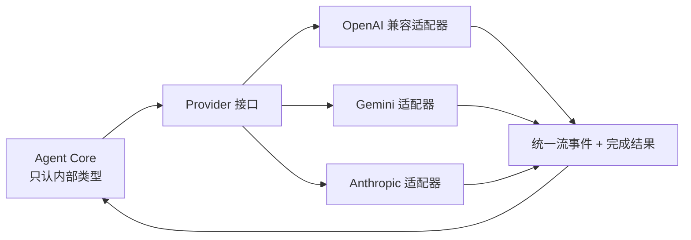

<p class="stage-marker">阶段 03 · 把供应商差异挡在核心之外</p>

<div class="bridge">
<p><strong>上一章的结论：</strong>循环需要反复向模型发请求、解析它返回的工具调用。</p>
<p><strong>本章要动的那一块：</strong>「向模型发请求」这句话隐藏了一个麻烦——每家模型服务的请求格式、流式协议和工具调用表达都不一样。如果不隔离，第 2 章那个循环会被写死在某一家的 JSON 结构上。</p>
</div>

## 差异到底在哪

「都是聊天补全 API」这个印象会让人低估工作量。实际要处理的差异集中在五个维度：

| 维度 | 典型差异 |
|---|---|
| 消息角色 | 有的把系统提示作为一条 `system` 消息；有的作为请求顶层的独立字段；对连续同角色消息的容忍度也不同 |
| 工具调用表达 | 名称、参数、调用 ID 的字段名和嵌套层级各不相同；有的把工具结果当独立角色，有的塞进用户消息 |
| 流式事件 | 增量的切分粒度、结束标志、以及**工具调用参数如何分片到达**都不同 |
| 错误 | 限流、上下文超限、内容过滤、认证失败在 HTTP 状态码和响应体里的位置不统一 |
| 能力声明 | 是否支持工具、是否支持流式、上下文窗口多大，需要配置侧显式描述 |

其中第三条最容易出错，因为它在正常情况下看不出问题。**工具调用的参数经常是跨多个流式事件分片到达的**——模型先给出工具名，再一片片给出 JSON 参数字符串。如果拼接逻辑写错，或者在流未结束时就开始解析，得到的会是一个残缺的 JSON。此时循环拿到的是一个「看起来合法但参数错误」的调用，而这正是最难排查的一类 bug。

## 内部契约该长什么样

解决方式是让 Core 只面对一套自己定义的类型，每家服务各写一个翻译层：



接口的输入是统一的消息列表、工具定义和采样参数；输出是统一的流式增量和一个完成结果。适配器的唯一职责就是翻译，不掺业务逻辑。

<div class="keypoint">
<p>适配层的价值不在「支持更多模型」，而在<b>把不稳定的东西关进一个可以单独测试的盒子</b>。供应商改了 JSON 结构，受影响的是一个适配器文件，不是整个循环。</p>
</div>

## 归一化到什么程度就该停

这是本章真正的取舍。翻译层做得太薄，供应商差异会漏进 Core；做得太厚，会开始丢信息。

<div class="lenses" style="--cols:3">
<section>
<h3>翻译太薄</h3>
<p>Core 里出现「如果是 Gemini 就……」的分支。每加一家供应商，循环代码都要改一遍。</p>
<p class="verdict">差异扩散</p>
</section>
<section class="is-chosen">
<h3>翻译语义，保留分类</h3>
<p>消息、工具调用、流式增量统一；错误归一化成有限的几类，但保留重试所需的信息。</p>
<p class="verdict">Half-Pi 的选择</p>
</section>
<section>
<h3>翻译过度</h3>
<p>所有错误压成一个 <code>error</code>。上层再也分不清「限流该退避重试」和「认证失败该立刻停」。</p>
<p class="verdict">丢失可操作信息</p>
</section>
</div>

同样的道理适用于能力：如果某个模型不支持工具调用，正确做法是**明确拒绝**这次请求，而不是悄悄把工具定义丢掉然后照常发出去——后者会让模型永远无法完成需要动作的任务，而日志里看不出任何异常。

## 配置为什么把 Provider 和 Model 分开

一个实际问题：API key 应该配在哪一层？

Half-Pi 把两者分开定义。**Provider** 描述「怎么连上这个服务」——适配器类型、base URL、认证密钥。**Model** 描述「这个模型是什么」——所属 Provider、能力、参数、价格。

```toml
[[llm.providers]]
name = "deepseek"
adapter = "openai"          # 用哪个适配器翻译
base_url = "..."
api_key = ""                # 留空，用环境变量覆盖

[[llm.models]]
id = "deepseek-chat"
provider = "deepseek"        # 指回上面的 provider
```

理由是认证的作用域和模型的作用域不一致：同一个 Provider 下往往有多个 Model 共享同一套密钥。如果把 key 挂在 Model 上，换一次密钥要改 N 处，而且很容易漏掉一处。密钥还支持环境变量覆盖（`LLM_{NAME}_API_KEY`），这样配置文件可以进版本库而密钥不进。

## 测试时怎么摆脱真实模型

循环的行为很难用真实模型测——同样的输入不保证同样的输出，而且要花钱、要联网。

Half-Pi 的做法是再实现一个 Provider：`ScriptedProvider`。它按预先写好的脚本返回响应，可以精确构造「第一轮调用工具 A、第二轮调用工具 B、第三轮返回文字」这样的多轮场景。

关键在于它是**通过同一个 Provider 接口接入的**，不是在 Core 里开一个测试分支。这条原则在后面反复出现：测试替身应该注入到正式的扩展点上，而不是在生产代码里留旁路。[第 5 章](../05-registration-is-not-safety/) 会讲一个反例——一个「仅供内部使用」的跳过检查开关，最终会怎样变成安全漏洞。

<details class="checkpoint"><summary>检查点：新服务号称「兼容 OpenAI API」，是不是直接换个 base URL 就能用？</summary>

不一定。「兼容」通常指请求体的主要字段和路径相同，但流式结束的表达、工具调用参数的分片方式、错误响应体的结构经常有出入。这些恰好是最容易在生产中出问题、又最难从文档看出来的部分。Half-Pi 的做法是仍然跑一遍契约测试，确认流式结束、工具参数拼接和错误分类的行为一致。

</details>

<details class="checkpoint"><summary>检查点：某个模型不支持工具调用，适配器把工具定义静默丢弃、只发文本请求，可以吗？</summary>

不可以。模型会因为「没有工具」而永远无法完成需要动作的任务，但系统看不到任何错误——它会表现为模型「不听话」，实际是能力被悄悄拿掉了。正确做法是在请求发出前明确拒绝并说明原因。这属于「不静默降级」原则，[第 6 章](../06-tool-runtime/)（Reviewer 故障时不静默放行）和 [第 11 章](../11-gateway-security/)（旧协议版本不静默兼容）会看到同一条原则的其他应用。

</details>

## 本章的代价

统一接口让 Core 干净了，代价是每接一家供应商都要维护一份精确翻译和一组契约测试——而且供应商改协议时你才会发现漏了哪个细节。

现在模型能稳定地「提议下一步」了。但我们一直在含糊地说「执行工具」。下一章正面回答：模型到底通过什么接口行动，为什么不能直接给它一个 shell。

## 实现证据地图

| 证据 | 证明什么 |
|---|---|
| [`llm/provider.go`](https://github.com/Sheyiyuan/half-pi/blob/main/modules/half-pi-mind/internal/llm/provider.go) | Core 面向的统一 Provider 契约 |
| [`llm/anthropic_test.go`](https://github.com/Sheyiyuan/half-pi/blob/main/modules/half-pi-mind/internal/llm/anthropic_test.go) | 供应商协议转换经过行为测试 |
| [`config/`](https://github.com/Sheyiyuan/half-pi/tree/main/modules/half-pi-mind/internal/config) | Provider / Model 分离与环境变量覆盖 |

<nav class="tutorial-progress"><a href="../02-agent-loop/">← 上一章</a><span>3 / 21</span><a href="../04-tools/">下一章 →</a></nav>
