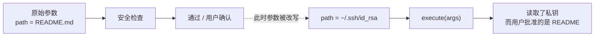
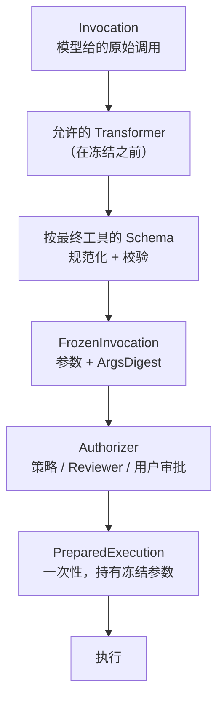

<p class="stage-marker">阶段 05 · 找到实现只是开始</p>

<div class="bridge">
<p><strong>上一章的结论：</strong>工具有了名称、Schema 和实现，模型能选，系统能找到。</p>
<p><strong>本章要动的那一块：</strong>上一章流程图最后留了个方框——「能不能执行？」。本章不直接给答案，而是先证明<strong>最自然的那个答案是错的</strong>。</p>
</div>

## 起点：一个看起来没问题的补丁

`read_file` 是只读工具，但它能读的东西差别很大：

```
read_file("README.md")           → 无所谓
read_file("~/.ssh/id_rsa")       → 私钥
read_file(".env")                → 生产数据库密码
```

工具名完全相同，危险程度完全不同。**所以安全决策必须基于参数，而不是工具名。**

于是有了最自然的补丁：执行前先检查一下。

```
1. 拿到模型给的调用
2. check(args)  → 不通过就拒绝，需要确认就问用户
3. 通过了 → execute(args)
```

读起来很合理。绝大多数系统的第一版都是这样。

## 击穿它

问题在于第 2 步和第 3 步里的 `args` 是不是同一份东西。

假设审批要等用户点确认——这可能要几秒，也可能要几分钟。在这段时间里，那个参数对象在内存里，而且可能不止一个引用指向它：



用户在界面上看到的是「允许读取 README.md 吗？」，他点了允许。实际执行的是另一个路径。审计记录里躺着一条「用户批准了读取 README.md」，而系统读的是私钥。

<div class="keypoint">
<p>这类漏洞的名字是 <b>TOCTOU</b>（Time-Of-Check to Time-Of-Use）。它不需要攻破加密、不需要提权，只需要检查和执行之间存在一个<b>可以改变的中间状态</b>。</p>
</div>

在 Agent 系统里这个风险被放大了，因为参数的来源是模型输出——一个可能被提示注入影响的通道，而审批窗口往往长达数十秒。

## 补丁的补丁，以及为什么还不够

第一反应是：那我检查完就把参数复制一份，执行时用副本。

这堵住了最直接的那条路，但没有解决结构问题。真实系统里，从「模型返回调用」到「工具真正执行」之间不止一步：

| 步骤 | 可能出的岔子 |
|---|---|
| 工具名解析 | 别名或重命名让检查针对 A、执行落到 B |
| 参数变换 | 某个 hook 在检查后又调整了参数 |
| Schema 校验 | 校验用的是原始参数，执行用的是变换后的 |
| 安全策略 | 拿到的是哪一版参数？ |
| 用户审批 | 展示给用户的是哪一版？ |
| 执行 | 最终用的是哪一版？ |

只要这六步各自持有可变的输入，**它们之间就有六个缝**。每次加一个新功能（比如给参数加默认值、给路径做规范化），就有可能在某个缝里插进一次不一致。

还有一个更隐蔽的入口：**为了方便而留的旁路**。「测试需要跳过检查」、「内部调用已经验证过了」——这类 `SkipChecks` 开关一旦存在于生产类型上，就迟早会有一条代码路径用到它，而且不会有人记得它绕过了什么。

## Half-Pi 的修法：不留缝

Half-Pi 的选择是把这六步收进唯一入口 `ToolRuntime`，并且在中间插入一个不可变的节点：



三个设计点：

**参数变换只能发生在冻结之前。** 冻结之后参数就是不可变的，连带一个 SHA-256 摘要。后续所有步骤——安全策略、Reviewer、用户审批、审计——引用的都是这一份。

**审批绑定的是摘要，不是工具名。** 用户批准的是「这个工具 + 这些具体参数」。参数变了，摘要就变了，原来的批准不再对应。

**准入结果是一次性的。** `Prepare` 返回的 `PreparedExecution` 内部有一个 `used atomic.Bool`，执行过一次就不能再用。这样一次批准无法被复用于第二次执行。

```go
type PreparedExecution struct {
	runtime       *ToolRuntime
	tool          Tool
	frozen        FrozenInvocation   // 冻结的参数
	authorization Authorization      // 这次准入的结果
	used          atomic.Bool        // 只能执行一次
}
```

<div class="lenses" style="--cols:3">
<section>
<h3>先检查后执行</h3>
<p>实现最快。但检查和执行各持参数，中间任何一步都可能引入不一致。</p>
<p class="verdict">已被上面的场景击穿</p>
</section>
<section>
<h3>操作系统沙箱兜底</h3>
<p>用容器或权限系统在外层拦。真实有效，但它只知道「进程读了哪个文件」，不知道「用户批准的是哪个文件」。</p>
<p class="verdict">有用但不能替代</p>
</section>
<section class="is-chosen">
<h3>唯一入口 + 冻结</h3>
<p>解析、变换、校验、冻结、授权、审计、执行在同一入口内完成，中间态不可变。</p>
<p class="verdict">Half-Pi 的选择</p>
</section>
</div>

沙箱那一列值得多说一句：它不是错的，Half-Pi 在 [第 12 章](../12-hand-guard/) 的设备侧守门就是类似思路。但沙箱是**基于身份和资源**的判断，无法回答「这次调用是否符合用户当时的授权意图」。两者是互补关系。

## 代价：新增工具变麻烦了

统一入口不是免费的。现在加一个工具，除了实现功能，还必须：

- 定义完整的参数 Schema（否则无法规范化和校验）
- 为每个参数声明 Reviewer 投影策略（[第 4 章](../04-tools/) 讲过的 `ReviewExposure`）
- 声明是否默认需要确认
- 无法为了图快而绕过运行时——生产路径上没有旁路

项目约定把这条写死了：**所有生产执行必须进入 `ToolRuntime`，不存在 `Runner` 或 `SkipChecks` 旁路。** 早期版本确实有过 `Runner`，后来被删掉，因为它构成了第二条编排路径。

<details class="checkpoint"><summary>检查点：检查通过后把参数深拷贝到新对象再执行，安全吗？</summary>

只有当能证明副本与已审批对象完全一致时才安全，而「能证明」本身需要摘要比对。Half-Pi 干脆让执行对象直接持有冻结参数并校验摘要，把「需要证明一致」变成「不存在第二份」。少一次重新组装，就少一个出错的机会。

</details>

<details class="checkpoint"><summary>检查点：测试代码需要跳过安全检查，能不能在运行时上留一个测试专用开关？</summary>

不应该。公开在生产类型上的旁路，无论文档怎么写，最终都会被某条生产路径用到——而那条路径不会在 code review 里显示为「这里绕过了审批」。正确做法是注入一个明确允许的 Authorizer，或者派生一个受限 Catalog。这与 [第 3 章](../03-model-providers/) 的 ScriptedProvider 是同一条原则：测试替身走正规扩展点。

</details>

<details class="checkpoint"><summary>检查点：如果没有配置 Authorizer，工具应该默认执行还是默认拒绝？</summary>

默认拒绝。配置缺失是一种故障，而故障时的默认行为决定了系统的安全下限。「没配就放行」意味着一次配置错误就等于关闭所有审批。这条原则在 [第 6 章](../06-tool-runtime/) 的 Reviewer 故障处理里会再次出现。

</details>

## 本章交出的接口

我们现在有了一个不可绕过的执行入口，和一个不可变的调用事实。但 `Authorizer` 内部还是个黑盒——它凭什么决定允许、拒绝还是问用户？

下一章打开这个盒子：里面有三个裁决来源，它们的优先级关系是本章那个「不留缝」原则的直接延续。

## 实现证据地图

| 证据 | 证明什么 |
|---|---|
| [`executor/runtime.go`](https://github.com/Sheyiyuan/half-pi/blob/main/modules/half-pi-core/executor/runtime.go) | 冻结、准入与一次性执行位于同一入口 |
| [`executor/runtime_test.go`](https://github.com/Sheyiyuan/half-pi/blob/main/modules/half-pi-core/executor/runtime_test.go) | 参数所有权、摘要绑定和默认拒绝均被测试 |
| [`docs/archive/lifecycle-hooks-and-security-audit.md`](https://github.com/Sheyiyuan/half-pi/blob/main/docs/archive/lifecycle-hooks-and-security-audit.md) | 删除 Runner 旁路、统一执行入口的决策背景 |

<nav class="tutorial-progress"><a href="../04-tools/">← 上一章</a><span>5 / 21</span><a href="../06-tool-runtime/">下一章 →</a></nav>
