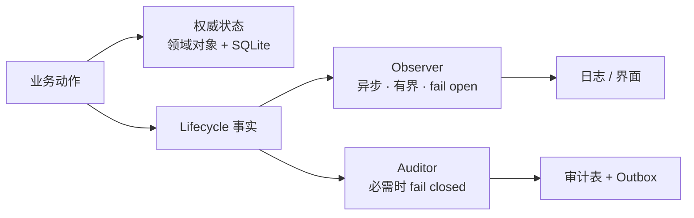

阶段 07 · 看见行为，但不混淆事实

<strong>上一章的结论：</strong>裁决有多层，等待和失败的种类都变多了。

<strong>本章要动的那一块：</strong>用户现在面对一个沉默的黑盒——它可能在想、在执行、在等审批、也可能已经拒绝了。要解释这些状态就必须发布信息，而<strong>不同信息丢失时的后果完全不同</strong>。

## 一次工具执行产生了四种信息

拿第 6 章的调用二（`rm -rf ./build`，灰名单，需要审批）来说。这一次执行会产生：

1. 「正在等待审批」——给用户看的界面提示
2. 「工具 exec_command 进入 awaiting_approval 阶段」——结构化的生命周期事实
3. 「这个 PreparedExecution 当前处于已授权未执行状态」——系统的权威状态
4. 「用户 X 在 T 时刻批准了参数摘要为 abc123 的调用」——审计记录

初学者最容易做的事是把这四样都塞进同一个「事件」概念里，用同一个总线发布。问题会在故障时暴露。

## 用一个问题把它们分开

对每一条信息问：**如果它丢了，会怎样？**

| 信息 | 丢了会怎样 | 因此需要的语义 |
|---|---|---|
| 界面提示 | 用户少看到一行字，执行结果不变 | 可丢弃，异步，绝不阻塞业务 |
| 生命周期事实 | 排查时少一段线索 | 有界队列，满了可丢，fail open |
| 权威状态 | 系统不知道这次执行到哪了 | 必须持久、唯一、可查询 |
| 审计记录 | 无法证明这次特权操作凭什么获准 | **必需，写不成就拒绝执行** |

最后两行和前两行的失败方向<b>正好相反</b>：进度事件丢了要继续执行，审计写不成要停止执行。把它们放在同一个通道里，必然有一半是错的。

这就是 Half-Pi 有两套机制的原因，它不是历史包袱：

权威状态信任与审计边界尽力展示

## 四类 Hook 各自能做什么

Lifecycle Registry 把扩展点分成四类，**关键在于能力是被刻意限制的**：

<section>
<h3>Guard</h3>

同步，可以拒绝。只能收紧，不能放宽。

</section>
<section>
<h3>Transformer</h3>

同步，可以改写——但只能在冻结之前（第 5 章）。

</section>
<section>
<h3>Observer</h3>

异步，收到不可变副本，<strong>无法改变任何业务事实</strong>。

</section>
<section>
<h3>Auditor</h3>

同步，只写记录。必需审计失败即阻止执行。

</section>

为什么不给 Observer 修改能力，让它「顺手」也能拦一下？因为 Observer 是异步的：等它发现问题时，副作用可能已经发生了。**一个能拦截但不保证时机的机制，比明确不能拦截更危险**——它会让人误以为有保护。

要拦就必须在同步准入路径上拦，那是 Guard 的位置。

## 一条信息串起整条链路

排查时最常问的问题是：「哪次 Face 请求导致了那台设备上的删除操作？」

要能回答，每条事实都得带上共享的标识：conversation、request、run，以及 trace 和 span。span 表达父子关系——一次 Chat 请求下面挂着若干次模型请求，每次模型请求下面挂着若干次工具调用。

这里有个安全约束容易被忽略：**事件里不放原始参数**。工具参数可能包含文件正文、密钥、个人信息，而事件会流向日志文件、终端、远程 Face。所以事件里只放参数的 SHA-256 摘要——足够用于关联和校验，但不泄露内容。需要看具体参数的地方（审批界面）走单独的、带权限检查的投影路径。

## 为什么 Face 不直接订阅 EventBus

一个很自然的想法：EventBus 已经有全部事件了，让远程 Face 连上来直接读，不是最省事吗？

<section>
<h3>Face 直接订阅总线</h3>

实现最快。但总线上的事件是<strong>为进程内展示设计的</strong>：没有按 Face 权限过滤、包含内部路径和错误细节、格式随时会改。

Half-Pi 不采用

</section>
<section class="is-chosen">
<h3>从领域 hook 显式投影</h3>

Gateway 为每种对外事件写明确的投影：哪些字段可见、按什么 scope 过滤、序号如何单调。

Half-Pi 的选择

</section>

还有一条更硬的理由：**远程客户端不应该靠解析控制台文本来理解状态**。那等于把展示格式变成了对外 API，任何一次输出微调都可能破坏客户端。[第 15 章](../15-face-protocol/) 会把这条投影关系正式化。

检查点：日志里有一行「tool succeeded」，重启后能拿它作为恢复依据吗？

不能。日志是投影，可能丢失、重复或乱序，而且没有事务保证。恢复必须查询权威状态——工具运行记录、远程 run 状态或持久化消息。这是本章那张表格里第三行和第一行的差别。

检查点：Observer 里发现某个操作很危险，立刻发取消信号，能当安全机制吗？

不能。Observer 异步且 fail open，它看到事件时副作用可能已经完成——取消一个已经删掉的文件没有意义。这类判断必须放在同步的 Guard 或 Authorizer 里。可以把 Observer 用于告警和事后分析，但不能算作防护。

检查点：为了排查方便，把工具参数原文也写进事件流，可以吗？

不可以。事件会进日志文件、终端和远程连接，而参数可能是文件正文或密钥。Half-Pi 在事件里只放参数摘要；需要人工核对参数时走带权限的审批投影路径。摘要同样能回答「这两次调用参数是否相同」这类排查问题。

## 本章的代价

分成四条通道之后，每加一条新信息都要先回答「它属于哪一类」。这是实打实的认知负担，换来的是**故障时行为可预测**：慢日志不会拖垮执行，丢事件不会伪造成功，而审计缺失一定会停下来。

现在过程可见了，但一切都在内存里。进程一重启，对话历史、审批状态、执行记录全部消失。下一章处理持久化——以及「哪些东西根本不该存」。

## 实现证据地图

| 证据 | 证明什么 |
|---|---|
| [`lifecycle/observer.go`](https://github.com/Sheyiyuan/half-pi/blob/main/modules/half-pi-core/lifecycle/observer.go) | Observer 的有界异步能力边界 |
| [`lifecycle/lifecycle_test.go`](https://github.com/Sheyiyuan/half-pi/blob/main/modules/half-pi-core/lifecycle/lifecycle_test.go) | Hook 排序、超时、隔离与失败语义 |
| [`store/lifecycle_audit_test.go`](https://github.com/Sheyiyuan/half-pi/blob/main/modules/half-pi-mind/internal/store/lifecycle_audit_test.go) | 安全决策与 outbox 原子提交 |

<nav class="tutorial-progress"><a href="../06-tool-runtime/">← 上一章</a>7 / 21<a href="../08-persistence/">下一章 →</a></nav>
