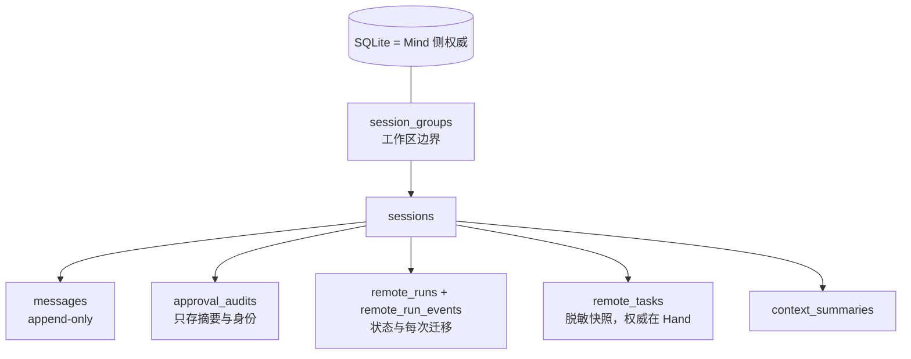

阶段 08 · 让事实活过一次进程

<strong>上一章的结论：</strong>权威状态和展示投影分开了，审计必需时 fail closed。

<strong>本章要动的那一块：</strong>上一章说「权威状态必须可查询」——但它现在全在内存里。<code>kill -9</code> 一下，全部消失。

## 在最坏的时刻杀掉它

设想 Mind 正处在这个瞬间：用户刚批准了一次远程删除，RPC 已经发给书房 Hand，Hand 已经开始执行，结果还没回来。

现在 Mind 崩溃重启。重启后它应该知道什么？

| 崩溃前的状态 | 重启后能知道吗 | 如果不知道会怎样 |
|---|---|---|
| 之前的对话说了什么 | 必须知道 | 用户面对一个失忆的 Agent |
| 用户批准过那次删除 | 必须知道 | 无法证明那次操作凭什么执行 |
| 有一个 run 发给了 study-pc | 必须知道 | 结果回来时不知道该给谁 |
| 那次删除到底执行成功了吗 | **不知道，而且无法知道** | 见下文 |

前三行靠写数据库解决。第四行是本章真正的难点——**它不是持久化能解决的问题**，因为那个事实此刻在另一台机器上。

## 存什么：Mind 的表结构

Half-Pi 用 SQLite 保存 Mind 侧的权威状态：

| 表 | 保存什么 |
|---|---|
| `session_groups` / `sessions` | 工作区边界与会话 |
| `messages` | 追加式对话历史，带稳定序号 |
| `approval_audits` | 审批绑定、裁决者身份、决定与时间 |
| `remote_runs` / `remote_run_events` | 远程执行的状态与每次迁移 |
| `remote_tasks` | 后台任务的**脱敏快照**（真实状态在 Hand） |
| `context_summaries` | 上下文摘要（[第 20 章](../20-context-compaction/)） |
| `security_decisions` / `lifecycle_outbox` | 安全裁决与可靠事件外发 |
| `hand_credentials` / `face_tokens` | 凭据与 scope |
| `management_audits` | 管理平面操作审计 |

两个设计点值得单独说。

**`remote_run_events` 为什么单独存一张表？** 如果只在 `remote_runs` 里存「当前状态」，你会丢掉迁移过程。排查时最需要的信息恰恰是「它是怎么从 running 走到 failed 的、中间隔了多久」。只存末态等于把病历换成一张死亡证明。

**`remote_tasks` 为什么叫「快照」？** 因为 Mind 不是这个状态的权威——真正在跑任务的是 Hand。Mind 存的是「我最后一次听说它是什么样」。这个区分是 [第 13 章](../13-remote-jobs/) 的核心。

表之间的归属关系决定了级联清理的方向：删掉一个 session group，属于它的会话、消息和审批记录一起清理。

## 不存什么：审计脱敏

一个直觉上很有道理的想法：审计表应该记录完整的工具参数，这样出事时能查清到底做了什么。

Half-Pi 不这么做。审计里存的是：工具名、**参数的规范摘要**、裁决者身份、决定、原因和时间。原始参数不进去。

<section>
<h3>审计存完整参数</h3>

排查最方便。但工具参数包含文件正文、密钥、个人信息——<strong>审计表会变成系统里最全的秘密仓库</strong>，而且它按设计要长期保留、广泛可读。

Half-Pi 不采用

</section>
<section class="is-chosen">
<h3>审计存摘要 + 身份</h3>

能证明「谁在何时批准了参数为 abc123 的这次调用」，能验证事后声称的参数是否一致，但不自己保存秘密。

Half-Pi 的选择

</section>

摘要保留了审计的核心用途：**验证**。有人声称「我批准的是删除 ./build」，拿那份参数算一次摘要就能对上或对不上。要做到这一点并不需要保存原文。

## 恢复：宁可标记失败，也不自动重跑

回到开头那个问题：重启后，那个「已发出但结果未知」的 run 怎么办？

三个选项：

<section>
<h3>假设成功</h3>

把它标成 succeeded 继续往下走。可能是对的，但如果实际失败了，后续所有推理都建立在假事实上。

制造假事实

</section>
<section>
<h3>自动重跑</h3>

重新发一次 RPC。对读文件没问题，对<strong>删除、写入、转账就是重复副作用</strong>——而系统无法判断哪次调用是幂等的。

最危险

</section>
<section class="is-chosen">
<h3>标记状态未知</h3>

标成 <code>lost</code> 或 <code>stale</code>，如实告诉用户「这次操作的结果我不知道」，让人根据实际情况决定。

Half-Pi 的选择

</section>

恢复的目标不是<b>让系统看起来正常</b>，而是<b>让系统对自己知道什么保持诚实</b>。「我不确定」是一个合法且有用的状态；假装确定不是。

不同领域的恢复规则各自定义：

| 领域 | 重启后的处理 |
|---|---|
| 消息历史 | 完整恢复，append-only 保证顺序可靠 |
| pending 审批 | 标记 `cancelled`——原来的等待者和连接都已不在 |
| 前台 run | 标记 `lost`——结果无法再路由回已消失的调用方 |
| 后台 task | 标记 `stale`，等 Hand 重连后对账真实状态 |

pending 审批那一行值得解释：为什么不保留它继续等？因为一个审批绑定的是「某个具体的执行正在等待这个裁决」。重启后那个 `PreparedExecution` 已经不存在了，即使用户现在点允许，也没有东西在等这个答案。保留它只会制造一个点了之后什么都不会发生的按钮。

## 事务边界：两件事必须一起成功

[第 6 章](../06-tool-runtime/) 说过必需审计失败要 fail closed。持久化层面的对应做法是：**业务状态和它必需的审计在同一个事务里提交。**

`security_decisions` 和 `lifecycle_outbox` 就是这样一对。如果分两次写，就存在一个窗口：裁决已生效但外发记录没写成（或反过来）。放进同一事务，两者要么都成立要么都不成立。

顺序也有讲究。审批的处理是**先持久化，再唤醒等待者**。反过来的话，一旦数据库写入失败，工具已经开始执行了，而记录没留下——正是第 6 章要避免的情况。

检查点：Mind 重启后，未完成的审批能不能继续等原来那个用户？

不能。审批绑定的是一个正在等待裁决的具体执行对象，重启后它已经不存在了。Half-Pi 把 pending 审批恢复为 `cancelled`，让调用方重新建立明确的等待关系。留一个点了没反应的按钮比直接告诉用户「这次请求已取消」更糟。

检查点：为了排查问题，审计表存完整工具参数，不是更有用吗？

不建议。审计表按设计要长期保留、被较多人读取，把原始参数放进去意味着它成为系统里最集中的敏感数据副本。摘要已经能支撑审计的核心用途——验证某份参数是否就是当时被批准的那份。真正需要看内容的场景（审批时）走单独的、有权限检查的投影路径。

检查点：既然有了摘要，是不是可以在压缩历史时把旧消息删掉省空间？

不能。原始消息是审计、恢复和后续重新压缩的事实来源。[第 20 章](../20-context-compaction/) 的做法是保持消息 append-only，另建一个摘要来改变<strong>发给模型的视图</strong>，而不是改写历史本身。删掉原文就再也无法验证摘要是否忠实。

## 本章的代价

持久化带来了 schema 迁移、事务边界和恢复语义三类成本，而且恢复语义必须逐个领域想清楚——没有通用答案。

现在 Agent 能行动、能被观察、能在重启后继续。下一章换个方向：不改核心循环，怎么扩展它的知识和工作方式。那一章还会展示一个**被明确否决的方案**，以及否决它的完整理由。

## 实现证据地图

| 证据 | 证明什么 |
|---|---|
| [`store/message.go`](https://github.com/Sheyiyuan/half-pi/blob/main/modules/half-pi-mind/internal/store/message.go) | 消息的追加写入与读取入口 |
| [`store/message_append_test.go`](https://github.com/Sheyiyuan/half-pi/blob/main/modules/half-pi-mind/internal/store/message_append_test.go) | 历史顺序、分页与请求绑定 |
| [`store/remote_run_test.go`](https://github.com/Sheyiyuan/half-pi/blob/main/modules/half-pi-mind/internal/store/remote_run_test.go) | run 恢复语义与不含原始参数的审计 |

<nav class="tutorial-progress"><a href="../07-observability/">← 上一章</a>8 / 21<a href="../09-skills/">下一章 →</a></nav>
