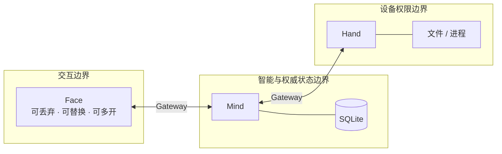
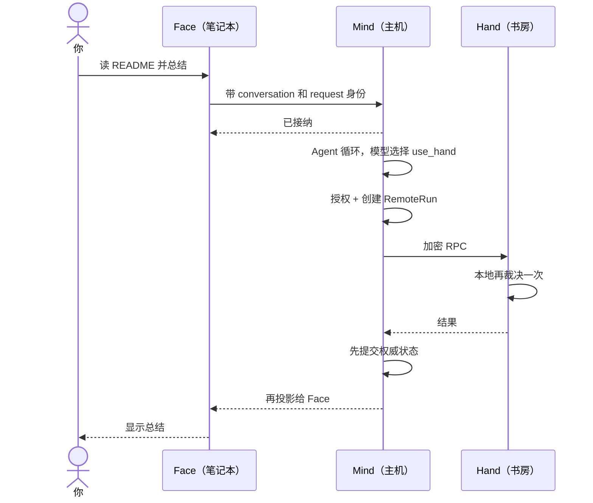

<p class="stage-marker">阶段 10 · 一个进程变成三个责任域</p>

<div class="bridge">
<p><strong>前九章的成果：</strong>一个单进程 Agent——能循环、能行动、有安全裁决、状态可恢复、知识可扩展。</p>
<p><strong>本章要动的那一块：</strong>那句贯穿全书的请求里有「书房电脑上的 Hand」。文件不在运行 Agent 的这台机器上。跨设备这件事，会让前九章的一批隐含假设失效。</p>
</div>

## 三个位置，三种生命周期

那句请求实际涉及三个不同的地方：

| 位置 | 干什么 | 生命周期 | 权限 |
|---|---|---|---|
| 笔记本 | 你在这里输入和查看 | 随时关掉、换设备、多开 | 只需要能连上 Mind |
| 常驻主机 | 跑模型、管对话、协调 | 长期在线 | 持有 API 密钥和会话数据 |
| 书房电脑 | 文件在这里 | 可能离线、可能重启 | 它自己的文件和进程权限 |

按职责划分就得到三个组件：**Face** 负责交互，**Mind** 负责智能和协调状态，**Hand** 负责在设备本地执行。



## 哪些假设失效了

前九章有一批没写出来但一直成立的假设。拆开之后它们全部不成立：

| 之前默认成立 | 拆开后的现实 | 后果 |
|---|---|---|
| 函数调用要么成功要么失败 | 网络请求还有第三种：**不知道** | 结果未知的执行需要单独的状态（第 8 章的 `lost`） |
| 消息按发出顺序到达一次 | 可能乱序、重复、丢失 | 需要序号和幂等标识（[第 11 章](../11-gateway-security/)、[第 15 章](../15-face-protocol/)） |
| 界面在，用户就在 | Face 随时断线，Chat 还在跑 | 连接生命周期 ≠ 业务生命周期 |
| 批准了就能执行 | 目标设备可能不同意 | 需要双重守门（[第 12 章](../12-hand-guard/)） |
| 状态在内存里就是唯一的 | 三个进程各有内存 | 必须指定谁是权威 |

最后一行是本章最核心的问题。

## 谁拥有「当前对话是什么」

如果 Face、Mind 各存一份对话状态，断线重连后就会出现分歧：Face 认为最后一条消息是 A，Mind 认为是 B。这时候谁对？

没有唯一答案的系统会用「最后写入胜出」之类的规则打补丁，然后在并发时产生谁都没说过的历史。Half-Pi 的做法是**明确指定权威所有者**：

| 状态 | 权威在哪 | 其他地方是什么 |
|---|---|---|
| 对话、消息、安全模式、当前 Hand | Mind | Face 上是快照和显示缓存 |
| 审批的首个裁决 | Mind | 各 Face 只展示待处理和已解决 |
| 前台远程执行 | Mind | 进度是可丢的观察 |
| 后台任务的真实执行 | **Hand** | Mind 存最后已知的脱敏快照 |
| 设备是否允许执行 | **Hand** | Mind 的批准不能覆盖 |

<div class="keypoint">
<p>注意最后两行不在 Mind 手里。这是本章最容易误解的地方：<b>状态集中不等于权限集中。</b></p>
</div>

## 为什么权限不能一起集中

Mind 已经持有对话、审批和协调状态了。让它顺便决定「Hand 该不该执行」看起来更简洁——只有一个地方做决定，实现也简单。

<div class="lenses" style="--cols:2">
<section>
<h3>Mind 的批准即设备许可</h3>
<p>只有一处决策，实现简单。但这意味着<strong>谁控制了 Mind，就控制了所有连上来的设备</strong>。设备所有者交出了自己机器上的最终决定权。</p>
<p class="verdict">Half-Pi 不采用</p>
</section>
<section class="is-chosen">
<h3>两边各守一道</h3>
<p>Mind 决定「用户的意图是否获准」，Hand 决定「这台机器是否愿意执行」。两者都能拒绝，任一拒绝都不能被另一方覆盖。</p>
<p class="verdict">Half-Pi 的选择</p>
</section>
</div>

第二种的实际意义：书房电脑的所有者可以配置「这台机器上永远不允许 `exec_command`」，即使 Mind 那边用户点了允许。**它对自己的机器保留最终否决权。** 这条边界让「把 Hand 装到别人的机器上」变成一个可以谈的事情，而不是一次无限授权。

代价是同一次调用可能有两个拒绝来源，用户会看到两种不同的拒绝原因——而且需要能分清是哪一侧拒的。

## 五个模块支撑三个进程

代码组织上是五个 Go 模块：

```
gateway-core/    # 通信协议、握手、加密、Hub
half-pi-core/    # ToolRuntime、安全策略、Lifecycle、通用工具
half-pi-mind/    # Mind：智能 + 状态 + 协调
half-pi-hand/    # Hand：设备侧执行
half-pi-face/    # Face：客户端
```

前两个是共享库，这样 Mind 和 Hand 用的是**同一份** ToolRuntime 和安全策略实现——不是两份看起来一样的代码。跨模块只能导入公开路径，`internal/` 下的东西不能跨模块引用，模块间通过导出接口交互。

这个约束的作用是防止「Hand 直接调 Mind 的内部函数」这种在单机时代很自然、在分布式下会破坏边界的写法。

## 一次请求现在要走多远

同样那句请求，现在的路径：



最后两步的顺序不是随便写的：**先提交权威状态，再投影给 Face。** 反过来的话，Face 可能显示了一个 Mind 最终没能保存的结果——用户看到成功，系统里没有记录。

<details class="checkpoint"><summary>检查点：Face 断线了，正在跑的 Chat 应该立刻取消吗？</summary>

不应该默认取消。连接是传输层的生命周期，Chat 是已经被接纳的业务操作——用户可能只是切换了网络，或者想换台设备继续看。Half-Pi 让 Chat 继续跑，重连后可以用相同的 request 标识找回结果。当然用户**显式**要取消是另一回事，那会真正传播下去。

</details>

<details class="checkpoint"><summary>检查点：Mind 已经审批通过了，Hand 还能拒绝吗？</summary>

能，而且必须保留这个权力。两者回答的是不同问题：Mind 证明「用户侧的意图获得了授权」，Hand 决定「这台机器此刻是否愿意执行」。设备的 allow/deny 列表、本地安全策略、工作目录限制都在 Hand 侧生效。丢掉这一层，装 Hand 就等于无限授权。

</details>

<details class="checkpoint"><summary>检查点：三个进程都在同一台机器上时，这套拆分是不是纯粹的浪费？</summary>

单机场景下确实有额外开销——序列化、加密、进程间通信。但换来两件事：Face 可以随时替换（终端、TUI、脚本、其他 Agent 用同一套协议），以及安全边界是真实的而不是约定的。如果只需要单机单用户，一个进程的 Agent 完全合理，[第 1 章](../01-model-is-not-agent/) 讲过同类取舍。

</details>

## 本章的代价

三端拆分换来了多端接入和跨设备执行，代价是引入了分布式系统的全套问题：身份、加密、重放、乱序、部分失败、状态恢复。接下来四章逐个处理。

先从最底层开始：Face 和 Hand 凭什么证明自己是谁，消息凭什么不被窃听和重放。下一章会看到 Half-Pi 的握手协议**被自己发现过一个真实漏洞**，以及修法。

## 实现证据地图

| 证据 | 证明什么 |
|---|---|
| [`go.work`](https://github.com/Sheyiyuan/half-pi/blob/main/go.work) | 五个模块的工作区边界与依赖方向 |
| [`conversation/manager_test.go`](https://github.com/Sheyiyuan/half-pi/blob/main/modules/half-pi-mind/internal/conversation/manager_test.go) | Mind 按 conversation 恢复独立 Actor |
| [`hand/hand.go`](https://github.com/Sheyiyuan/half-pi/blob/main/modules/half-pi-hand/internal/hand/hand.go) | Hand 持有自己的执行与授权路径 |

<nav class="tutorial-progress"><a href="../09-skills/">← 上一章</a><span>10 / 21</span><a href="../11-gateway-security/">下一章 →</a></nav>
