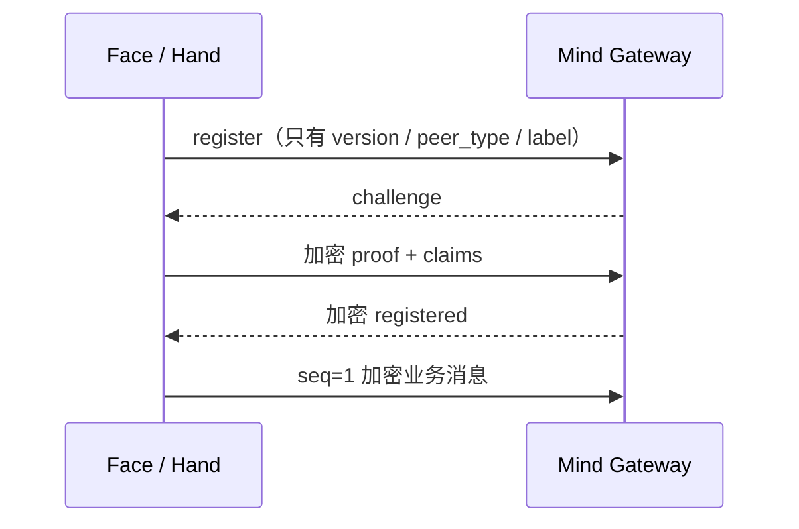

<p class="stage-marker">阶段 11 · 不把 WebSocket 当裸管道</p>

<div class="bridge">
<p><strong>上一章的结论：</strong>拆成三个进程，权威状态在 Mind，设备许可在 Hand。</p>
<p><strong>本章要动的那一块：</strong>「Face 连上 Mind」这句话现在还没有任何内容。Mind 凭什么相信连进来的是 Face 而不是别人？这一章用五个版本逐步回答，每一版都先让攻击者赢一次。</p>
</div>

## v0：明文 JSON over WebSocket

最简单的实现：开一个 WebSocket，双方发 JSON。

```json
{"type": "rpc", "tool": "exec_command", "args": {"command": "rm -rf /tmp/x"}}
```

**攻击者做什么：** 直接连上端口，发一条同样的消息。没有任何身份概念，任何能访问端口的人都是合法客户端。

## v1：加上 token

注册时带一个预共享的 token，Mind 查表验证。

```json
{"type": "register", "peer_type": "hand", "label": "study-pc", "token": "a3f9..."}
```

**攻击者做什么：** 在同一网络上抓包。token 是明文发的，抓一次就永久可用。业务消息也是明文，命令内容、文件路径、主机名全部可见。

这里有个容易被接受的错误结论：「加上 TLS 就好了」。TLS 确实能挡住这个抓包，但它解决的是**传输通道**的问题，不解决应用层身份——TLS 只证明「你连到了正确的服务器」，不证明「这条消息属于哪个已认证的 peer、是不是第几条、有没有被挪用到另一个连接」。

## v2：双秘密 + 应用层加密

Half-Pi 的做法是不在首帧发任何秘密。注册只公开三样东西：协议版本、peer 类型、label。



两个长期秘密——**token** 和 **application key**——都不上线，而是共同参与 HKDF-SHA-256 派生出三把 AES-128-GCM 密钥：一把算 proof，一把 C→S，一把 S→C。方向分离是为了避免两端用同一把密钥产生 nonce 复用和角色混淆。

身份声明（Hand 的主机名、工作目录等 `HandInfo`）放在**加密的 proof claims** 里，不在明文帧里。Envelope 头作为 AAD 绑定，防止一条合法消息被挪到另一个连接或另一个序号上。业务消息带严格递增的序号，旧序号一律拒绝。

旧版协议怎么办？**严格拒绝，不做兼容降级。** 如果 v2 服务端还接受 v1 的明文首帧，攻击者只要声称自己是 v1 客户端就能绕过全部加固——这是 [第 3 章](../03-model-providers/) 那条「不静默降级」原则在协议层的应用。

## v2 里的真实漏洞

上面这套看起来很完整。Half-Pi 后来在它身上发现了一个可实证的漏洞。

问题在 **transcript**——那份参与密钥派生的握手记录。v2 的 transcript 漏掉了两个字段：`expires_at` 和 `algorithm`。它们既不参与密钥派生，也不被任何 AEAD 覆盖。

于是攻击者可以这样做：

| 步骤 | 攻击者的动作 |
|---|---|
| 1 | 录制一次完整的 server→client 握手流量（**不需要任何秘密**） |
| 2 | 把 `expires_at` 改写成一个未来的时间 |
| 3 | 把改写后的流量重放给客户端 |
| 4 | 客户端派生出**相同的会话密钥**，接受这些历史业务消息 |

<div class="keypoint">
<p>教训不是「少写了两个字段」，而是：<b>握手里任何不被 transcript 或 AEAD 覆盖的字段，都等于可被篡改的字段</b>。「这个字段看起来无害」不是安全论据。</p>
</div>

## v3：补全 transcript + 前向保密

v3 的修法有两部分。

**第一，transcript 覆盖全部握手字段。** 现在的结构里每个字段都在：

```go
type HandshakeTranscript struct {
	ProtocolVersion int      `json:"protocol_version"`
	PeerType        PeerType `json:"peer_type"`
	Label           string   `json:"label"`
	HandshakeID     string   `json:"handshake_id"`
	ServerID        string   `json:"server_id"`
	SessionID       string   `json:"session_id"`
	Challenge       string   `json:"challenge"`
	ExpiresAt       int64    `json:"expires_at"`   // v3 补上
	Algorithm       string   `json:"algorithm"`    // v3 补上
	ClientShare     string   `json:"client_share"` // v3 新增
	ServerShare     string   `json:"server_share"` // v3 新增
}
```

光补字段不够——以后再加字段还是会漏。所以有一个用反射写的测试 `TestTranscriptCoversHandshakeFrames`，断言握手帧的**每一个 JSON 字段**都被 transcript 覆盖。漏同步就编译测试失败。这比「记得同步」这条约定可靠。

**第二，加入 ECDH 提供前向保密。** 双方各生成一对一次性的 X25519 密钥，交换 32 字节公钥（`client_share` / `server_share`），算出共享秘密，和两个长期秘密一起进 HKDF。

<div class="lenses" style="--cols:2">
<section>
<h3>只用长期秘密派生（v2）</h3>
<p>会话密钥可以仅由 token + application key 重算。<strong>秘密一旦泄露，此前录制的所有流量都能解密。</strong></p>
<p class="verdict">无前向保密</p>
</section>
<section class="is-chosen">
<h3>长期秘密 + 一次性 ECDH（v3）</h3>
<p>会话密钥每次握手都新鲜，且无法由长期秘密单独重算。临时私钥用后即弃。</p>
<p class="verdict">获得前向保密</p>
</section>
</div>

公钥要校验规范 base64 编码和长度；低阶点由 `crypto/ecdh` 在计算阶段直接拒绝。v2 客户端和缺失/畸形 share 在两端都 fail closed。

凭据格式没变，所以这次升级**不需要重新签发 token**。

## 顺手关掉一个信息泄露

还有一个更细的问题：如果 label 不存在，服务端直接返回「未知 label」错误，攻击者就得到了一个探测接口——可以枚举出哪些 label 已注册。

修法是：**未知 label 也用一次性随机秘密走完整握手**，最后统一在 proof 校验处失败。攻击者无法从时序或错误内容区分「label 不存在」和「label 存在但秘密不对」。

这和 [第 9 章](../09-skills/) 里 `view_skill` 对「不存在」和「无权限」返回同一个错误是同一个模式：**错误信息的差异本身就是信息。**

## 还没解决的问题

诚实地列出当前边界：

- 没有 TLS 时，握手**元数据**仍是明文可见的——peer 类型、label、时序、消息长度
- 没有静态非对称服务端身份，客户端无法在首次连接前独立验证服务端
- 没有握手限流，暴力尝试没有速率限制

这些是已知缺口，不是本章假装解决了的东西。

<details class="checkpoint"><summary>检查点：已经用 wss（TLS）了，应用层的序号和 session 还有必要吗？</summary>

有必要，两者管的不是同一件事。TLS 保证的是「这条 TCP 连接上的字节没被窃听或篡改」。应用层序号和 session 保证的是「这条业务消息属于哪个已认证 peer、在该连接内是第几条、不能被挪用到别的连接」。一条在 TLS 内合法传输的消息，仍然可以被服务端自己错误地当成另一个连接的消息处理。

</details>

<details class="checkpoint"><summary>检查点：payload 已经加密了，token 和 application key 记到日志里应该没事吧？</summary>

不行。它们是长期认证秘密，共同用于派生会话密钥。泄露之后攻击者可以自己发起合法握手，冒充那个 peer——加密保护的是传输中的内容，不是认证凭据本身。另外在 v3 之前，泄露长期秘密还能解密此前录制的流量；v3 的 ECDH 消除了这一点，但冒充风险依然存在。

</details>

<details class="checkpoint"><summary>检查点：为了兼容老版本 Hand，保留 v1 明文握手作为 fallback，可以吗？</summary>

不可以。降级路径的安全等级等于最弱那条路径的安全等级——攻击者会主动选择声称自己是 v1。这类「为了兼容」的旁路在协议安全里是最常见的失败原因。正确做法是要求升级客户端，并让旧协议明确失败。

</details>

## 本章的代价

正式协议带来了版本管理、密钥派生、错误处理和握手测试的成本。换来的是远程执行有了**可验证的来源**：Mind 能确定某条 RPC 结果确实来自那个已认证的 Hand。

但 Gateway 只证明「谁发来了什么」。它不回答「这台设备是否愿意执行」。下一章交给 Hand。

## 实现证据地图

| 证据 | 证明什么 |
|---|---|
| [`wss/handshake.go`](https://github.com/Sheyiyuan/half-pi/blob/main/modules/gateway-core/wss/handshake.go) | v3 握手、ECDH、proof 与方向密钥派生 |
| [`wss/handshake_test.go`](https://github.com/Sheyiyuan/half-pi/blob/main/modules/gateway-core/wss/handshake_test.go) | 旧协议、错误秘密、transcript 篡改与 label 枚举均被拒绝 |
| [`protocol/protocol.go`](https://github.com/Sheyiyuan/half-pi/blob/main/modules/gateway-core/protocol/protocol.go) | Transcript 字段与 Envelope / AAD 结构 |

<nav class="tutorial-progress"><a href="../10-face-mind-hand/">← 上一章</a><span>11 / 21</span><a href="../12-hand-guard/">下一章 →</a></nav>
