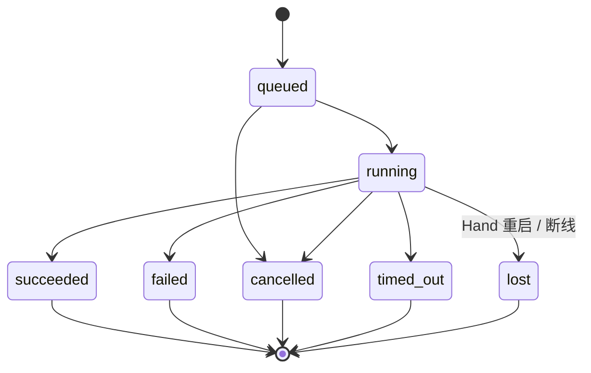

<p class="stage-marker">阶段 13 · 让长任务有正确的生命期</p>

<div class="bridge">
<p><strong>上一章的结论：</strong>一次远程调用被两侧各裁决一遍，结果绑定 Hand 和连接 generation。</p>
<p><strong>本章要动的那一块：</strong>上一章走读的是「读一个文件」——几十毫秒就结束。如果换成「构建整个项目」，要跑十分钟，前面那套模型立刻不够用了。</p>
</div>

## 十分钟的操作暴露了什么

读文件时不存在的问题，现在全都出现：

- 用户盯着一个没有任何输出的界面，不知道它是在跑还是卡死了
- 跑到第 8 分钟用户想取消——但命令可能已经改了一半的文件
- 第 5 分钟网络断了 30 秒，这期间的输出丢了；**任务本身应该继续吗？**
- Face 关掉了，用户想明天再看结果

这些需求指向三种**生命期完全不同**的东西，混在一起建模必然出错。

## 三种生命期

| | 前台 run | 进度流 | 后台 task |
|---|---|---|---|
| 用途 | 一次调用的权威状态 | 让用户看见正在发生什么 | 断线后仍要跑完的工作 |
| 丢了会怎样 | 不能丢，模型要靠它继续 | 少看几行输出，无影响 | 不能丢，用户明天要查 |
| 谁是权威 | Mind Registry | 没有权威，纯观察 | **Hand** |
| 终态 | 唯一 | 无终态概念 | 唯一 |
| 生命期绑定 | 调用方还在等 | 连接 | 独立于任何连接 |

<div class="keypoint">
<p>把进度当状态用是最常见的错误。<b>「最后一条进度显示 100%」不等于成功</b>——进度是允许丢弃的观察，而成功是需要终态裁决的事实。</p>
</div>

## 进度流：有界，且明确允许丢弃

进度的设计目标是「尽量让用户看到」，不是「保证送达」。一个跑十分钟的构建可能产生几十 MB 输出；如果全量转发并持久化，一次调用就能把连接和数据库打满。

所以有三个硬上限：

```go
MaxRPCProgressChunkBytes = 4 << 10   // 单条进度消息 4 KiB
MaxRPCProgressBytes      = 1 << 20   // 单次 run 总量 1 MiB
MaxRPCProgressEvents     = 256       // 单次 run 事件数
```

超出之后**丢弃后续进度，但不影响执行**——命令继续跑，终态照常产生。这是 [第 7 章](../07-observability/) 那条「可丢通道 fail open」的直接应用。

如果用户确实需要完整输出呢？那说明这个工作应该是后台 task——它有自己的日志文件，不受进度上限约束。**进度是给人看的，日志是留存的**，两者刻意分开。

## 走读一次竞争：取消和结果同时到达

这是本章的核心场景。

时间线：用户在第 8 分钟点了取消。取消请求发往 Hand 的同时，Hand 的命令**刚好执行完**，结果正在回程。两条消息在网络上交错。

Mind 此刻收到两个都合法的输入：一个「已取消」，一个「已成功」。终态该是哪个？

<div class="lenses" style="--cols:3">
<section>
<h3>取消优先</h3>
<p>用户的意图最新，听用户的。但命令<strong>确实已经跑完了</strong>——文件已经改了。报告「已取消」是在说谎。</p>
<p class="verdict">制造假事实</p>
</section>
<section>
<h3>结果优先</h3>
<p>如实反映发生了什么。但如果取消其实先到、Hand 也确实中止了，硬报成功同样是错的。</p>
<p class="verdict">同样可能说谎</p>
</section>
<section class="is-chosen">
<h3>先到者赢，且唯一</h3>
<p>由 Registry 仲裁：<strong>第一个合法终态胜出，之后所有终态被拒绝</strong>。哪个先到取决于实际时序，而实际时序就是事实。</p>
<p class="verdict">Half-Pi 的选择</p>
</section>
</div>

配套的界面语义很重要：用户点取消后，Face 只能显示「**取消已请求**」，不能显示「已取消」。真正的状态要等 Authority 仲裁完成。这听起来体验变差了，但另一种做法是**在界面上撒谎**——显示已取消，而那个命令实际跑完并改了文件。



## 后台任务：两条状态机，一个关联 ID

需要断线后继续的工作，显式声明 `background = true`。这时会发生一件容易搞混的事：

**启动这个任务的 run，和这个任务本身，是两条独立的状态机。**

- 启动 run：在 Hand 完成持久化登记后就**成功结束**了。它的成功只意味着「任务已被受理」
- 后台 task：独立继续执行，可能几分钟后才有结果

两者用 `task_id == start_run_id` 关联，但**这只是关联，不是同一个状态**。看到启动 run 成功就报告任务完成，是这里最典型的错误。

权威在 Hand 侧：它用自己的 SQLite 存元数据、用受限的日志文件存输出。Mind 存的是脱敏快照——「我最后一次听说它是什么样」。

| 情况 | Hand 侧 | Mind 侧 |
|---|---|---|
| 正常运行 | 权威状态 | 快照跟随更新 |
| 连接断开 | **任务继续跑** | 快照标 `stale` |
| Hand 重启 | 非终态任务标 `lost` | 重连后对账 |

## 为什么重启不自动重跑

Hand 重启后发现有几个任务处于 `queued`/`running`。自动重跑显然对用户更友好——为什么不做？

因为系统**无法判断哪个动作是幂等的**。重跑 `read_file` 无害，重跑 `git push`、重跑一次部署、重跑一次数据迁移则是重复副作用。而 Hand 手里只有一个工具名和一份参数，它没有任何依据来区分这两类。

<div class="keypoint">
<p>标记 <code>lost</code> 把「我不知道这个任务是否完成」如实交给用户判断。这比替用户赌一次幂等要好——<b>赌错的代价是不可逆的</b>。</p>
</div>

同样的理由，[第 8 章](../08-persistence/) 里 pending 审批恢复为 `cancelled`、[第 12 章](../12-hand-guard/) 里旧 run 标 `lost`，都是同一条原则。

<details class="checkpoint"><summary>检查点：最后一条进度显示「Build succeeded, 100%」，能把任务标成 succeeded 吗？</summary>

不能。进度是尽力投递、允许丢弃的观察通道，它甚至可能是命令输出里的一句普通文本。只有合法的终态结果能推进状态机。反过来也成立：<strong>没收到 100% 的进度不代表任务失败</strong>——进度可能已经超出上限被丢弃了。

</details>

<details class="checkpoint"><summary>检查点：Hand 重启后自动重跑 queued 任务，用户体验不是更好吗？</summary>

对非幂等操作风险太高，而系统无法自动判断幂等性。Half-Pi 标记 `lost`，由用户根据实际外部状态（文件是否已改、提交是否已推）决定要不要重新发起。「让用户多做一步」优于「可能执行两次不可逆操作」。

</details>

<details class="checkpoint"><summary>检查点：启动后台任务的那个 run 返回成功了，能告诉用户任务完成了吗？</summary>

不能。启动 run 成功只证明任务已被 Hand 持久化受理，它此刻很可能刚开始跑。两条状态机共用一个 ID 容易让人混淆，但它们的终态是分开的——要查任务结果必须查 task 状态，不是查启动 run。

</details>

## 本章的代价

三种生命期各自建模、加上 Hand 与 Mind 的对账机制，是本章引入的主要复杂度。换来的是系统不会把「已启动」误报成「已完成」，也不会把「没看到进度」误判成「失败」。

到这里跨设备执行完整了。但有个前提一直没兑现：Mind 得一直在线，才能持有这些 run 和 task。如果 Mind 本来只是个跟着终端一起启动退出的交互程序呢？下一章把它变成常驻服务。

## 实现证据地图

| 证据 | 证明什么 |
|---|---|
| [`protocol/rpc.go`](https://github.com/Sheyiyuan/half-pi/blob/main/modules/gateway-core/protocol/rpc.go) | 进度的三个上限与消息校验 |
| [`taskmanager/manager_test.go`](https://github.com/Sheyiyuan/half-pi/blob/main/modules/half-pi-hand/internal/taskmanager/manager_test.go) | 去重、取消竞争、重启 lost 与配额 |
| [`remoteexec/registry_cancel_test.go`](https://github.com/Sheyiyuan/half-pi/blob/main/modules/half-pi-mind/internal/remoteexec/registry_cancel_test.go) | result / cancel / disconnect 的唯一终态仲裁 |

<nav class="tutorial-progress"><a href="../12-hand-guard/">← 上一章</a><span>13 / 21</span><a href="../14-mind-service-actors/">下一章 →</a></nav>
