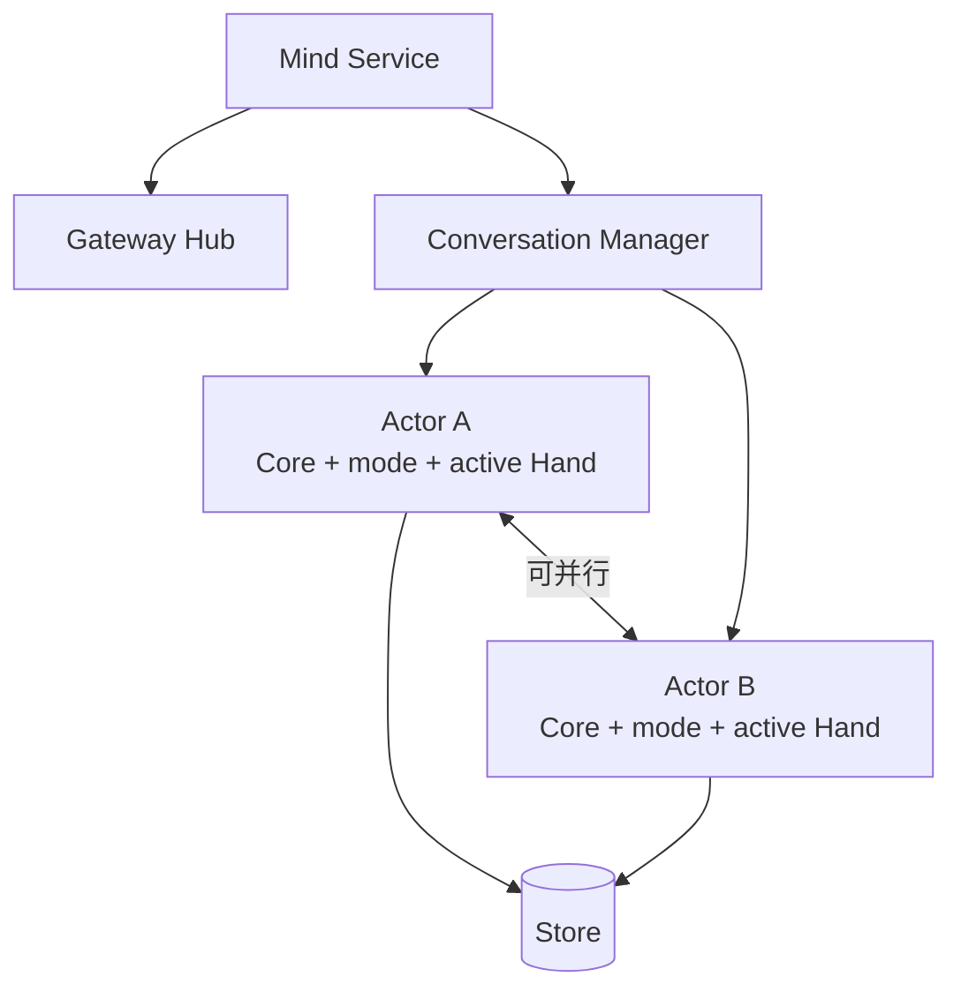

阶段 14 · 智能中心独立于终端存在

<strong>上一章的结论：</strong>后台任务在 Hand 侧继续跑，Mind 保存快照并在重连后对账。

<strong>本章要动的那一块：</strong>「Mind 保存快照并对账」有个前提——Mind 得活着。如果它是个跟着终端一起启动和退出的交互程序，用户一关窗口，Hub、run 和对账全都没了。

## 先把 REPL 降级成一个客户端

原来的形态是「Mind 就是那个 REPL 程序」。改法是把关系倒过来：

| | 服务模式（默认） | REPL 模式（`--repl`） |
|---|---|---|
| 跑什么 | WS Hub + Store + 各 Registry | 同上，**再加**一个交互适配器 |
| 输出去哪 | `~/.half-pi/logs/mind.log` | 终端 |
| 怎么退出 | 收到信号后有序关闭 | 用户退出 |
| 附带 | 写 PID 文件 | —— |

关键点：REPL 不再是 Mind 的本体，而是**接在服务上的一个交互适配器**。这条转变让 REPL 和远程 Face（[第 15 章](../15-face-protocol/)）能共用同一套 Actor 工厂和审批路径，而不是各走一条。

REPL 适配器默认选择 `transparent` 工具详情视图，所以操作者能在终端看到结构化参数、进行中的工具输出和可靠终态。它和 Face、EventBus 共享同一条 ToolRuntime/lifecycle 路径；透明模式只是展示投影选择，**不是绕过 Runtime、Authorizer 或审计的旁路**。透明日志可能包含用户自己传入的 token、密码或文件内容，终端与日志文件都应按可能含秘密的数据处理。

## 多个对话同时跑，状态放哪

服务化之后立刻有个新问题：Mind 现在要同时服务多个对话。每个对话都有自己的模型、安全模式、当前 Hand、会话级审批记忆。这些状态该怎么组织？

三种选法：

<section>
<h3>全局一个 Core</h3>

每次请求前切换到对应 session。实现最省事，但 mode、active Hand、审批缓存<strong>会泄漏到相邻请求</strong>——A 对话里批准过的东西可能影响 B 对话。

状态泄漏

</section>
<section>
<h3>全局一把锁</h3>

所有对话串行执行，杜绝泄漏。但一个跑十分钟的对话会<strong>阻塞所有无关对话</strong>，服务化的意义大打折扣。

并发粒度太粗

</section>
<section class="is-chosen">
<h3>每会话一个 Actor</h3>

每个 conversation 一个 Actor，持有自己的 Core、mode、active Hand。同会话内串行，不同会话并行。

Half-Pi 的选择

</section>

第一列的危险值得强调：**安全模式泄漏是一个安全问题**。如果用户在一个临时对话里切到 `yolo`，而这个模式泄漏到了另一个正在操作生产环境的对话，后果是实质性的。把状态所有权和并发边界对齐，是从结构上消除这类问题，而不是靠记得每次切换干净。

## Actor 内部仍然要串行

不同 Actor 之间并行，但**同一个 Actor 内部必须串行**。这就是 [第 2 章](../02-agent-loop/) 留下的那个伏笔——当时说「Conversation Actor 持有单会话操作租约」，在单机单用户下看起来多余，现在它的必要性出现了。

需要串行的不只是 Chat。上下文压缩（[第 20 章](../20-context-compaction/)）也在改同一段历史。如果 Chat 正在基于消息 1–50 构造模型请求，而压缩同时把 1–40 换成了一份摘要，那次请求就建立在一个已经不存在的视图上。两者共用同一个 mutation lease。

## 一个 conversation 只能有一个 Actor

还有个并发陷阱：两个 Face 几乎同时请求同一个 conversation，Manager 会不会创建出两个 Actor？

如果会，那就有两个状态所有者同时往同一段历史里写——[第 2 章](../02-agent-loop/) 那个「谁拥有这段历史」的问题又回来了，只是这次发生在进程内部。

所以 Manager 保证：并发加载同一个 ID 时，**返回同一个 Actor**。Actor 从 Store 恢复该会话的独立状态（[第 8 章](../08-persistence/) 的持久化在这里兑现）。

## 有序关闭

常驻服务多了一个之前不存在的要求：能可靠地停下来。收到信号后要按顺序做几件事——先停止接纳新请求，再关闭连接，最后关 Store。

顺序反了会出问题：如果先关 Store 再停接纳，中间到达的请求会撞上一个已关闭的数据库。而如果关闭过程没有超时上限，一个卡住的操作能让服务永远退不出去——运维上这和崩溃一样麻烦。

检查点：所有对话共用一个 Core，每次请求前切换 session，行不行？

容易泄漏状态。mode、active Hand、会话级审批缓存都挂在 Core 上，「切换干净」依赖每次都记得清空每一个字段——加一个新字段就可能漏一处。更重要的是安全模式泄漏属于安全问题而非体验问题。独立 Actor 让状态所有权和并发边界一致，从结构上消除这类 bug。

检查点：Chat 正在跑，能同时对同一个对话手动执行 compact 吗？

不能并发修改同一段上下文。两者共用 Actor 的 mutation lease，会被串行化。自动压缩也在模型请求前受同一边界协调——否则模型请求可能基于一个正在被替换的历史视图。

检查点：Mind 要退出了，正在跑的 Chat 应该立刻杀掉吗？

需要有序收尾而不是直接杀。理想情况是停止接纳新请求、给进行中的操作一个有界的完成窗口、把能提交的状态提交掉，然后退出。已经发给 Hand 的远程操作不会因为 Mind 退出而撤销——它们会按 <a href="../13-remote-jobs/">第 13 章</a> 的规则变成 <code>lost</code> 或继续作为后台任务运行。

## 本章的代价

Actor 模型带来了缓存管理、恢复逻辑和关闭编排的成本，也要求想清楚每个状态属于哪个 Actor。换来的是并发粒度和状态边界对齐。

Mind 现在能常驻了。下一章回答 Face 侧的问题：一个**不共享内存、随时可能断线**的客户端，怎么知道当前对话是什么状态。

## 实现证据地图

| 证据 | 证明什么 |
|---|---|
| [`conversation/manager.go`](https://github.com/Sheyiyuan/half-pi/blob/main/modules/half-pi-mind/internal/conversation/manager.go) | Actor 创建、恢复与进程内唯一性 |
| [`conversation/manager_test.go`](https://github.com/Sheyiyuan/half-pi/blob/main/modules/half-pi-mind/internal/conversation/manager_test.go) | 并发加载同一 ID 与 mutation lease 行为 |
| [`docs/archive/mind-service-mode.md`](https://github.com/Sheyiyuan/half-pi/blob/main/docs/archive/mind-service-mode.md) | Mind 从 REPL 演化为服务的决策背景 |

<nav class="tutorial-progress"><a href="../13-remote-jobs/">← 上一章</a>14 / 21<a href="../15-face-protocol/">下一章 →</a></nav>
