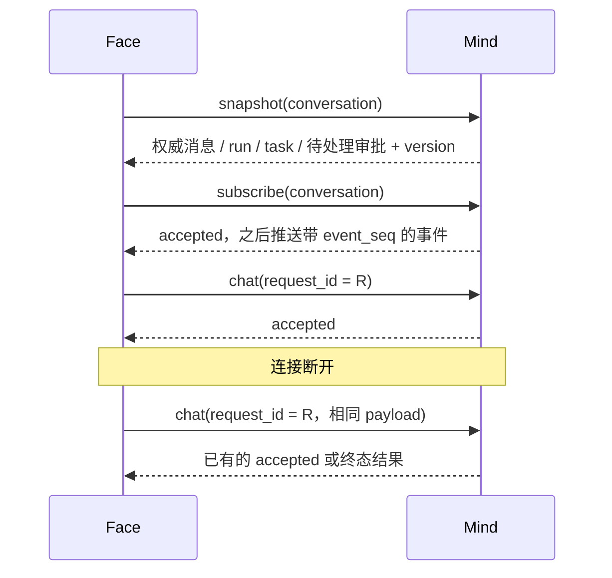

阶段 15 · 客户端不拥有会话真相

<strong>上一章的结论：</strong>Mind 常驻，每个对话一个 Actor，状态从 Store 恢复。

<strong>本章要动的那一块：</strong>Face 在另一台机器上，不共享内存，网络随时会断。它怎么知道「现在这个对话是什么状态」？

## 应用协议 revision 3：看见工具，但不改变事实

revision 3 为 `face.subscribe` 增加连接级 `detail_mode`：`operator` 省略时默认为 `transparent`；`observer` 省略时默认为 `summary`，显式请求 `transparent` 返回 `forbidden`，不能靠连接字段提升凭据权限。`summary` 只返回工具、状态、长度、摘要和告警；`transparent` 返回经过展示投影的参数、进度和结果。完整字段以 [`docs/tool-visibility.md`](https://github.com/Sheyiyuan/half-pi/blob/main/docs/tool-visibility.md) 为准。

详情模式在每次工具、前台 run 或后台 task admission 时冻结。断线、换一个订阅模式或 task 跨重连继续，都不能把已经按 `summary` 接纳的调用升级成透明历史；透明 admission 可以向 summary 订阅者降级投影。

工具事件分成两类可靠性：`chat.tool_called` 记录调用，`chat.tool.progress` 是有界瞬时输出，队列拥塞时可以丢失并用 `seq/gap` 标记；`chat.tool_completed` 携带可靠终态结果，长度和 digest 针对完整受限输出，不能用瞬时 progress 代替。`snapshot.tool_history` 恢复 admission 时保存的版本化展示记录：透明记录可以按当前连接降级为 summary，summary admission 没有可回填的原文；升级前的旧历史保持摘要，不从消息文本推测透明参数。

## 为什么本地缓存不够

最直觉的做法：Face 把收到的事件累积在本地，断线重连后接着收。

这在两个方向上都会错：

- **漏**：断线期间产生的事件没人给你补，本地状态永远缺一块
- **重**：重连后重发了一次请求，而 Mind 其实已经接纳并执行了

所以协议需要两样东西配合：一次**全量快照**用来对齐当前状态，加上**幂等的请求标识**用来判断某个请求是否已经被接纳过。

## 在五个时刻拔掉网线

同一次 Chat 请求，断线时机不同，恢复方式也不同。这张表是本章的核心：

| 断线时刻 | Mind 侧发生了什么 | Face 重连后怎么办 |
|---|---|---|
| 请求还没发出去 | 什么都没有 | 正常发起，没有歧义 |
| 请求发出，没收到 accepted | **可能已接纳，也可能没到** | 用相同 request ID 重发；Mind 返回已有 accepted 或正常新建 |
| 已 accepted，Chat 正在跑 | Chat 继续跑，不受连接影响 | 重发相同请求 → 拿到已有的 accepted，然后订阅后续事件 |
| Chat 已完成，终态事件没送到 | 终态已保存 | 重发相同请求 → 直接拿到**终态结果** |
| 完全结束，只是想看历史 | 无进行中操作 | 拉 snapshot 即可 |

第二行是最难的情况——Face 处于真正的不确定状态。解法是 `(principal_id, request_id)` 查重：

- 相同 payload 的相同 request → 返回已有的 accepted 或终态（**幂等重放**）
- 不同 payload 的相同 request → 明确报冲突（说明客户端有 bug，不能猜）

关键是 <b>Chat 的生命周期绑定在「已接纳的业务操作」上，不绑定在连接上</b>。断线不取消 Chat；<a href="../10-face-mind-hand/">第 10 章</a>那条「连接生命周期 ≠ 业务生命周期」在这里兑现。

终态记录会保留一段时间（有界保留，约 10 分钟、最多 256 条），足够覆盖常见的重连窗口，又不会无限增长。

## 不是所有请求都能自动重发

上面那套对 Chat 有效，因为它的 payload 是绑定的、可查重的。但能不能对**所有**未收到响应的请求都自动重发？

<section>
<h3>全部自动重发</h3>

恢复最彻底。但对非幂等的 mutation——创建对话、取消任务——重发可能<strong>创建两个对话或取消错误的目标</strong>。

重复副作用

</section>
<section class="is-chosen">
<h3>只重放协议明确支持的</h3>

Chat 这类有 payload 绑定和查重的可以重放；其他 mutation 先<strong>查询状态对账</strong>，确认没生效再重试。

Half-Pi 的选择

</section>

这和 [第 13 章](../13-remote-jobs/) 拒绝自动重跑后台任务是同一条原则：**幂等性必须被证明，不能被假定。**

## 快照里有什么

`snapshot` 要合并三个来源，因为没有任何单一位置持有全部状态：

| 来源 | 提供什么 |
|---|---|
| SQLite | 历史消息、已完成的 run |
| 活跃 Registry | 正在跑的 run、待处理审批 |
| Task 快照 | 后台任务的最后已知状态（权威在 Hand） |

revision 3 的快照还可以带 `tool_history`。它是 Store 保存的展示投影，不是把安全审计表变成原始参数仓库：透明记录按当前 Face 模式降级，summary 记录永远不能恢复原文。`chat.tool.progress` 和 `run.progress` 可以在断线期间缺失，但工具终态、Chat `face.result` 和快照中的权威状态必须可靠。

快照带 version，进程内单调。订阅事件带连接内单调的 `event_seq`——Face 发现序号有跳跃就知道漏了事件，可以主动重新拉快照对账，而不是默默带着一个缺口继续跑。

## 慢客户端不能拖垮别人

一个实际的运维问题：某个 Face 在很差的网络上，或者干脆卡住不读数据。事件在服务端堆积，怎么办？

做法是**每个连接一条独立的有界队列**。队列满了就断开**那一个**连接，其他 Face 不受影响。断开的那个重连后拉快照即可恢复——因为快照本来就是为这个设计的。

如果用共享队列，一个慢客户端会给所有人制造背压；如果用无界队列，它会耗尽内存。有界加隔离是唯一不会让一个坏客户端影响全局的选择。

## 身份不能只按名字认

一个容易忽略的安全细节。假设 Face 凭据的 label 是 `laptop`，被删除后又用同一个 label 建了一个新的、权限更高的凭据。

如果身份只按 label 解析，**旧连接会继承新凭据的权限**。所以 Half-Pi 用稳定的 principal ID，并要求它匹配握手时绑定的那一个。凭据删除后，旧连接不会因为同名新凭据出现而获得新权限。

另外，每一条 command 都要**重新**检查 scope、principal 和资源归属——不是握手时检查一次就一直有效。理由是权限可能在连接期间被撤销，而一个长连接可能存在数小时。

检查点：Face 本地已经显示了完整的回复文字，但没收到终态结果，能标成成功吗？

不能。流式 delta 是展示通道，它到达不代表最终持久化成功——Chat 可能在最后一步失败。应该用相同 request 重放或拉快照获取权威终态。这是 <a href="../02-agent-loop/">第 2 章</a>「半条回复不算事实」和 <a href="../07-observability/">第 7 章</a>「展示 ≠ 权威」在协议层的延续。

检查点：重连后把所有没收到结果的命令都自动重发一次，不是最省事吗？

只对协议明确支持重放、且 payload 有绑定的请求安全。其他 mutation 应该先查询当前状态：那个对话是不是已经建好了、那个任务是不是已经取消了。自动重发一个「创建」类操作，可能留下两份资源。

检查点：某个 Face 网络很差导致事件堆积，是不是应该给它更大的缓冲区？

加大缓冲只是把问题推后，而且把内存暴露给最差的那个客户端。有界队列加「满了只断自己」是更好的组合：坏客户端立刻被隔离，重连后靠快照恢复。快照机制的存在让「断开」变成一个可接受的处置手段。

## 本章的代价

快照、订阅、请求 Registry 三套机制显著增加了协议状态，Mind 侧要维护查重记录和每连接队列。换来的是 Face **真正可替换**——终端、TUI、脚本、另一个 Agent 都可以接同一套协议。

还有一类交互本章没处理：审批。它比 Chat 麻烦，因为多个 Face 可能同时看到同一个审批，还可能同时做出相反的裁决。下一章处理这场竞争。

## 实现证据地图

| 证据 | 证明什么 |
|---|---|
| [`facegateway/gateway.go`](https://github.com/Sheyiyuan/half-pi/blob/main/modules/half-pi-mind/internal/facegateway/gateway.go) | 连接、身份与 command 路由入口 |
| [`facegateway/gateway_test.go`](https://github.com/Sheyiyuan/half-pi/blob/main/modules/half-pi-mind/internal/facegateway/gateway_test.go) | 快照、scope、订阅、慢连接与状态 fallback |
| [`docs/face-protocol.md`](https://github.com/Sheyiyuan/half-pi/blob/main/docs/face-protocol.md) | 当前 Face wire contract |
| [`docs/tool-visibility.md`](https://github.com/Sheyiyuan/half-pi/blob/main/docs/tool-visibility.md) | revision 3 详情模式、工具事件和历史恢复 |

<nav class="tutorial-progress"><a href="../14-mind-service-actors/">← 上一章</a>15 / 21<a href="../16-async-approval/">下一章 →</a></nav>
