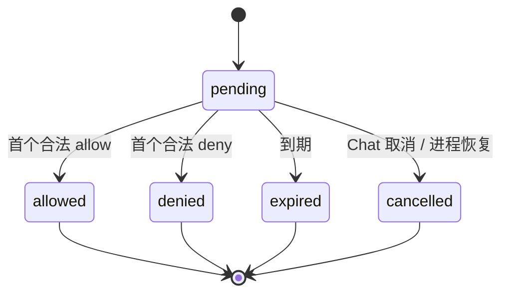

阶段 16 · 等待用户也是一条状态机

<strong>上一章的结论：</strong>Face 靠快照和请求重放恢复，Chat 不绑定连接生命周期。

<strong>本章要动的那一块：</strong><a href="../06-tool-runtime/">第 6 章</a>里审批是「暂停执行，问用户，等答案」。单机单终端时这没问题。现在有三个客户端，答案可能同时来自不同地方，甚至互相矛盾。

## 一个审批，三个客户端

场景：模型要在书房 Hand 上删一个目录，触发审批。此刻在线的有桌面 Face、手机 Face 和本地 REPL——**三个都会显示这个审批**。

会发生什么：

- 桌面点了「允许」，手机几乎同时点了「拒绝」
- 或者，批准的人点完之后网络断了，Mind 没收到
- 或者，没人处理，审批就这么挂着
- 或者，同一个人在两个客户端上各点了一次「允许」

每一种都需要明确的答案，而不能只考虑「用户点了允许」这条顺利路径。

## 首个合法裁决胜出

规则是：**第一个合法裁决成为事实，之后的一律拒绝。**

「合法」有一串条件，缺一不可：

| 检查 | 挡住什么 |
|---|---|
| 裁决者有审批 scope | 只读客户端不能批准操作 |
| 属于绑定的 conversation / request | 别的对话的用户不能批准这一次 |
| approval / run / tool 匹配 | 张冠李戴 |
| **参数摘要匹配** | [第 5 章](../05-registration-is-not-safety/) 的参数替换攻击 |
| 未过期 | 几小时前的审批框现在点已无意义 |

第二个点「允许」的客户端会收到「已解决」或冲突错误，**而不是成功**。这一点很重要：如果两个客户端都显示成功，两个用户都会以为是自己的决定生效了。出问题时的归因会完全错。

## 先写审计，再唤醒执行

这是本章真正的核心取舍，而且顺序反了很容易看不出问题。

用户点了允许，接下来两件事：把裁决写进审计表，唤醒那个暂停的 `PreparedExecution`。哪个先？

<section>
<h3>先唤醒，再写审计</h3>

用户感觉更快。但如果审计写入失败，<strong>工具已经在执行了，而没有任何记录能证明它凭什么获准</strong>。事后无法审计的特权操作。

Half-Pi 不采用

</section>
<section class="is-chosen">
<h3>先写审计，成功后再唤醒</h3>

审计提交成功才发布 resolved 事件、才唤醒执行。数据库故障时执行不会发生。

Half-Pi 的选择

</section>

这是 <a href="../06-tool-runtime/">第 6 章</a>「必需审计失败即 fail closed」的落地方式。<b>顺序本身就是安全机制</b>——不是「记得写日志」这种约定，而是「写不成就到不了执行那一步」这种结构。

## Broker 是进程级的，session 记忆不是

审批要跨多个入口协调，所以 Approval Broker 是**进程级**的单一对象——Face 和 REPL 竞争同一个首裁决，走同一条审计路径。

但有个东西刻意**不**共享：会话级的 allow/deny 记忆。用户在某个对话里选了「本次会话都允许这类操作」，这条记忆留在那个 conversation 的 Core 里，不跨 Actor。

理由和 [第 14 章](../14-mind-service-actors/) 拒绝全局 Core 一样：在一个临时对话里放宽的授权，不应该泄漏到另一个正在操作生产环境的对话。

## 重启后的 pending 审批

Mind 重启，数据库里有几条 `pending` 审批。恢复成什么？

标记为 `cancelled`。理由在 [第 8 章](../08-persistence/) 讲过，这里再确认一次：审批绑定的是「某个具体执行正在等这个答案」，而那个 `PreparedExecution` 已经随进程消失了。保留 pending 只会产生一个点了之后什么都不会发生的按钮——**比明确告知「已取消」更糟**。

## 取消要能穿透等待

用户不想等审批了，直接取消整个 Chat。这个取消必须能：

1. 让审批本身进入 `cancelled`
2. 唤醒那个正在阻塞等待裁决的工具调用，让它以取消状态结束
3. 如果已经有远程 run 在跑，通过 [第 13 章](../13-remote-jobs/) 那条路径取消它

第 2 点容易漏。如果只把审批标成 cancelled 而没唤醒等待者，那个工具调用会一直阻塞到超时——用户点了取消，界面却还在转圈。

检查点：两个 Face 都点了「允许」，第二个是不是也该显示成功？

不应该。只有一个裁决成为事实，第二个应收到「已解决」或冲突。如果都显示成功，两个用户都会认为是自己的决定生效——审计记录里是 A，而 B 也以为是自己批的。归因错误在事后追查时代价很高。

检查点：审批界面只展示工具名和一个参数摘要哈希，用户看得懂吗？

界面**可以也应该**展示人类可读的关键参数（哪个文件、哪台机器、什么命令），只要做好安全投影——长内容截断、敏感字段打码。但协议层的裁决必须绑定完整的规范参数摘要。两者是不同层次：展示层为了让人能判断，协议层为了防止参数替换。

检查点：审批设一个很长的过期时间（比如 24 小时），是不是对用户更友好？

不友好，而且不安全。用户在 24 小时后看到一个审批框，早已不记得当时的上下文——此时点「允许」不构成有意义的同意。而且那段时间里系统资源一直被一个暂停的执行占着。过期是一种保护：它把「无人处理」明确变成一个终态，而不是无限等待。

## 本章的代价

异步审批让用户可以从任意客户端处理请求，代价是要严格处理时序、身份、幂等和过期——以及为每个连接维护可靠的裁决投递队列。

审批这条最复杂的交互路径打通后，可以看两种真实的客户端了。下一章：一个给人用的全屏终端，一个给程序用的 JSONL 管道，它们如何共用同一套协议而不分叉。

## 实现证据地图

| 证据 | 证明什么 |
|---|---|
| [`approval/broker.go`](https://github.com/Sheyiyuan/half-pi/blob/main/modules/half-pi-mind/internal/approval/broker.go) | 进程级审批状态、首裁决与持久化先行 |
| [`facegateway/approval_test.go`](https://github.com/Sheyiyuan/half-pi/blob/main/modules/half-pi-mind/internal/facegateway/approval_test.go) | scope、过期、归属与多 Face 竞争 |
| [`facegateway/approval_integration_test.go`](https://github.com/Sheyiyuan/half-pi/blob/main/modules/half-pi-mind/internal/facegateway/approval_integration_test.go) | 加密 Face 审批真正授权绑定的 RPC |

<nav class="tutorial-progress"><a href="../15-face-protocol/">← 上一章</a>16 / 21<a href="../17-face-clients/">下一章 →</a></nav>
