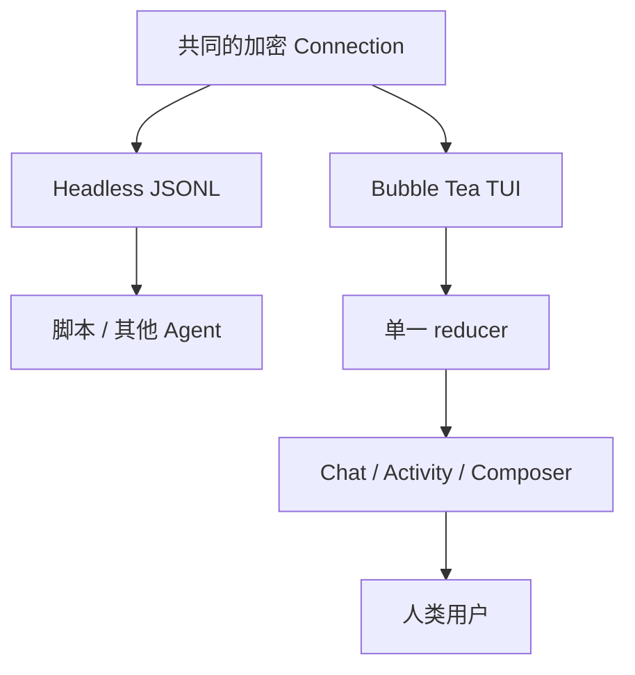

阶段 17 · 一个协议，两种交互形态

<strong>上一章的结论：</strong>审批可以从任意客户端异步处理，首裁决胜出且审计先行。

<strong>本章要动的那一块：</strong>协议齐备了，但还没有真正的客户端。而两类用户的需求几乎相反——人要富交互界面，程序要干净的机器可读输出。

## 两种需求，两种形态

| | 人类用户 | 自动化程序 |
|---|---|---|
| 想要 | 浏览对话、看进度、处理审批、查任务 | stdout 上只有可解析的协议消息 |
| 输出 | 富文本、布局、颜色 | 严格 JSONL，一行一条 |
| 最怕 | 信息看不清、界面错乱 | 混进一行提示日志，管道就废了 |

Half-Pi 因此有两种模式：**TUI**（Bubble Tea 全屏工作台）和 **Headless**（JSONL 管道）。

## 共享什么，各自负责什么

关键设计决策是划清这条线：

<section>
<h3>两者共享</h3>

同一个加密 <code>client.Connection</code>、同一套 <code>face.*</code> command / event / result 结构、同样的 scope 检查、同样的重连与 replay 语义。

身份与协议不分叉

</section>
<section class="is-chosen">
<h3>各自负责</h3>

怎么渲染、怎么组织本地状态、怎么响应输入。TUI 有 reducer 和布局，Headless 直接透传。

只有表现层不同

</section>

为什么不给 Headless 开一条直接调用 Mind 内部函数的捷径？因为那样测出来的**集成信心是假的**。真实协议、加密握手、scope 检查恰恰是最需要验收的部分——绕过它们的测试通过了，只说明绕过的那条路能用。这和 [第 3 章](../03-model-providers/) 的 ScriptedProvider、[第 5 章](../05-registration-is-not-safety/) 拒绝 `SkipChecks` 是同一条原则。

实际收益是：Headless Face 可以直接用于真实进程的端到端测试，也可以让**另一个 Agent** 通过它接入 Half-Pi。

## 终端要防的三件事

TUI 面对的问题和协议无关，但同样是安全问题。

**控制字符。** Mind 转发的内容里可能有 C0/C1 控制字符——它们可能来自被读取的文件，或者模型生成的文本。直接打到终端上，可以移动光标、清屏、改标题，甚至在某些终端里触发更严重的行为。所以渲染前要转义。这是**输出侧的注入攻击**，容易被忽略，因为大家习惯只防输入。

**旧连接的延迟事件。** 断线重连后，旧连接的事件可能晚到，把新连接的状态覆盖成过期数据。解法是给每次连接标一个 generation，忽略非当前 generation 的事件——和 [第 12 章](../12-hand-guard/) 用 connection generation 拒绝旧 run 结果是同一个模式。

**payload 严格校验。** 即使消息来自已认证的 Mind，渲染前也要验证结构。嵌套结果要按当前挂起的操作校验，而不是见到什么就渲染什么。

## TUI 的几个设计点

**首次发送要做四件事。** 用户打开 TUI 看到的是一个本地草稿，还没有对应的 conversation。第一次按发送时依次执行：create → subscribe → snapshot → chat。放在发送时而不是启动时，是为了让「打开看一眼就关掉」不产生空对话。

**delta 原地聚合，终态重新渲染。** 流式增量在原位累积（保持视口稳定，不跳动），拿到终态后用 Markdown 重新渲染一次。

**审批默认 deny once。** 审批框的默认选项是「拒绝这一次」而不是允许。理由是误触的代价不对称——误拒只是多一次操作，误允许可能是不可逆的。

**前台进度和后台任务日志严格分开。** 对应 [第 13 章](../13-remote-jobs/) 那两条通道，界面上不能混在一起，否则用户会把可丢的进度当成完整日志。

**非交互环境明确失败。** 在管道里请求 TUI 模式会直接报错并提示用 `--mode headless`，而不是降级成一堆乱码。

## 重连时的克制

Connector 持有凭据，按 generation 隔离连接，断线自动退避重连。恢复行为遵循 [第 15 章](../15-face-protocol/) 的规则：

- Chat 用**原来的 request ID** 重放，拿到已有 accepted 或终态
- 非幂等 mutation **只对账，不自动重发**

界面上这意味着：重连后用户可能看到「正在确认之前的操作状态」而不是立刻恢复。这是诚实的代价。

检查点：为了方便测试，Headless 直接调 Mind 的本地函数、跳过 Gateway，可以吗？

不可以。加密握手、scope 检查、command 路由正是要验收的行为。绕过它们的测试只能证明「绕过后的路径能跑」，而生产环境走的是另一条路。Half-Pi 的进程 E2E 用真实的 `-race` 二进制、真实端口、真实握手，理由就是这个。

检查点：重连后收到了旧连接的终态事件，应该更新界面吗？

不应该直接更新。TUI 按 connection generation 忽略旧连接的事件，然后通过当前连接的 snapshot 或 request replay 对账。旧事件可能已经过期——比如那个 run 后来又发生了状态变化。

检查点：模型输出的文字来自已认证的 Mind，直接打到终端上有什么风险？

有。文字内容本身可能来自不可信来源——被读取的文件、网页内容、模型生成。其中的控制字符能操纵终端行为。「消息来源可信」和「消息内容可信」是两件事，这和 <a href="../04-tools/">第 4 章</a>「模型输出是不可信输入」是同一个道理，只是发生在输出侧。

## 本章的代价

共享协议避免了后端分叉，但两个客户端各自要处理渲染安全、布局适配和本地恢复。TUI 尤其吃细节——响应式布局、视口稳定、键鼠路由都得自己管。

功能到这里齐了。但「代码能跑」和「能交给别人部署」之间还有距离：凭据怎么管、Mind 没启动时怎么操作、Windows 上那些 Unix 假设怎么办。下一章处理这些。

## 实现证据地图

| 证据 | 证明什么 |
|---|---|
| [`headless/runner.go`](https://github.com/Sheyiyuan/half-pi/blob/main/modules/half-pi-face/internal/headless/runner.go) | Headless JSONL 走正式协议循环 |
| [`tui/reducer_test.go`](https://github.com/Sheyiyuan/half-pi/blob/main/modules/half-pi-face/internal/tui/reducer_test.go) | 首次发送、gap 恢复与 generation 隔离 |
| [`docs/ai-face-protocol.md`](https://github.com/Sheyiyuan/half-pi/blob/main/docs/ai-face-protocol.md) | Headless Face 的接入约定 |

<nav class="tutorial-progress"><a href="../16-async-approval/">← 上一章</a>17 / 21<a href="../18-operations/">下一章 →</a></nav>
