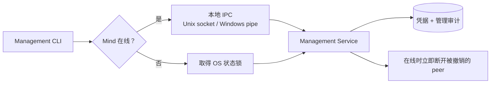

阶段 18 · 让架构成为可运行的产品

<strong>上一章的结论：</strong>两种客户端共用同一套加密协议，各自负责渲染。

<strong>本章要动的那一块：</strong>Face 要连上 Mind 得先有凭据。而「创建一个 Face 凭据」这个看起来最简单的操作，藏着一个麻烦的条件——<strong>Mind 此刻可能没在运行</strong>。

## 一个条件，两条路径

用户要执行 `half-pi-mind face add laptop`。两种情况：

**Mind 在线。** 不能直接改数据库——因为撤销一个凭据需要**立刻断开**对应的在线连接，而那个动作只有 Mind 进程内的 Hub 能做。绕过它去写数据库，会得到一个「凭据已删除但连接还活着」的状态。

**Mind 离线。** 没有进程可以委托，只能直接开 SQLite。但如果此时 Mind 启动了，两个进程会同时持有同一个数据库。

解法是两条路径汇聚到同一个 Service：

两条路径的差别只在<b>怎么到达 Service</b>，不在 Service 做什么。业务逻辑、审计事务、校验规则只有一份——否则离线路径迟早会漏掉在线路径后来加的某条检查。

状态锁是关键：离线 CLI 和 Mind 启动时都要先拿这把 OS 级别的锁，才能打开 Store。这样「离线操作」和「Mind 启动」不会重叠。

## 凭据的处理细节

三个约定：

- **秘密只显示一次。** 创建时输出，之后 `list` 不回显。数据库里存的不是可以反查的原文
- **mutation 和审计同事务提交。** 成功的凭据变更必须伴随成功的审计记录（[第 8 章](../08-persistence/) 那条原则）
- **失败也留审计。** 但只记无秘密的失败事实，不记尝试用的值

## Unix 假设在 Windows 上逐项失效

Half-Pi 前面用到的几乎每个操作系统原语都需要 Windows 对应物：

| 需要什么 | Unix | Windows |
|---|---|---|
| 本地 IPC | Unix domain socket | Named pipe（`go-winio`） |
| 状态锁 | 文件锁 | `LockFileEx` |
| 权限收紧 | 文件权限位（`0600`） | DACL 仅允许当前用户 SID 和 SYSTEM |
| 杀进程树 | 进程组 | Job Object（[第 12 章](../12-hand-guard/)） |

按项目约定，这些差异用 build tag 加平台文件（`_unix.go` / `_windows.go`）在**编译期**决定，不用运行时 `if runtime.GOOS` 分支。

<section>
<h3>运行时 GOOS 判断</h3>

一个文件里写全平台逻辑。但不适用的平台 API 仍然被编译进二进制，而且各平台的代码路径混在一起难以单独测试。

Half-Pi 不采用

</section>
<section class="is-chosen">
<h3>编译期平台文件</h3>

不适用的实现在编译期就被排除，零运行时开销，每个平台的实现可以独立阅读和测试。

Half-Pi 的选择

</section>

## 单元测试发现不了的问题

这一章还有一个更普遍的教训：**有些问题只在真实进程里出现。**

Half-Pi 的发布门禁要跑真实的 `-race` 二进制端到端测试——真实端口、真实握手、临时 HOME 和数据库。它实际抓到过这些：

- 交互式终端在测试环境下的输入注入行为差异
- named pipe 的 deadline 错误在不同平台上的表现不一致
- 目录 DACL 的继承行为
- PowerShell 下非零退出码的收集方式

这些没有一个能靠单元测试发现，因为它们恰好出在「进程边界」和「操作系统交互」上——而单元测试通常把这两样都 mock 掉了。

Windows 侧的验收在真实的 Windows 11 环境跑（`386`/`amd64`/`arm64` 交叉编译 + 原生 race 测试）。有一个已知边界：`windows/arm` 不在构建矩阵里，因为上游的 `modernc.org/sqlite` 不支持它。

检查点：Mind 在线时，CLI 直接写同一个 SQLite 文件不是更快吗？

不行。数据库变化不会自动通知 Mind 进程内的 Hub 和各个 Registry——撤销一个凭据后，那个连接会继续保持在线。另外这也绕过了进程内的管理审计顺序。快几毫秒换来一个不一致的状态，不值得。

检查点：平台差异用 `runtime.GOOS` 在一个文件里判断，不是更集中易读吗？

集中，但代价大。不适用平台的 API 调用仍然会被编译（有时根本编译不过，需要更多存根代码），而且各平台逻辑交织在一起，难以为单一平台独立测试。项目约定用 build tag 让编译器在编译期就排除不适用的实现。

检查点：单元测试全绿，是不是可以发布了？

不够。单元测试通常 mock 掉进程边界和操作系统交互，而这两处恰好是运维问题的高发区——文件锁、命名管道、权限继承、进程退出码、终端行为。Half-Pi 的门禁额外要求真实进程的 `-race` E2E，历史上抓到的问题都属于单元测试盲区。

## 本章的代价

管理平面加跨平台实现让验收矩阵显著变大——每个平台都要跑交叉编译、原生 race 测试和进程 E2E。换来的是从「代码能编译」推进到「真实进程能安全运行」。

功能和运维都齐了。但回看前面 17 章，会发现一件事：Chat、工具、审批、远程执行、审计各自发展出了自己的一套回调和事实格式。下一章处理这个技术债——为什么它必须被统一。

## 实现证据地图

| 证据 | 证明什么 |
|---|---|
| [`management/service.go`](https://github.com/Sheyiyuan/half-pi/blob/main/modules/half-pi-mind/internal/management/service.go) | 在线 / 离线复用的同一业务入口 |
| [`e2e/management_e2e_test.go`](https://github.com/Sheyiyuan/half-pi/blob/main/modules/half-pi-mind/e2e/management_e2e_test.go) | 真实进程的管理链路与撤销行为 |
| [`docs/archive/mind-management-cli.md`](https://github.com/Sheyiyuan/half-pi/blob/main/docs/archive/mind-management-cli.md) | 管理服务、IPC 与状态锁的决策背景 |

<nav class="tutorial-progress"><a href="../17-face-clients/">← 上一章</a>18 / 21<a href="../19-lifecycle-audit/">下一章 →</a></nav>
