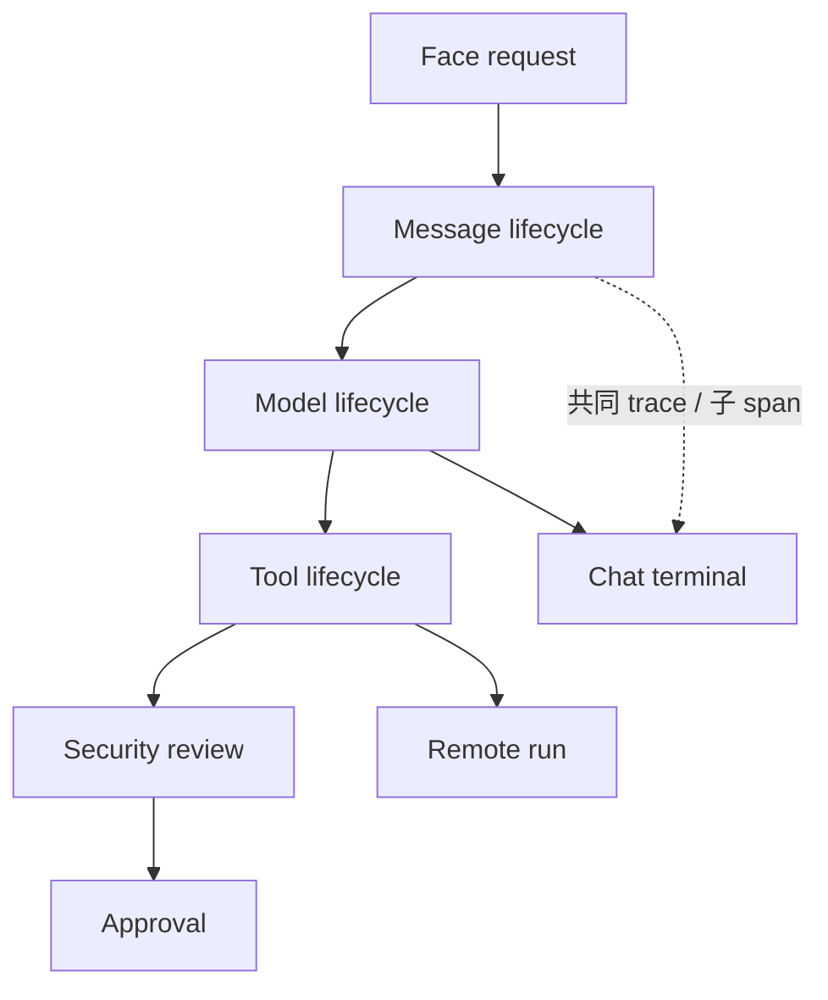

阶段 19 · 让跨子系统的事实说同一种语言

<strong>前 18 章的成果：</strong>一个功能完整、可跨设备、可运维的 Agent 系统。

<strong>本章要动的那一块：</strong>把前面的章节连起来看，会发现一笔技术债——每个子系统都自己长出了一套回调、事实格式和失败语义。本章解释为什么它必须还。

## 先看这笔债有多大

回头数一下前面各章各自引入了什么扩展点和事实：

| 章节 | 引入了什么 |
|---|---|
| [第 2 章](../02-agent-loop/) | Chat 的开始与终态 |
| [第 3 章](../03-model-providers/) | 模型请求与流式响应 |
| [第 5–6 章](../05-registration-is-not-safety/) | 工具冻结、安全裁决、用户审批 |
| [第 7 章](../07-observability/) | 展示事件、生命周期事实、审计 |
| [第 12–13 章](../12-hand-guard/) | 远程 run、进度、后台 task |
| [第 15–16 章](../15-face-protocol/) | Face 请求、审批的异步裁决 |

如果每一个都定义自己的回调签名、自己的标识字段、自己的失败语义，会出现一个很具体的问题：

> **「哪一次 Face 请求，导致了那台设备上那次已审批的删除操作？」**

这个问题在排查和审计时天天要问。而如果 Chat 用 `session_id`、工具用 `invocation_id`、远程执行用 `run_id`、审批用 `approval_id`，且它们之间没有统一的关联关系，回答它就得靠人工拼时间戳——不可靠，而且在并发时根本拼不出来。

## 统一的是什么

`half-pi-core/lifecycle` 固定三样东西：

- **共享 Meta**：conversation、request、run、trace、span
- **固定 Phase 和 Outcome**：每类事实有确定的阶段和结果取值
- **统一 wire contract**：跨子系统同一种表达

trace 和 span 建立父子关系：一次 Face 请求下挂若干次模型请求，每次模型请求下挂若干次工具调用，工具调用下可能挂一次远程 run。于是上面那个问题变成一次沿 trace 的查询。

## 四类 Hook：能力被刻意限制

[第 7 章](../07-observability/) 已经介绍过这四类，这里补上「为什么不能混」。

| Hook | 同步性 | 能改业务吗 | 失败语义 |
|---|---|---|---|
| Guard | 同步 | 只能拒绝（单调收紧） | 失败即拒绝 |
| Transformer | 同步 | 能改参数，仅限冻结前 | 失败即中止 |
| Observer | **异步** | **不能** | fail open，队列满可丢 |
| Auditor | 同步 | 只写记录 | 必需时 fail closed |

假设允许一个 Hook 既改参数又写审计，会怎样？

**审计可能记录错误的值。** 如果它先写审计再改参数，记录的是旧值；顺序反了又要保证所有实现都记得这个顺序。而当有多个这样的 Hook 时，**执行顺序决定了审计内容**——同一次调用在不同注册顺序下会留下不同记录。

拆开注册之后，Transformer 只在冻结前跑、Auditor 只看冻结后的事实，顺序不再影响正确性。每类 Hook 还有各自的排序、scope 和超时。

限制扩展点的能力不是为了防止开发者做坏事，而是为了让<b>系统的行为可以在不阅读所有 Hook 实现的前提下被推理</b>。

## 一个具体后果：完整输出要先缓冲

这是能力划分带来的一个不太直观的结果。

模型的回复是流式的，自然的做法是边生成边发给 Face。但如果某个 Guard 或 Transformer 需要检查**完整**的 assistant 输出（比如敏感内容过滤、格式改写），边生成边外发就意味着——**内容在被检查之前已经送出去了**。之后 Guard 拒绝也没用，用户已经看到了。

所以当启用了需要完整输出的策略时，交付自动切换成 buffered：先收完整、检查通过、再持久化和交付。

代价是用户失去打字机效果，感觉变慢。这是安全和体感的直接冲突，Half-Pi 选择让**策略是否存在**来决定，而不是让开发者手动配对。

另外，`ChatTransport` 被明确定位成「只负责 Face 流传输与背压」——它不是 Hook，不参与裁决。把传输和策略分开，避免了「在传输层顺手做检查」这种位置错误的实现。

## 可靠外发：有 outbox，但不假装有 consumer

`security_decisions` 和 `lifecycle_outbox` 同事务提交（[第 8 章](../08-persistence/)），dispatcher 支持重试、死信和保留策略。

但有一个刻意的选择：**没有正式 consumer 时不启动空 dispatcher。**

理由是诚实性。启动一个没有下游的 dispatcher，会让系统看起来「已经具备事件外发能力」，而实际上事件只是从一个表搬到另一个地方。这会把「有 outbox 基础设施」误写成「已有插件 runtime」——而后者[还没实现](https://github.com/Sheyiyuan/half-pi/blob/main/docs/plugin-architecture.md)。

检查点：一个 Hook 既改参数又写审计，不是更省事吗？

会让顺序和责任难以验证。改参数和记录参数是两个动作，它们的先后决定了审计内容是新值还是旧值；多个这样的 Hook 叠加时，注册顺序会影响审计正确性。Half-Pi 把 Transformer 和 Auditor 分开注册，各自拿到受限视图，让顺序不再影响正确性。

检查点：模型输出是流式的，为什么有时候要等完整了才显示？

因为如果有 Guard 或 Transformer 需要检查完整输出，提前显示就等于在检查前泄露了内容——之后拒绝也来不及。此时系统自动切换到 buffered delivery。没有这类策略时仍然是流式的。

检查点：既然 outbox 已经实现了，为什么不顺便启动 dispatcher？

因为没有 consumer 时它不产生价值，却会让系统的能力看起来比实际更多。这属于文档和实现的诚实性问题：「具备可靠外发的基础设施」和「已经有插件 runtime 在消费事件」是两件事，不该被一个空转的进程模糊掉。

## 本章的代价

统一 Lifecycle 要求所有生产路径遵守同一套契约——新增子系统不能再自己发明一套回调。换来的是可关联、可扩展且不可绕过的事实链。

还剩一个物理限制没处理。前面所有章节都在往对话历史里加东西：消息、工具调用、结果、进度摘要。而模型的输入窗口是有限的。下一章处理这个必然会撞上的墙。

## 实现证据地图

| 证据 | 证明什么 |
|---|---|
| [`lifecycle/coordinator.go`](https://github.com/Sheyiyuan/half-pi/blob/main/modules/half-pi-core/lifecycle/coordinator.go) | 四类 Hook 的共享协调入口 |
| [`agentcore/lifecycle_chat_test.go`](https://github.com/Sheyiyuan/half-pi/blob/main/modules/half-pi-mind/internal/agentcore/lifecycle_chat_test.go) | 缓冲交付、Guard 拒绝与审计 fail closed |
| [`docs/archive/lifecycle-hooks-and-security-audit.md`](https://github.com/Sheyiyuan/half-pi/blob/main/docs/archive/lifecycle-hooks-and-security-audit.md) | 统一 Lifecycle 的决策与不变量 |

<nav class="tutorial-progress"><a href="../18-operations/">← 上一章</a>19 / 21<a href="../20-context-compaction/">下一章 →</a></nav>
