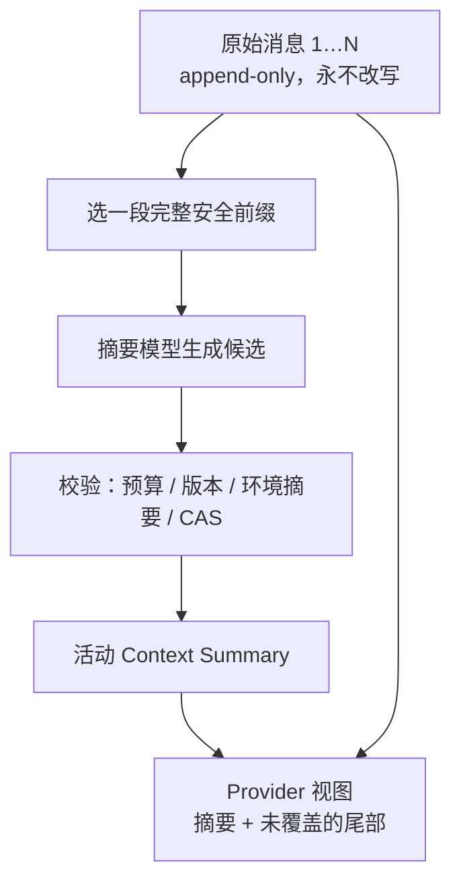

阶段 20 · 压缩模型视图，不改写历史

<strong>上一章的结论：</strong>跨子系统的事实统一到共享 Meta 和四类受限 Hook。

<strong>本章要动的那一块：</strong>前 19 章一直在往历史里加东西——消息、工具调用、结果。而模型的输入窗口是固定的。这堵墙一定会撞上。

## 三种直觉做法，各自破坏一条不变量

<section>
<h3>删掉最旧的消息</h3>

最简单。但开头往往是<strong>最重要的约束</strong>——用户的目标、限制条件、「不要碰生产环境」。删掉它们，模型会开始违反自己早已同意的约束。

丢失约束

</section>
<section>
<h3>原地改写历史</h3>

把旧消息替换成摘要，省空间。但审计、请求重放和恢复全都依赖原始历史（<a href="../08-persistence/">第 8 章</a>）——改写之后再也无法验证摘要是否忠实。

破坏事实来源

</section>
<section class="is-chosen">
<h3>原文不动，另建投影</h3>

消息保持 append-only；另建一份摘要，只改变<strong>发给模型的视图</strong>。

Half-Pi 的选择

</section>

核心区分：<b>历史是事实，发给模型的内容是一个视图。</b>压缩改的是视图，不是事实。

## 压缩边界不能随便切

一个具体的坑：如果压缩范围的末端刚好切在一次工具调用和它的结果之间，会得到一段**协议上非法**的历史——一个有调用没结果的 assistant 消息。多数模型会直接报错，或者行为异常。

这是 [第 2 章](../02-agent-loop/) 那条「工具调用和结果必须配对」在压缩时的回响。所以压缩范围只能跨越完整的消息和完整的 tool batch，不能拆开语义单元。

## 走读一次压缩：它要校验什么才敢提交

压缩不是「生成摘要然后存下来」。从开始到提交，中间世界可能已经变了：

| 校验项 | 防的是什么 |
|---|---|
| source generation | 压缩期间又有新消息追加进来了 |
| 环境 digest | Skill 重载、工具目录变化、系统提示改了（[第 9 章](../09-skills/)） |
| 请求 fingerprint | 候选是否对应当前这次请求的环境 |
| 预算 | 压完之后是否真的低于目标水位 |
| CAS 提交 | 有没有另一个操作已经提交了别的摘要 |

举个具体的失败例子：压缩开始时 Skill 库有 3 个技能，摘要生成花了 5 秒，这期间用户执行了 `/skill reload` 加载了第 4 个。这份摘要是基于旧环境生成的——**提交它就等于让后续请求基于一个不再成立的环境**。Engine 拒绝提交，由后续操作重试。

最后的提交用 compare-and-swap，摘要和 lifecycle outbox 原子写入。冲突时不覆盖新事实。

## 自动压缩的节奏

用高低水位而不是单一阈值：到达**高水位**触发压缩，压到**低水位**为止。

如果只有一个阈值，压完之后马上又会越过它，于是每加一条消息都触发一次压缩——每次都要花一次模型调用。高低水位之间的空间就是「压一次能撑多久」。

还有一道更硬的防线：如果上下文已经超过**硬预算**，在向 Provider 发请求前就 fail closed。

为什么不直接发出去让 Provider 自己截断？因为**截断方式不可控**：它可能砍掉系统提示、可能砍掉工具定义、可能把一次 tool batch 切成两半。一个明确的错误比一次行为异常的成功调用更好排查。这又是「不静默降级」（[第 3 章](../03-model-providers/)）。

## 摘要不是免费的，也不是无损的

诚实地说清代价：

- 每次压缩要**额外花一次模型调用**（时间和钱）
- 摘要是**有损的**。它会丢细节，可能丢掉后来才发现重要的东西
- 摘要本身由模型生成，因此**可能出错或遗漏**

所以原始历史必须保留——它是唯一能在事后重新压缩（rebase）的依据。摘要兼容时可以增量扩展；不兼容或需要修正时走显式 rebase。

检查点：压缩成功后，把被覆盖的原始消息删掉省空间，可以吗？

不能。原始历史是审计、恢复和未来 rebase 的事实来源。摘要只改变发给模型的视图，删掉原文之后就再也无法验证摘要是否忠实，也无法用更好的策略重新压缩。<a href="../08-persistence/">第 8 章</a>的 append-only 约束在这里兑现。

检查点：摘要生成期间用户重载了 Skill，这份摘要还能提交吗？

不能。环境 digest 已经变化，这份候选代表的是旧环境。提交它会让后续请求建立在一个不再成立的环境假设上。Engine 拒绝提交，后续操作会重试——宁可多花一次模型调用，也不引入一个静默的不一致。

检查点：上下文已经超过硬预算了，直接发给 Provider 让它自己截断行不行？

不行。截断行为不可控，可能砍掉系统提示、工具定义，或把一次 tool batch 切成两半——后者会产生协议非法的历史。Core 在准入前停下来，尝试按配置压缩，或返回明确错误。可诊断的失败优于不可预测的成功。

## 本章的代价

严格的版本、环境和并发校验意味着压缩**可能失败并重试**，而且每次都要额外花一次模型调用。换来的是它不会悄悄改写事实。

到这里，21 章的结构全部就位。最后一章把它们串成一次完整的请求——以及所有主要的异常路径。

## 实现证据地图

| 证据 | 证明什么 |
|---|---|
| [`compact/engine.go`](https://github.com/Sheyiyuan/half-pi/blob/main/modules/half-pi-mind/internal/compact/engine.go) | 范围选择、候选校验、CAS 提交与失败事件 |
| [`compact/engine_test.go`](https://github.com/Sheyiyuan/half-pi/blob/main/modules/half-pi-mind/internal/compact/engine_test.go) | 增量摘要、环境变化与限流行为 |
| [`store/compact_test.go`](https://github.com/Sheyiyuan/half-pi/blob/main/modules/half-pi-mind/internal/store/compact_test.go) | append-only 投影与原子提交 |

<nav class="tutorial-progress"><a href="../19-lifecycle-audit/">← 上一章</a>20 / 21<a href="../21-graduation/">毕业章 →</a></nav>
