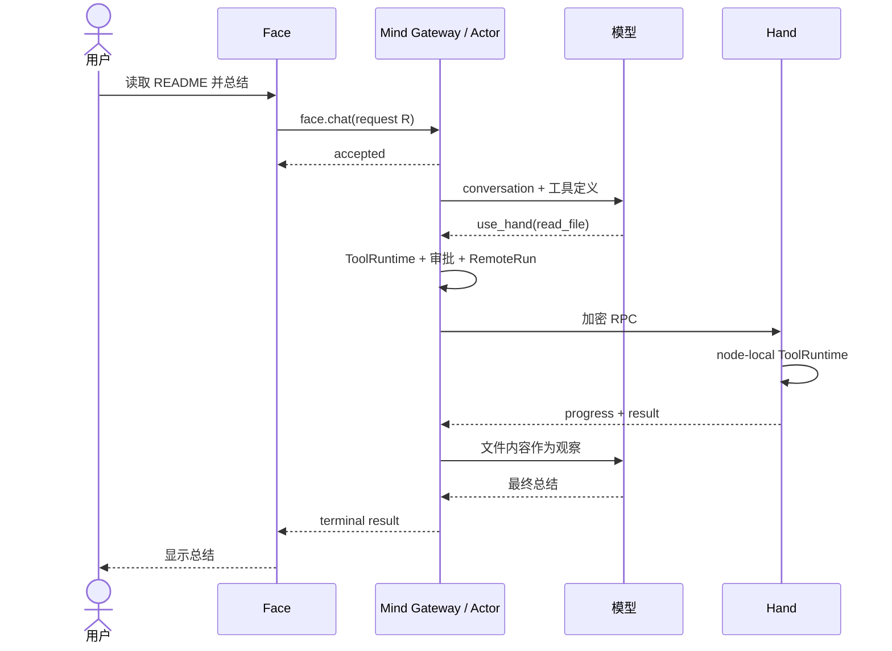

阶段 21 · 把局部设计还原成完整系统

<strong>第 1 章那句请求：</strong>「请让书房电脑上的 Hand 读取项目的 README，再由 Mind 总结一下。」

<strong>那时它办不到。</strong>现在它经过身份验证、会话恢复、安全审批、双重守门、进度与取消、持久化和可靠审计——本章走完它，然后走完它所有主要的失败方式。

## 成功路径

这条链上的每一段都对应前面的章节：

| 段 | 发生了什么 | 哪一章建立的 |
|---|---|---|
| Face → Mind | 握手认证、scope 校验、请求接纳 | [11](../11-gateway-security/)、[15](../15-face-protocol/) |
| Actor 取得租约 | 单会话串行化，加载历史与模式 | [8](../08-persistence/)、[14](../14-mind-service-actors/) |
| 构造模型请求 | 上下文视图 + Skill 索引 + 工具定义 | [3](../03-model-providers/)、[9](../09-skills/)、[20](../20-context-compaction/) |
| 模型选择 use_hand | 循环推进，等待观察 | [2](../02-agent-loop/)、[4](../04-tools/) |
| Mind 外部准入 | 冻结、策略、审批、绑定摘要 | [5](../05-registration-is-not-safety/)、[6](../06-tool-runtime/)、[16](../16-async-approval/) |
| Hand 本地执行 | 设备侧再裁决一次 | [12](../12-hand-guard/) |
| 结果回到模型 | 唯一终态，写入权威状态 | [13](../13-remote-jobs/) |
| 投影给 Face | 先提交，再展示 | [7](../07-observability/)、[15](../15-face-protocol/) |

注意<b>没有任何一个组件对整条链拥有全部权威</b>：Mind 拥有会话与协调事实，Hand 拥有设备执行许可，Gateway 约束连接身份，Store 与各领域状态机保存各自的事实。

## 每个箭头都会失败

上图有十几个箭头，每个都可能断——而且**断在不同时刻后果不同**。这是完整系统真正的复杂度来源。

| 异常 | 谁来裁决 | 用户怎么恢复 |
|---|---|---|
| Face 凭据或 scope 无效 | Gateway 在接纳前拒绝 | 修复凭据；不会产生 Chat |
| 安全策略硬拒绝 | ToolRuntime 记录拒绝，不发 RPC | 换个目标，而不是想办法覆盖 |
| 用户拒绝审批 | Broker 记录首裁决 | 按需重新发起 |
| 审批无人处理 | 到期转 `expired` | 重新发起 |
| Hand 本地拒绝 | RPC rejected，run 进入拒绝终态 | 查设备策略后再决定 |
| Hand 上没有该工具 | 明确拒绝，不隐式安装 | 在设备侧显式启用 |
| Face 断线 | Chat 继续跑 | snapshot + 相同 request replay |
| result 与 cancel 竞争 | Registry 只接纳一个终态 | 查 run 的权威状态 |
| Hand 断线 | 前台 run 标 `lost`；后台 task 标 `stale` | 重连后对账，不自动重跑 |
| Mind 重启 | pending 审批转 `cancelled` | 重新发起 |
| 上下文接近上限 | Actor 自动 compact；硬预算前 fail closed | 手动 compact / rebase 后重试 |

## 三条贯穿全书的原则

回看这 21 章，反复出现的其实只有三条判断标准。

**一，区分「事实」和「关于事实的陈述」。**
模型说读了文件 ≠ 读了文件（[第 1 章](../01-model-is-not-agent/)）。日志说成功 ≠ 成功（[第 7 章](../07-observability/)）。进度显示 100% ≠ 成功（[第 13 章](../13-remote-jobs/)）。界面显示完整回复 ≠ 终态成功（[第 15 章](../15-face-protocol/)）。每一次，答案都是去查权威状态。

**二，故障时往安全的一侧倒，并且如实说不知道。**
Reviewer 挂了升级到用户而不是放行（[第 6 章](../06-tool-runtime/)）。审计写不成就不执行（[第 6](../06-tool-runtime/)、[16 章](../16-async-approval/)）。没配 Authorizer 默认拒绝（[第 5 章](../05-registration-is-not-safety/)）。结果未知就标 `lost` 而不是猜（[第 8](../08-persistence/)、[13 章](../13-remote-jobs/)）。环境变了就拒绝提交摘要（[第 20 章](../20-context-compaction/)）。

**三，不留旁路，也不静默降级。**
删掉 `SkipChecks`（[第 5 章](../05-registration-is-not-safety/)）。不支持的能力明确拒绝而非悄悄丢弃（[第 3 章](../03-model-providers/)）。旧协议版本严格拒绝（[第 11 章](../11-gateway-security/)）。测试替身走正规扩展点（[第 3](../03-model-providers/)、[17 章](../17-face-clients/)）。没有 consumer 就不启动空 dispatcher（[第 19 章](../19-lifecycle-audit/)）。

## Half-Pi 的复杂性来自哪里

这套系统比「一个调模型的循环」复杂得多。但复杂度不是自我增殖的，它逐条对应真实约束：

| 约束 | 换来的结构 |
|---|---|
| 模型输出不可信 | 结构化工具 + Schema 校验 + 冻结 |
| 工具能造成不可逆副作用 | 多层裁决 + 审批绑定 + 审计 |
| 资源在别人的机器上 | 三端拆分 + 双重守门 |
| 网络会断、消息会重放 | 握手、加密、序号、幂等标识 |
| 客户端可能有多个且会掉线 | 权威状态 + 快照 + 请求重放 |
| 进程会重启 | 持久化 + 保守恢复语义 |
| 上下文窗口有限 | append-only 原文 + 摘要投影 |

如果你的场景没有其中某几条约束，对应的结构就可以省掉——[第 1 章](../01-model-is-not-agent/) 说过，不需要观察外部世界的任务根本不该做成 Agent。**这套架构不是「Agent 的正确做法」，而是「这些约束下的一种解」。**

## 当前的边界

教程只描述已实现的能力。仍未解决或未落地的：

- 无 TLS 时握手元数据明文可见；没有静态服务端身份；没有握手限流（[第 11 章](../11-gateway-security/)）
- 插件 runtime 尚未实现，outbox 有基础设施但没有正式 consumer（[第 19 章](../19-lifecycle-audit/)）
- Windows 原生凭据 / 配置 / 数据库 ACL 的发布环境验收，以及 ConPTY 与 macOS PTY 的全屏 TUI 发布验收仍在进行

检查点：用户点了取消，界面能立刻显示「已取消」吗？

只能显示「取消已请求」。那个命令可能已经执行完了，必须等权威状态机仲裁后的终态。[第 13 章](../13-remote-jobs/) 讲过这个竞争——另一种做法是在界面上撒谎。

检查点：Face 一条 progress 都没收到，能推断 Hand 没执行吗？

不能。progress 是有界且允许丢弃的通道（单块 4 KiB、单 run 1 MiB、256 事件上限）。应该查 run / task 的权威状态和最终结果。「没看到」和「没发生」是两件事。

检查点：哪个组件对整条请求拥有全部权威？

没有。Mind 拥有会话与协调事实，Hand 拥有设备执行许可，Gateway 约束连接身份，Store 和各领域状态机保存各自的事实。这是刻意的：单一全权组件意味着攻破它就等于攻破全部，也意味着设备所有者交出了自己机器的控制权。

## 接下来去哪

主线到这里结束。接下来可以用 [架构手册](../../architecture/) 回查当前系统边界、状态机、失败语义和源码入口。

<nav class="tutorial-progress"><a href="../20-context-compaction/">← 上一章</a>21 / 21<a href="../../architecture/">架构手册 →</a></nav>
