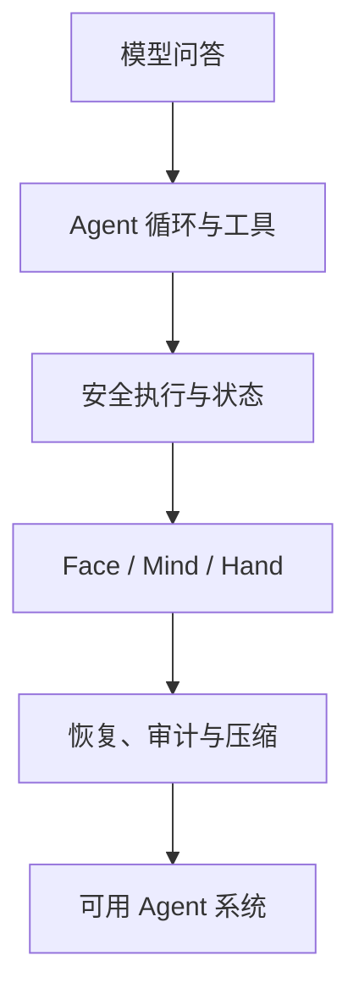

如果你想知道 Half-Pi 为什么被拆成 Mind、Face 和 Hand，不必一开始就钻进源码。先沿着这条路线走：从一次普通模型问答出发，逐步补上循环、工具、安全、状态、远程执行、审批和审计。

每一章只回答一个核心问题，也只引入解决它所必需的结构。读完之后，你再回到架构手册或源码，会更容易看出每个模块为什么存在。

## 怎么读

这不是 API 手册，也不是从文件树开始的源码导览。它更像一条建设路线：先遇到问题，再比较方案，最后落到 Half-Pi 当前采用的实现。

章节形式会随问题变化：有的章逐轮走读一次 Agent 循环（[第 2 章](./02-agent-loop/)），有的章用攻击场景证明“注册工具”不等于“安全执行”（[第 5 章](./05-registration-is-not-safety/)、[第 11 章](./11-gateway-security/)），也有章节把几种设计摆开对比，再解释为什么选择其中一种（[第 9 章](./09-skills/)、[第 14 章](./14-mind-service-actors/)）。

每章开头会接住上一章留下的问题；中间的折叠**检查点**适合先自己判断再展开；章末的**证据地图**用于回查实现与测试。被否决的方案也值得看，因为很多架构边界正是从这些失败路径里长出来的。

## 五段路线

### 第一段：让模型成为会行动的 Agent

1. [模型调用为什么还不是 Agent](./01-model-is-not-agent/)
2. [从一次问答到 Agent 循环](./02-agent-loop/)
3. [如何适配不同模型提供商](./03-model-providers/)
4. [为什么 Agent 需要工具](./04-tools/)
5. [为什么工具注册不等于安全执行](./05-registration-is-not-safety/)
6. [审批、安全策略与统一 ToolRuntime](./06-tool-runtime/)

### 第二段：让行为可观察、可延续

7. [如何观察模型、工具和系统行为](./07-observability/)
8. [为什么会话与消息必须持久化](./08-persistence/)
9. [Skill 如何扩展知识与工作方式](./09-skills/)

### 第三段：把能力安全地延伸到另一台设备

10. [为什么要拆分 Face、Mind 与 Hand](./10-face-mind-hand/)
11. [Gateway、身份、加密与防重放](./11-gateway-security/)
12. [Hand 远程执行与设备侧最终守门](./12-hand-guard/)
13. [取消、进度流和持久化后台任务](./13-remote-jobs/)

### 第四段：让多端交互在断线后仍然成立

14. [Mind 服务化与 Conversation Actor](./14-mind-service-actors/)
15. [Face 协议、快照、订阅与请求重放](./15-face-protocol/)
16. [异步审批、并发竞争与断线恢复](./16-async-approval/)
17. [Headless Face 与全屏 TUI](./17-face-clients/)

### 第五段：走向可发布的系统

18. [管理 CLI、跨平台边界与进程验收](./18-operations/)
19. [为什么最终需要统一 Lifecycle 与可靠审计](./19-lifecycle-audit/)
20. [上下文为什么会溢出，以及如何安全压缩](./20-context-compaction/)
21. [毕业章：完整请求及主要异常路径](./21-graduation/)

第一次阅读建议从 [第一章](./01-model-is-not-agent/) 开始。已经掌握主线时，可以直接跳到 [架构手册](../architecture/) 回查模块边界、状态机和源码入口。
